# VDA 5050 中文完整指南

> **VDA 5050** 是德国汽车工业协会（VDA）发布的标准，定义了自动化导引车（AGV）和自主移动机器人（AMR）与车队控制系统之间的通信接口，基于 MQTT 协议和 JSON 格式，旨在实现不同厂商设备之间的互操作性。当前版本：**3.0.0**

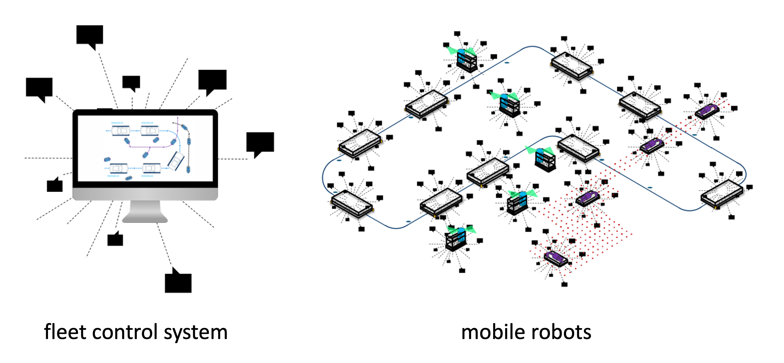

# 免责声明

以下说明旨在为实施移动机器人与车队管理系统之间的通信接口提供指导。它们面向所有用户，免费提供且不具有约束力。任何选择应用这些指南的当事方应负责在具体情况下确保其正确和适当的使用。

用户必须考虑指南应用时的最新技术水平。使用这些建议不免除任何当事方对其自身行为的责任。这些声明不声称是详尽无遗的，也不构成对现有法律的权威解释。它们不取代审查和遵守相关政策、立法或法规的必要性。

此外，必须考虑各自产品的具体特点及其各种潜在应用。所有用户自行承担风险。VDA 和 VDMA 以及参与制定或应用这些建议的任何个人均不承担任何责任。

如果您发现这些建议在应用中存在任何不准确之处或可能存在的误解风险，请立即通知 VDA，以便进行必要的更正。

**出版者**
Verband der Automobilindustrie e. V. (VDA)
Behrenstraße 35, 10117 Berlin, Germany
www.vda.de

**版权**
Association of the Automotive Industry (VDA)
仅允许在注明出处的情况下进行复制和任何其他形式的复制。

Version 3.0.0

## 目录

- [0. 前言](#ch00)
- [1. 简介](#ch01)
- [2. 范围](#ch02)
- [3. 术语定义](#ch03)
- [4. 传输协议](#ch04)
- [5. 通信流程与内容](#ch05)
- [6. 订单协议](#ch06)
- [7. 动作](#ch07)
- [8. 地图](#ch08)
- [9. 区域](#ch09)
- [10. 连接](#ch10)
- [11. 状态](#ch11)
- [12. 可视化](#ch12)
- [13. 自由导航机器人的路径共享](#ch13)
- [14. 请求/响应机制](#ch14)
- [15. 信息单 (Factsheet)](#ch15)
- [16. 消息规格](#ch16)
- [术语表](#glossary)
- [常见问题](#faq)

---

<div id="ch00"></div>

# 0. 前言

本接口规范由德国汽车工业协会（VDA）和德国机械工程工业协会（VDMA）联合制定。
VDA 代表德国汽车行业，包括 OEM 和 Tier-1/Tier-n 供应商，贡献其在车辆架构、系统集成和安全关键通信方面的专业知识。
VDMA 代表欧洲机械和工厂工程行业的公司，在自动化技术、机械互操作性和生产系统标准化方面拥有丰富的知识。
两家组织合作确保接口规范反映当前工程需求，支持稳健可扩展的系统集成，并实现跨异构环境的一致数据交换。其联合开发过程强调协调的通信模型、与既定工业标准的兼容性以及跨领域接口的长期可维护性。这种合作确保了最终的规范能够可靠地应用于汽车、机械和混合行业应用中，支持高互操作性、操作安全性和面向未来的系统架构。
卡尔斯鲁厄理工学院（KIT）物流与物料搬运研究所（IFL）隶属于机械工程系，专注于将研究、教学和工业应用相结合。其跨学科团队致力于应对未来的物流挑战，包括物料流分析、自动化、机器人技术、数字化、人工智能、可持续性和系统设计。
IFL 受 VDA 和 VDMA 委托，负责监督 VDA 5050 的开发。它通过主导开发、支持问题审查和管理官方 GitHub 仓库为这一过程做出贡献。

<div id="ch01"></div>

# 1. 简介

本规范描述了中央车队控制系统与移动机器人之间交换信息的通信接口。

本建议的目标是通过实施标准化的、供应商中立的通信接口来支持移动机器人车队在集中车队控制系统监督下的集成和高效运行，从而确保车队控制系统与各个移动机器人之间的互操作性。

在此背景下，各国的技术指南和法律框架可提供总体方向性参考。它们可能在规划、运营、安全或自动化系统协调等方面提供指示性信息。此外，国家标准和监管规定有助于确保技术流程和术语在统一框架内得到考虑。

## 1.1 背景

在现代工业自动化环境中，自动化导引车（AGV）和自主移动机器人（AMR）的应用越来越广泛。然而，不同厂商的机器人往往使用专有的通信协议，这给系统集成带来了挑战。VDA 5050 标准的出现就是为了解决这一问题，它提供了一种统一的通信方式，使得来自不同制造商的机器人可以在同一环境中协同工作。

## 1.2 版本说明

本标准采用语义化版本（Semantic Versioning）进行版本管理：

- **主版本 (x.0.0)**：通常包含破坏性变更，例如引入了新的必填字段
- **次版本 (x.x.0)**：通常引入新功能，例如为可视化添加了可选参数
- **补丁版本 (3.0.x)**：通常用于较小的修正，例如修复文档中的拼写错误

当前版本为 **3.0.0**

## 1.3 参与单位

该规范的制定由以下机构共同完成：

- **VDA (Verband der Automobilindustrie)**：德国汽车工业协会，代表德国汽车行业，包括OEM和Tier-1/Tier-n供应商
- **VDMA (Verband Deutscher Maschinen- und Anlagenbau)**：德国机械工程工业协会，代表欧洲机械和工厂工程行业
- **IFL (Institute for Material Handling and Logistics)**：卡尔斯鲁厄理工学院(KIT)物流与物料搬运研究所，负责技术支持和管理官方GitHub仓库

## 1.4 反馈与贡献

欢迎各相关方通过 GitHub 仓库提交对本接口规范的修改或增强建议：

> https://github.com/vda5050/vda5050

## 1.5 相关标准与参考

在实施本标准时，可能需要参考以下相关技术指南和法律框架：

- ISO 3691-4：工业车辆 - 自动导引车（AGV）安全要求
- VDMA 66512：Layout Interchange Format (LIF) 布局交换格式
- 各国的技术安全法规和自动化系统运营规范

---

<div id="ch02"></div>

# 2. 范围

本文档描述了车队控制系统与移动机器人之间的标准化、供应商中立的通信接口。其目的是提供一个通用参考，支持在多个移动机器人在车队控制系统协调下运行的环境中的互操作性。

## 2.1 目标

本规范的目标包括：

1. **降低集成复杂度**：减少将移动机器人连接到车队控制系统时的复杂性

2. **支持异构车队**：实现在共享物理环境中来自不同制造商的异构移动机器人车队的协调运行

3. **通用接口定义**：提供一套通用的、与领域无关的接口定义，适用于具有不同导航原理、物理尺寸、负载处理或操纵能力以及自主等级的移动机器人

## 2.2 不涉及的内容

本规范**不**涵盖以下主题：

### 2.2.1 安全要求
本文档不定义功能、操作或系统安全要求，不应被视为或应用为安全标准。

### 2.2.2 交通管理逻辑
交通协调的策略、算法或决策过程（如路由、优先级、拥塞处理或死锁解决）不在本规范范围内。

### 2.2.3 其他通信接口
与车队控制系统和移动机器人之间通信无关的接口被排除在外，例如与外围设备、基础设施组件或外部IT系统的接口。

### 2.2.4 项目协调和实施程序
项目管理活动、集成方法、调试工作流、验证和验收程序以及类似的组织流程不在本规范覆盖范围内。

### 2.2.5 运营责任
本规范不分配运营商、系统集成商、车辆制造商或车队控制提供商在规划、运营、维护或安全方面的责任。

### 2.2.6 网络安全措施
安全通信或数据保护的技术、流程或机制不在本规范指定范围内。

---

<div id="ch03"></div>

# 3. 术语定义

以下术语和定义适用于本标准。

| 术语 (英文) | 中文 | 定义 |
|------------|------|------|
| Mobile Robot | 移动机器人 | 一种用于在操作环境中主要进行物料运输的无人系统，由自动化控制，独立于其自主等级 [来源: ISO 3691-4]。在本标准中，"移动机器人"涵盖自动化导引车（AGV）和自主移动机器人（AMR）。 |
| Moving | 移动 | 移动机器人或其任何组件在空间位置或方向上发生改变的状态，包括车轮、移动处理装置或机器人本体的运动。 |
| Driving | 驾驶 | 移动机器人具有非零线速度和/或角速度的运行状态。 |
| Automatic Driving | 自动驾驶 | 移动机器人在无人干预的情况下运行的驾驶状态。 |
| Manual Driving | 手动驾驶 | 移动机器人在直接人工控制下运行的驾驶状态。 |
| Line-guided Mobile Robot | 循线导航移动机器人 | 遵循预定义轨迹的移动机器人。预定义轨迹由车队控制作为订单的一部分发送，或在机器人上定义（显式或隐式为节点之间的直接连接）。 |
| Freely Navigating Mobile Robot | 自由导航移动机器人 | 自主规划轨迹的移动机器人。如果车队控制在订单中发送了轨迹，机器人应遵循该轨迹。 |
| Fleet Control | 车队控制 | 负责协调和管理多个移动机器人的中央控制系统，负责订单分配、路径规划和交通协调。 |
| Order | 订单 | 车队控制发送给移动机器人的任务指令，包含节点和边的序列，定义机器人需要执行的动作和移动路径。 |
| Node | 节点 | 订单图中的顶点，表示机器人需要到达的位置点。 |
| Edge | 边 | 订单图中的边，连接两个节点，表示机器人需要行驶的路径段。 |
| Released | 发布 | 节点或边的属性，指示该节点或边是否允许机器人通过。`released = true` 表示机器人应遍历该节点/边，`released = false` 表示机器人不应遍历。 |
| Base | 基线 | 已发布的节点和边的集合，定义机器人可以行驶的路径。 |
| Horizon | 视界 | 未发布的节点和边的集合，表示车队控制为机器人规划的未来路径。 |
| Decision Point | 决策点 | 基线的最后一个节点，机器人在此处等待新的指令或路径扩展。 |
| State | 状态 | 移动机器人向车队控制发送的当前状态信息，包括位置、速度、错误状态等。 |
| Action | 动作 | 机器人执行的具体操作，如取货、放货、充电、开门等。 |
| Map | 地图 | 描述环境的二维或三维表示，包括可行驶区域、障碍物等信息。 |
| Zone | 区域 | 地图上的逻辑分区，可用于定义速度限制、访问权限或其他约束。 |
| MQTT | 消息队列遥测传输 | Message Queuing Telemetry Transport，一种轻量级的消息传输协议，广泛用于物联网设备通信。 |
| QoS | 服务质量 | MQTT 的服务质量等级。QoS 0：最多一次（Best Effort）；QoS 1：至少一次 (At Least Once)；QoS 2：恰好一次 (Exactly Once) |

## 其他关键术语

| 术语 (英文) | 中文 | 定义 |
|------------|------|------|
| Sequence ID | 序列号 | 定义节点和边遍历顺序的标识。第一个节点的 sequenceId 为 0，第一个边为 1，依此类推。 |
| Order ID | 订单标识 | 订单的唯一标识符，用于关联订单和订单更新。 |
| Order Update | 订单更新 | 对现有订单的修改或扩展，通过 orderUpdateId 区分。 |
| Factsheet | 信息单 | 移动机器人向车队控制提供的参数和供应商特定信息。 |
| Connection | 连接 | 移动机器人与 MQTT Broker 之间的连接状态。 |
| Instant Action | 即时动作 | 车队控制发送给移动机器人要求立即执行的动作。 |
| Zone Set | 区域集 | 区域集合，与特定地图关联。 |
| Corridors | 走廊 | 车队控制为移动机器人定义的精确行驶边界，用于障碍物回避。 |
| LIF | 布局交换格式 | Layout Interchange Format，用于路线导入导出。 |
| AGV | 自动化导引车 | Automated Guided Vehicle |
| AMR | 自主移动机器人 | Autonomous Mobile Robot |

---

<div id="ch04"></div>

# 4. 传输协议

通信通过无线网络进行，需要考虑连接失败和消息丢失的影响。

消息协议采用 **MQTT (Message Queuing Telemetry Transport)** 结合 **JSON** 格式。

> MQTT 3.1.1 是兼容所需的最低版本。

MQTT 允许将消息分发到称为"主题"(Topic)的子通道。MQTT 网络中的参与者订阅这些主题，接收与其相关的信息。

JSON 格式允许协议未来扩展额外的参数，并支持基于 Schema 的验证。

## 4.1 连接处理、安全与 QoS

### Last Will 消息

MQTT 协议提供设置"最后遗言"(Last Will)消息的选项。如果客户端意外断开连接，Last Will 消息将由 Broker 分发给其他订阅的客户端。该功能的使用在第 10 节中有详细描述。

### 断开连接处理

如果移动机器人与 Broker 断开连接，它应保留所有订单信息并执行到最后一个已发布节点为止的订单。

### QoS 级别

为减少通信开销，对以下主题使用 **MQTT QoS 级别 0 (Best Effort)**：

- `order`
- `instantActions`
- `state`
- `factsheet`
- `zoneSet`
- `responses`
- `visualization`

对主题 `connection` 使用 **QoS 级别 1 (At Least Once)**。

### 安全

协议安全需要由 Broker 配置来考虑，但本规范不涉及此方面。

## 4.2 主题级别

由于云提供商的强制主题结构，MQTT 主题结构没有严格定义。对于基于云的 MQTT Broker，主题结构可能需要单独调整，但应大致遵循建议的结构。

以下章节中定义的主题名称是**强制性的**。

对于本地 Broker，建议的 MQTT 主题级别结构如下：

```
interfaceName/majorVersion/manufacturer/serialNumber/topic
```

### 示例

```
vda5050/v3/KIT/0001/order
```

### 主题级别参数说明

| 主题级别 | 数据类型 | 说明 |
|----------|----------|------|
| `interfaceName` | string | 使用的接口名称 |
| `majorVersion` | string | VDA 5050 建议的主版本号，前缀为 "v" |
| `manufacturer` | string | 移动机器人制造商 |
| `serialNumber` | string | 移动机器人唯一序列号，可使用字符：A-Z, a-z, 0-9, _, ., :, - |
| `topic` | string | 主题名称（如 order, state） |

> **注意**：由于 `/` 字符用于定义主题层次结构，上述任何字段中都不应使用该字符。通配符字符 `+` 和 `#` 以及 Broker 内部主题保留的字符 `$` 也不应使用。

## 4.3 通信主题

协议使用以下主题在车队控制和移动机器人之间交换信息：

| 主题名称 | 发布者 | 订阅者 | 用途 | 实现 | Schema |
|----------|--------|--------|------|------|--------|
| `order` | 车队控制 | 移动机器人 | 订单通信 | 必选 | order.schema |
| `instantActions` | 车队控制 | 移动机器人 | 即时动作通信 | 必选 | instantActions.schema |
| `state` | 移动机器人 | 车队控制 | 移动机器人状态通信 | 必选 | state.schema |
| `visualization` | 移动机器人 | 可视化系统 | 高频位置和规划路径通信 | 可选 | visualization.schema |
| `connection` | Broker / 移动机器人 | 车队控制 | 指示移动机器人连接丢失。不应被车队控制用于检查移动机器人健康状态，仅用于 MQTT 协议级别的连接检查 | 必选 | connection.schema |
| `factsheet` | 移动机器人 | 车队控制 | 参数或供应商特定信息，帮助车队控制设置移动机器人 | 必选 | factsheet.schema |
| `zoneSet` | 车队控制 | 移动机器人 | 区域集从车队控制传输到移动机器人 | 可选 | zoneSet.schema |
| `responses` | 车队控制 | 移动机器人 | 车队控制对移动机器人状态中请求的响应 | 可选 | responses.schema |

> **表 1**：车队控制和移动机器人之间的通信主题

---

<div id="ch05"></div>

# 5. 通信流程与内容

## 5.1 概述

无人驾驶运输系统的运行至少涉及以下参与者：

- **运营商**：提供基本信息和环境配置
- **车队控制**：组织和管理系统运行
- **移动机器人**：执行订单任务

下图描述了运行阶段的信息流结构。在实施或修改阶段，移动机器人和车队控制需要进行手动配置。

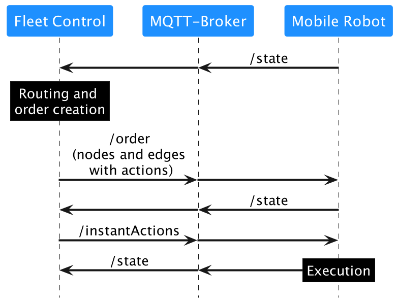
> **图 1**：信息流结构

## 5.2 实施阶段

在实施阶段，由车队控制和移动机器人组成的无人驾驶运输系统进行设置。运营商定义必要的框架条件，并手动输入或从其他系统导入车队控制中。

主要内容包括：

### 5.2.1 路线定义

- 使用布局交换格式 (LIF, Layout Interchange Format) 将路线导入车队控制
- LIF 是轨道布局的文件格式，用于在无人驾驶运输移动机器人集成商和（第三方）车队控制系统之间进行交换
- 也可以由运营商手动在车队控制中实现路线
- 路线可以是单向街道、根据移动机器人尺寸限制的路线等

### 5.2.2 路线网络配置

在路线内定义以下内容：
- 装卸站
- 电池充电站
- 外围环境（门、电梯、屏障）
- 等待位置
- 缓冲站等

### 5.2.3 移动机器人配置

运营商存储移动机器人的物理属性（尺寸、可用载具托架等）。移动机器人应通过 `factsheet` 主题以特定方式将此信息传达给车队控制。

> 上述路线和路线网络的配置不在本规范范围内。它们构成了车队控制基于这些信息和需要完成的运输需求进行订单控制和行驶路线分配的基础。

## 5.3 车队控制的功能

车队控制系统至少执行以下功能：

| 功能 | 说明 |
|------|------|
| 订单分配 | 将任务分配给移动机器人 |
| 路线计算与引导 | 为循线导航移动机器人计算路线（考虑各机器人的物理限制） |
| 死锁检测与解决 | 检测和解决阻塞情况 |
| 能源管理 | 充电订单可以中断运输订单 |
| 交通控制 | 缓冲路线和等待位置 |
| 环境变更 | 临时变更环境，如释放某些区域或更改最大速度 |
| 外围系统通信 | 与门、电梯、屏障等外围系统通信 |
| 通信错误处理 | 检测和解决通信错误 |

## 5.4 移动机器人的功能

每个移动机器人应执行以下功能：

| 功能 | 说明 |
|------|------|
| 定位 | 确定自身位置 |
| 路线执行 | 执行关联的路线（循线导航或自由导航） |
| 动作执行 | 执行指定的动作 |
| 状态传输 | 持续向车队控制传输状态信息 |

---

<div id="ch06"></div>

# 6. 订单协议

`order` 主题是移动机器人接收订单的 MQTT 主题，包含机器人移动或执行动作的指令。

## 6.1 概念与逻辑

运输订单的核心是一个定义路线的节点-边图段。移动机器人被期望遍历节点和边以完成订单。

所有连接节点和边的完整图由车队控制持有，其中可能包含限制条件（例如，允许哪些移动机器人遍历哪条边）。这些限制不会传达给移动机器人。车队控制仅在订单中包含相关移动机器人允许遍历的边。

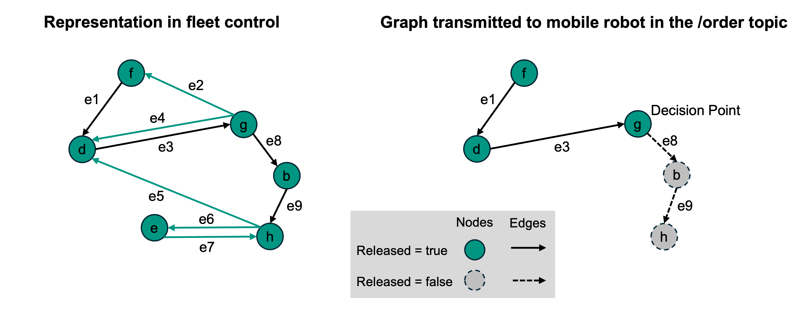
> **图 2**：车队控制中的图表示和订单中传输的图

节点和边作为两个列表在订单消息中传递。节点和边列表内的顺序也决定了它们被遍历的顺序。`sequenceId` 在节点和边之间共享，定义遍历顺序。第一个节点的 `sequenceId` 为 0，第一个边的 `sequenceId` 为 1，第二个节点的 `sequenceId` 为 2，依此类推。`sequenceId` 为 n 的边连接 `sequenceId` 为 n-1 和 n+1 的节点。`sequenceId` 在订单内应是连续的。

对于有效订单，至少有一个节点，边数应等于节点数减一。

订单的第一个节点（`sequenceId` = 0）对移动机器人来说应是自然可达的，并且始终是已发布的。这意味着移动机器人已经站在该节点上，或者移动机器人在该节点的偏差范围内。因此，第一个节点不应在 `nodeStates` 中报告。

节点和边都具有布尔属性 `released`。如果节点或边已发布，机器人应遍历它。如果节点或边未发布，机器人不应遍历它。

边只有在它的起点和终点节点都已发布时才能被发布。

已发布边之后不能跟随未发布的节点或边。

已发布的节点和边的集合称为 **"基线"(Base)**。
未发布的节点和边的集合称为 **"视界"(Horizon)**。

可以发送没有视界的订单。

订单消息不一定描述完整的运输订单。为了交通控制和适应资源受限的移动机器人，完整的运输订单（可能包含许多节点和边）可以拆分为多个子订单，通过 `orderId` 和 `orderUpdateId` 连接。

## 6.2 订单与订单更新

为支持交通管理，车队控制可以将通过订单传达的路径分为两部分：

- **基线 (Base)**：移动机器人被允许行驶的已定义路线。基线的所有节点和边已由车队控制为该移动机器人发布。基线的最后一个节点称为**决策点**。
- **视界 (Horizon)**：车队控制为移动机器人规划的在决策点之后行驶的路线。该路线尚未由车队控制发布。

如果未向基线添加更多节点和边，移动机器人应在决策点停止。为确保流畅移动，如果交通情况允许，车队控制应在移动机器人到达决策点之前扩展基线。

由于 MQTT 是异步协议且无线网络传输不可靠，基线无法更改。车队控制因此应假设基线已被移动机器人执行。本规范后面部分描述了取消订单的程序，但由于上述通信限制，这也被认为是不可靠的。

车队控制可以通过向移动机器人发送包含更改的节点和边列表的更新路线来更改视界。更改视界路线的程序如图 3 所示。


> **图 3**：扩展行驶路线"视界"的程序

图 3 中，初始订单首先由车队控制在 t = 0 时发送。

### 订单示例

**初始订单**：
```json
{
  "orderId": "1234",
  "orderUpdateId": 0,
  "nodes": [
    { "nodeId": "f", "released": true },
    { "nodeId": "d", "released": true },
    { "nodeId": "g", "released": true },
    { "nodeId": "b", "released": false },
    { "nodeId": "h", "released": false }
  ],
  "edges": [
    { "edgeId": "e1", "released": true },
    { "edgeId": "e3", "released": true },
    { "edgeId": "e8", "released": false },
    { "edgeId": "e9", "released": false }
  ]
}
```

**订单更新**（扩展视界）：
```json
{
  "orderId": "1234",
  "orderUpdateId": 1,
  "nodes": [
    { "nodeId": "g", "released": true },
    { "nodeId": "b", "released": true },
    { "nodeId": "h", "released": true },
    { "nodeId": "i", "released": false }
  ],
  "edges": [
    { "edgeId": "e8", "released": true },
    { "edgeId": "e9", "released": true },
    { "edgeId": "e10", "released": false }
  ]
}
```

注意 `orderUpdateId` 递增，并且订单更新的第一个节点对应于上一条订单消息的最后一个基线节点（拼接节点）。来自上一基线的其他节点和边不会重新发送。

这确保移动机器人也可以执行订单更新，即订单更新的第一个节点可以通过执行移动机器人已知的边到达。


> **图 6**：常规订单更新流程 — 扩展视界

图 6 描述了应如何扩展订单。它显示了移动机器人当前持有的信息。`orderId` 保持不变，`orderUpdateId` 递增。

决策点（图 6 中的节点 g）的内容不应改变。这意味着动作、偏差范围等应重新发送。为了通过订单更新为机器人已在的节点释放要执行的动作，车队控制应首先重新发送此节点及其所有元数据（包括可能已 'FINISHED'/'RUNNING' 的动作），这些动作不会被移动机器人再次执行，然后添加一个带有新释放动作的节点。该节点可以与决策节点具有相同的 `nodeId`，或不同的 `nodeId` 但相同的位置。新节点的 `sequenceId` 总是决策节点的 `sequenceId` 加 2。

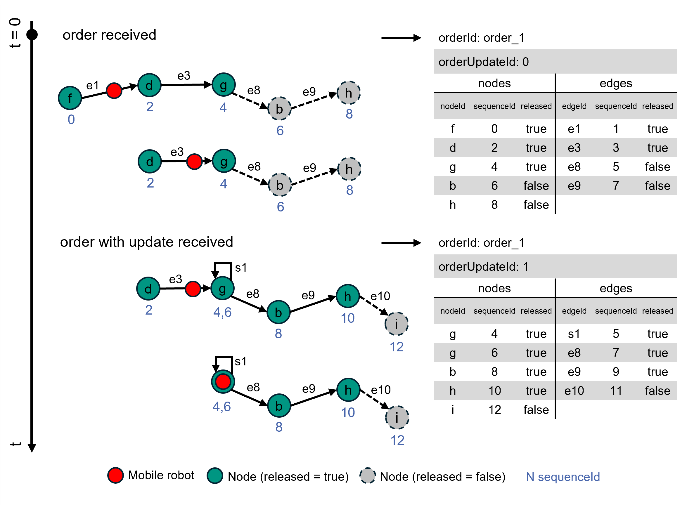
> **图 7**：带拼接节点的订单更新（例如，在决策点执行新动作）

视界可以通过任何订单更新进行修改或完全删除，或者基线可以以与之前视界不同的方式扩展。

一旦 `sequenceId` 被分配且节点被发布，它不会随订单更新而改变。

### 订单接收流程


> **图 4**：订单或订单更新的接收流程

1. **订单格式是否有效？**：检查 JSON 数据类型和格式是否正确
2. **是新订单还是订单更新？**：接收到的订单 `orderId` 与机器人当前持有的 `orderId` 是否不同
3. **机器人是否空闲且不等待更新？**：机器人是否处于空闲状态且没有等待的视界
4. **orderUpdateId 是否为 0？**：新订单的 `orderUpdateId` 是否为 0
5. **新订单起点是否在当前位置范围内？**：机器人是否已站在该节点上，或是否在节点的偏差范围内
6. **收到的订单更新是否已过时？**：收到的 `orderUpdateId` 是否小于或等于机器人当前的
7. **订单更新是否在 cancelOrder 之后？**：车队控制不应发送取消订单的任何进一步更新
8. **收到的更新是否与当前机器人上的订单相同？**：收到的 `orderUpdateId` 是否等于机器人当前的
9. **收到的更新是否是当前仍在运行的订单的有效延续？**：新基线的第一个节点是否等于上一个基线的最后一个节点
10. **收到的更新是否是已完成订单的有效延续？**：机器人不再执行任何动作且没有视界时，新基线的第一个节点是否等于上一个基线的最后一个节点
11. **填充/附加新状态到 actionStates/nodeStates/edgeStates**：机器人根据接收到的订单内容，初始化动作状态和节点/边遍历状态，填充到相应的状态列表中

#### 订单完成

移动机器人遍历完订单的最后一个节点并完成所有相关动作后，进入空闲状态，准备接收新订单。

## 6.3 订单取消

车队控制可以使用即时动作 `cancelOrder` 取消活动订单。

车队控制可以选择性地传递 `orderId` 来指定要取消的订单。

收到 `cancelOrder` 即时动作后，移动机器人应尽快停止。对于循线导航移动机器人，这可能是下一个可行的节点。自由导航移动机器人应尽快停止，而不仅仅是在下一个节点。

如果 `actionStates` 中有安排的动作，这些动作应被取消，并在 `actionState` 中报告为 'FAILED'。
如果 `actionStates` 中有正在运行的动作，这些动作应被取消，也应报告为 'FAILED'。
如果动作无法取消，该动作的 `actionState` 应通过在运行时报告 'RUNNING' 来反映这一点，之后报告相应的状态（如果成功则 'FINISHED'，如果不成功则 'FAILED'）。
当 `actionStates` 中有正在运行的动作时，`cancelOrder` 动作应报告 'RUNNING'，直到所有动作都被取消/完成。无法取消的动作（`cancelAllowed = false`）应完成。

移动机器人的所有移动和 `actionStates` 中的所有动作停止后，`cancelOrder` 动作状态应报告 'FINISHED'。

移动机器人然后应处于空闲状态，准备接收新订单。

`orderId` 和 `orderUpdateId` 保持不变。

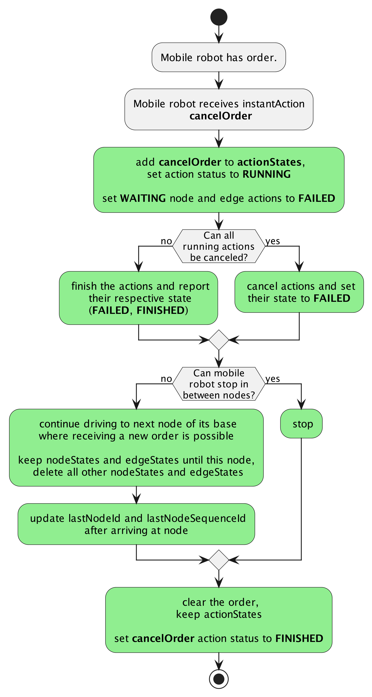
> **图 5**：取消订单后的预期行为

### 取消后接收新订单

订单取消后，移动机器人处于空闲状态，准备接收新订单。车队控制不应再发送对该订单的任何订单更新。如果移动机器人收到订单更新，应报告类型为 'ORDER_UPDATE_FOLLOWING_CANCEL'、级别为 'WARNING' 的错误。

对于只能在一个节点上定位自身的移动机器人，新订单应从移动机器人当前站立的节点开始。

对于可以在节点之间停止的移动机器人，车队控制可以决定如何开始下一个订单。移动机器人应接受这两种方式：

1. 新订单的第一个节点是位于移动机器人当前位置的临时节点。移动机器人应识别该节点是自然可达的，并接受订单。
2. 新订单的第一个节点是上一个订单的最后一个遍历节点。该节点的允许偏差设置得足够大，以确保移动机器人处于该范围内。因此，移动机器人应立即将该节点视为已遍历，并接受订单。

### 机器人在空闲状态下收到 cancelOrder

如果移动机器人收到 `cancelOrder` 即时动作，但移动机器人当前处于空闲状态，或者动作中指定的 `orderId` 与移动机器人当前活动订单的 `orderId` 不匹配，`cancelOrder` 动作应报告为 'FAILED'。

移动机器人应报告类型为 'NO_ORDER_TO_CANCEL'、级别为 'WARNING' 的错误。即时动作的 `actionId` 应作为 `errorReference` 传递。

## 6.4 订单拒绝

移动机器人在以下场景中应拒绝订单：

| 场景 | 响应 |
|------|------|
| 订单格式错误 | 报告 `VALIDATION_FAILURE` 错误，级别 WARNING |
| 订单包含不支持的参数 | 报告 `UNSUPPORTED_PARAMETER` 错误，级别 CRITICAL |
| 订单包含无法执行的动作 | 报告 `INVALID_ORDER_ACTION` 错误，级别 WARNING |
| 相同 orderId 但 orderUpdateId 更低 | 报告 `OUTDATED_ORDER_UPDATE` 错误，级别 WARNING |
| 相同 orderId 和相同 orderUpdateId | 忽略（内容相同）或报告 `SAME_ORDER_UPDATE_ID` 错误（内容不同） |
| 不同的 orderId 且有活动订单 | 报告 `OTHER_ORDER_ACTIVE` 错误，级别 WARNING |
| 起始节点超出范围 | 报告 `START_NODE_OUT_OF_RANGE` 错误，级别 WARNING |
| 至少有一个节点不可达 | 报告 `NO_ROUTE_TO_TARGET` 错误，级别 WARNING |
| 当前模式不允许接收订单 | 报告 `MOBILE_ROBOT_NOT_AVAILABLE` 错误，级别 WARNING |
| 订单包含未知 mapId | 报告 `UNKNOWN_MAP_ID` 错误，级别 WARNING |

### 拒绝处理规则

1. 移动机器人不应将新订单接收到其内部缓冲区
2. 移动机器人应保持之前的订单在其缓冲区中
3. 错误应持续报告，直到移动机器人接受新订单

## 6.5 走廊 (Corridors)

走廊是一种可选的边属性，允许移动机器人偏离边轨迹以避开障碍物，并定义移动机器人允许运行的范围边界。

使用走廊属性需要预定义的轨迹。如果未定义走廊属性，移动机器人将遵循该轨迹。定义了走廊属性的移动机器人行为仍然是循线导航移动机器人的行为，只是允许暂时偏离轨迹以避开障碍物。

> **注**：订单中的边定义了两个节点之间的逻辑连接，并不一定代表机器人在起点和终点之间行驶的实际轨迹。根据机器人类型，轨迹可由车队控制通过边的 trajectory 属性定义，或分配给机器人作为预定义轨迹。根据机器人内部状态，所选轨迹可能有所不同。

如果设置了 `releaseRequired` 标志为 true，移动机器人在使用走廊前需向车队控制申请批准（见第 6.6.10 节）。

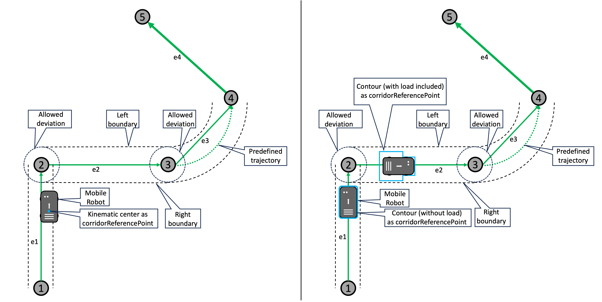
> **图 6**：带走廊属性的边

### 走廊参数

| 参数 | 类型 | 说明 |
|------|------|------|
| `leftWidth` | float64 | 相对于机器人轨迹左侧的走廊宽度（米），范围 [0.0 ... float64.max] |
| `rightWidth` | float64 | 相对于机器人轨迹右侧的走廊宽度（米），范围 [0.0 ... float64.max] |
| `corridorReferencePoint` | string | 定义边界适用于运动中心还是机器人轮廓。枚举：`KINEMATIC_CENTER`（运动中心）、`CONTOUR`（轮廓） |
| `releaseRequired` | boolean | 是否需要车队控制批准使用走廊。默认值：false |
| `releaseLossBehavior` | string | 授权丢失时的行为。枚举：`STOP`（停止等待干预）、`RETURN`（返回预定义轨迹）。默认值：`STOP` |

### 走廊越界处理

移动机器人的运动控制软件应持续检查移动机器人是否在定义的边界内。如果没有，移动机器人应停止（因超出允许导航空间），并报告类型为 'OUTSIDE_OF_CORRIDOR'、级别为 CRITICAL 的错误。车队控制可决定是否需要人工干预，或通过取消当前订单并发送包含允许机器人重新移动的走廊信息的新订单来让机器人继续运行。

> **注**：允许移动机器人偏离轨迹会增加行驶时机器人的潜在占用空间。在初始运行阶段以及车队控制基于机器人占用空间做出交通控制决策时，应考虑这一因素。

---

<div id="ch07"></div>

# 7. 动作

动作是移动机器人在执行订单过程中需要执行的具体操作，如取货、放货、充电、开关门等。

## 7.1 动作概述

如果移动机器人支持除行驶外的其他动作，这些动作通过附加在节点或边上的 `actions` 数组来指示，或通过 `instantActions` 主题发送，或通过动作区域配置。

在边上执行的动作只能在移动机器人在边上时运行。在节点上触发的动作可以运行任意长时间，并且应该是自我终止的（如持续5秒的音频信号或取货动作在取货完成后结束）或成对制定（如 "activateWarningLights" 和 "deactivateWarningLights"）。

## 7.2 即时动作 (Instant Actions)

即时动作是车队控制发送给移动机器人要求立即执行的动作。与订单中的动作不同，即时动作不依赖于订单的执行进度。

即时动作通过 `instantActions` 主题发送。

### 即时动作的特点

- 立即执行，不等待订单完成
- 可以带有参数
- 可能需要一定时间完成
- 可以被拒绝或失败
- 阻塞类型始终为 'NONE'

### 即时动作示例

- 暂停移动机器人而不更改当前订单
- 暂停后恢复订单
- 激活信号（视觉、音频等）

### 无效即时动作

当移动机器人收到无法执行的 `instantAction` 时，应报告 'INVALID_INSTANT_ACTION' 错误，级别为 'WARNING'，并将 `instantAction` 的 `actionId` 作为 `errorReference`。

## 7.3 动作阻塞类型

动作具有不同的阻塞类型，定义了动作执行时允许的其他行为：

| 阻塞类型 | 自动驾驶 | 并行执行 |
|----------|----------|----------|
| `NONE` | 允许 | 允许 |
| `SINGLE` | 允许 | 不允许 |
| `SOFT` | 不允许 | 允许 |
| `HARD` | 不允许 | 不允许 |

### 动作执行顺序

多个动作的顺序定义了移动机器人执行它们的顺序。动作的并行执行由各自的 `blockingType` 控制。

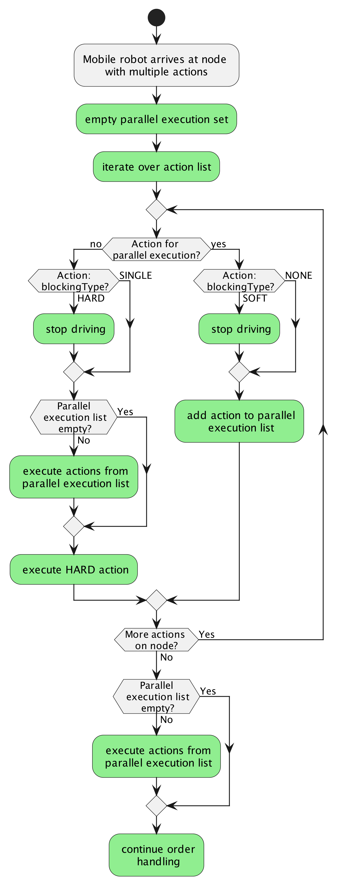
> **图 1**：处理多个动作

当移动机器人到达要执行新动作的点时（即到达节点、边或动作区域），动作按动作数组的相同顺序入队。如果队列中任何动作的 `blockingType` 是 'SOFT' 或 'HARD'，移动机器人应停止自动驾驶。如果动作的 `blockingType` 是 'NONE' 或 'SOFT'，则收集并行执行。如果要执行 `blockingType` 为 'SINGLE' 或 'HARD' 的动作，所有已收集的并行动作应在开始该动作之前 'FINISHED' 或 'FAILED'。如果队列中不再有 `blockingType` 为 'SOFT' 或 'HARD' 的动作，移动机器人可以恢复自动驾驶。

## 7.4 动作状态

动作在执行过程中会经历多个状态：

| 状态 | 说明 |
|------|------|
| `INITIALIZING` | 动作正在初始化准备 |
| `WAITING` | 等待执行（在订单中定义的位置） |
| `RUNNING` | 正在执行 |
| `PAUSED` | 已暂停（如安全区域被违反） |
| `FINISHED` | 成功完成 |
| `FAILED` | 执行失败 |
| `RETRIABLE` | 可以重试（如果启用重试且之前失败） |

## 7.5 预定义动作

VDA 5050 定义了一组标准化的动作类型。所有移动机器人应支持 `cancelOrder`、`startPause` 和 `stopPause` 这三个动作。

### 7.5.1 动作列表

| 动作类型 | 反向动作 | 说明 | 幂等 | 即时 | 节点 | 边 | 区域 |
|----------|----------|------|------|------|------|-----|------|
| `startPause` | stopPause | 激活暂停模式，停止自动驾驶，无需到达下一个节点 | 是 | 是 | 否 | 否 | 否 |
| `stopPause` | startPause | 停用暂停模式，恢复运动和动作 | 是 | 是 | 否 | 否 | 否 |
| `startHibernation` | stopHibernation | 进入休眠模式。机器人保持与 MQTT Broker 的连接，但不再发送状态消息。若有活动订单则清除。休眠中不移动，仅响应 stopHibernation 指令。可设置 wakeUpTime 定时自动唤醒 | 是 | 是 | 否 | 否 | 否 |
| `stopHibernation` | startHibernation | 退出休眠模式。需有控制设备订阅 instantAction 主题并保持 MQTT 连接；唤醒可由独立 MQTT 客户端触发。成功后发布 connectionState 为 ONLINE | 是 | 是 | 否 | 否 | 否 |
| `shutdown` | - | 有序关闭移动机器人，断开 MQTT 连接 | 是 | 是 | 否 | 否 | 否 |
| `startCharging` | stopCharging | 激活充电过程 | 是 | 是 | 是 | 否 | 否 |
| `stopCharging` | startCharging | 停止充电过程 | 是 | 是 | 是 | 否 | 否 |
| `initializePosition` | - | 重置移动机器人的位姿 | 是 | 是 | 是 | 否 | 否 |
| `enableMap` | - | 启用之前下载的地图 | 是 | 是 | 是 | 否 | 否 |
| `downloadMap` | - | 触发新地图下载 | 是 | 是 | 否 | 否 | 否 |
| `deleteMap` | - | 删除移动机器人内存中的地图 | 是 | 是 | 否 | 否 | 否 |
| `downloadZoneSet` | - | 触发区域集下载 | 是 | 是 | 否 | 否 | 否 |
| `enableZoneSet` | - | 启用之前下载的区域集 | 是 | 是 | 是 | 否 | 否 |
| `deleteZoneSet` | - | 删除区域集 | 是 | 是 | 否 | 否 | 否 |
| `clearInstantActions` | - | 清除所有已完成的即时动作 | 是 | 是 | 是 | 否 | 否 |
| `clearZoneActions` | - | 清除所有区域动作 | 是 | 是 | 是 | 否 | 否 |
| `stateRequest` | - | 请求移动机器人发送新状态 | 是 | 是 | 否 | 否 | 否 |
| `logReport` | - | 请求生成日志报告 | 是 | 是 | 否 | 否 | 否 |
| `pick` | drop | 请求移动机器人取货 | 否 | 否 | 是 | 是 | 否 |
| `drop` | pick | 请求移动机器人放货 | 否 | 否 | 是 | 是 | 否 |
| `detectObject` | - | 检测物体（负载、充电位等） | 是 | 否 | 是 | 是 | 是 |
| `finePositioning` | - | 精确到达目标位置 | 是 | 否 | 是 | 是 | 是 |
| `waitForTrigger` | - | 等待触发器触发 | 是 | 否 | 是 | 否 | 是 |
| `trigger` | - | 通知移动机器人可以继续 | 是 | 是 | 否 | 否 | 否 |
| `retry` | - | 重试当前处于 RETRIABLE 状态的动作 | 是 | 否 | 否 | 否 | 否 |
| `skipRetry` | - | 跳过重试，将动作设为 FAILED | 是 | 否 | 否 | 否 | 否 |
| `cancelOrder` | - | 尽快停止移动机器人 | 是 | 是 | 否 | 否 | 否 |
| `factsheetRequest` | - | 请求发送 factsheet | 是 | 是 | 否 | 否 | 否 |
| `updateCertificate` | - | 下载并激活新证书集 | 是 | 是 | 否 | 否 | 否 |

### 7.5.2 动作详细参数

#### 取放动作

**pick - 取货**

| 参数 | 类型 | 必填 | 说明 |
|------|------|------|------|
| `lhd` | string | 否 | 负载处理设备标识（如 LHD1） |
| `stationType` | string | 否 | 站点类型（floor/rack/passiveConveyor/activeConveyor） |
| `stationName` | string | 否 | 站点名称 |
| `loadType` | string | 否 | 负载类型（如 EPAL/INDU） |
| `loadId` | string | 否 | 负载标识 |
| `height` | float64 | 否 | 负载底部相对于地面的高度 |
| `depth` | float64 | 否 | 深度（叉车用） |
| `side` | string | 否 | 侧面（如 conveyor） |

**drop - 放货**：参数与 pick 相同。

#### 地图操作

**downloadMap**

| 参数 | 类型 | 必填 | 说明 |
|------|------|------|------|
| `mapId` | string | 是 | 地图标识 |
| `mapVersion` | string | 是 | 地图版本 |
| `mapDownloadLink` | string | 是 | 地图下载链接 |
| `mapHash` | string | 否 | 地图哈希值（可选） |

**enableMap** / **deleteMap**

| 参数 | 类型 | 必填 | 说明 |
|------|------|------|------|
| `mapId` | string | 是 | 地图标识 |
| `mapVersion` | string | 是 | 地图版本 |

#### 区域集操作

**downloadZoneSet**

| 参数 | 类型 | 必填 | 说明 |
|------|------|------|------|
| `zoneSetId` | string | 是 | 区域集标识 |
| `zoneSetDownloadLink` | string | 是 | 区域集下载链接 |
| `zoneSetHash` | string | 否 | 区域集哈希值 |

**enableZoneSet** / **deleteZoneSet**

| 参数 | 类型 | 必填 | 说明 |
|------|------|------|------|
| `zoneSetId` | string | 是 | 区域集标识 |

#### 位置初始化

**initializePosition**

| 参数 | 类型 | 必填 | 说明 |
|------|------|------|------|
| `x` | float64 | 是 | X 坐标 |
| `y` | float64 | 是 | Y 坐标 |
| `theta` | float64 | 是 | 方向角（弧度） |
| `mapId` | string | 是 | 地图标识 |
| `lastNodeId` | string | 是 | 最后一个节点 ID |

#### 充电动作

**startCharging** / **stopCharging**
无额外参数。

#### 暂停/休眠

**startPause** / **stopPause**
无额外参数。

#### 休眠动作

**startHibernation**

| 参数 | 类型 | 必填 | 说明 |
|------|------|------|------|
| `wakeUpTime` | string | 否 | 唤醒时间（ISO 8601） |

**stopHibernation**
无额外参数。

#### 证书更新

**updateCertificate**

| 参数 | 类型 | 必填 | 说明 |
|------|------|------|------|
| `service` | string | 是 | 服务类型（如 'MQTT'） |
| `keyDownloadLink` | string | 是 | 密钥下载链接 |
| `certificateDownloadLink` | string | 是 | 证书下载链接 |
| `certificateAuthorityDownloadLink` | string | 否 | 证书颁发机构下载链接 |

## 7.6 动作参数格式

动作参数以 JSON 对象数组的形式传递：

```json
{
  "actionType": "pick",
  "actionId": "action-001",
  "blockingType": "HARD",
  "actionParameters": [
    {
      "key": "deviceId",
      "value": "device-01"
    },
    {
      "key": "loadId",
      "value": "load-001"
    }
  ]
}
```

参数支持的数据类型：`string`、`integer`、`float`、`boolean`、`object`、`array`

## 7.7 动作执行与节点/边的触发

### 节点动作触发

到达节点时，该节点上定义的所有动作被添加到执行队列。动作可以：
- 自我终止（如音频信号持续5秒）
- 成对执行（如 activateWarningLights / deactivateWarningLights）

### 边动作触发

在边上执行的动作只能在移动机器人在边上时运行。动作从进入边开始执行，到离开边结束。

### 动作状态转换

1. **INITIALIZING** → **RUNNING**：初始化完成后开始执行
2. **RUNNING** → **PAUSED**：因安全区域违反等暂停
3. **RUNNING** → **FINISHED**：成功完成
4. **RUNNING** → **FAILED**：执行失败
5. **RUNNING** → **RETRIABLE**：可重试的失败
6. **PAUSED** → **RUNNING**：恢复执行
7. **PAUSED** → **FAILED**：无法恢复
8. **RETRIABLE** → **RUNNING**：通过 retry 动作重试
9. **RETRIABLE** → **FAILED**：通过 skipRetry 跳过

---

<div id="ch08"></div>

# 8. 地图

为确保不同类型移动机器人之间的导航一致性，位置始终参照项目特定坐标系指定。项目特定坐标系是指为车队控制与移动机器人之间的交互定义的坐标系。使用唯一的 `mapId` 区分站点的不同楼层或区域。

地图坐标系指定为右手坐标系，Z 轴朝上。正旋转为逆时针方向。

移动机器人坐标系也指定为右手坐标系（ISO 9787 4.1），X 轴指向移动机器人的前进方向，Z 轴朝上（ISO 9787 5.5）。除非另有说明，移动机器人参考点在移动机器人参考系中定义为 (0,0,0)。

X、Y 和 Z 坐标应以米为单位。方向角应以弧度为单位，范围在 -Pi 到 +Pi 之间。


> **图 12**：坐标系和移动机器人朝向示例

## 8.1 地图分发

为实现自动地图分发和在必要时智能管理移动机器人重启，车队控制可以管理移动机器人上的地图。

需要分发的地图文件存储在地图服务器上，移动机器人可以访问该服务器。为确保传输效率，每次传输应包含单个文件。如果需要多个地图或文件，应打包为单个文件。

每个地图通过地图标识符（`mapId` 字段）和地图版本（`mapVersion` 字段）的组合唯一标识。在接收新订单之前，移动机器人应检查订单请求的每个地图标识符在移动机器人上是否存在对应的地图。如果 `maps` 列表中缺少对应的 `mapId`，移动机器人应报告类型为 'UNKNOWN_MAP_ID'、级别为 'WARNING' 的错误。确保正确的地图已启用以操作移动机器人是车队控制的责任。

### 8.1.1 初始地图分发

在系统实施阶段，地图由车队控制分发到移动机器人。地图包含环境的完整描述。地图从地图服务器到移动机器人的传输是拉取（pull）操作，由车队控制通过 `instantAction` 触发下载命令来启动。

### 8.1.2 地图更新

车队控制可以发送更新后的地图以反映环境变化，如新增工作站、重新布局等。

为减少停机时间并使车队控制更容易同步启用新地图的过程，地图应在移动机器人上预加载或缓冲。移动机器人上的地图状态反映在移动机器人的状态中。将地图传输到移动机器人和启用地图是不同的流程。要在移动机器人上启用预加载的地图，车队控制应发送即时动作。结果是，任何具有相同地图标识符但不同地图版本的其它地图应由移动机器人禁用。

地图的删除也可以由车队控制通过即时动作完成。

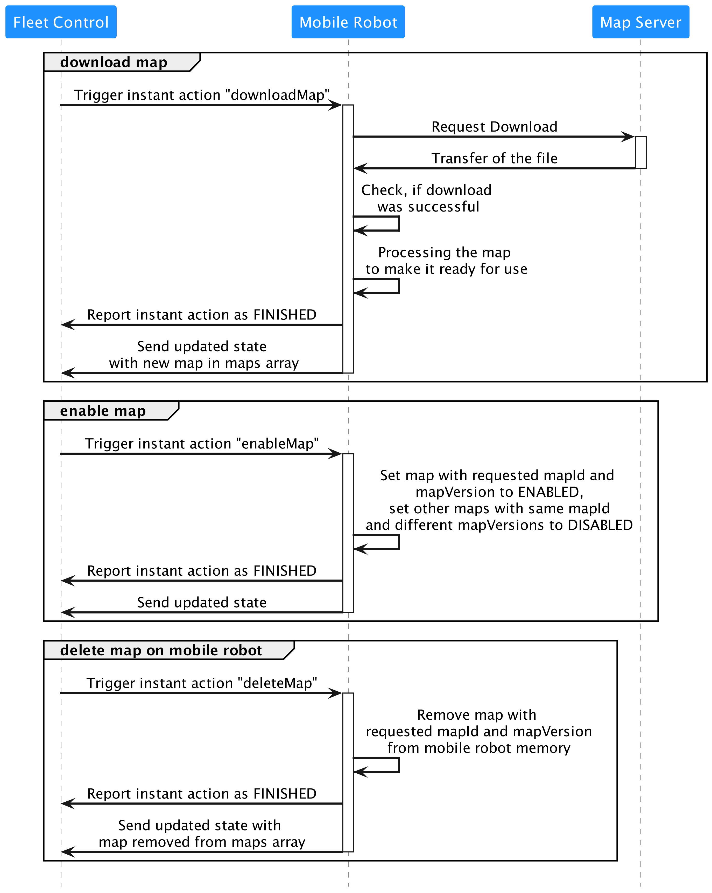
> **图 13**：地图分发过程中车队控制、移动机器人和地图服务器之间的通信

## 8.2 地图格式

地图以 JSON 格式表示，包含以下主要元素：

```json
{
  "mapId": "map-001",
  "mapDescriptor": "Factory Floor 1",
  "resolution": 0.01,
  "unit": "m",
  "width": 100,
  "height": 50,
  "origin": {
    "x": 0,
    "y": 0
  },
  "grid": [...]
}
```

## 8.3 移动机器人状态中的地图

状态消息中的 `mobileRobotPosition` 内的 `mapId` 字段表示当前活动的地图。

移动机器人上可用地图的信息通过 `maps` 数组呈现，该数组是状态消息的组成部分。数组中的每个条目是一个 JSON 对象，包含必填字段 `mapId`、`mapVersion` 和 `mapStatus`（可为 'ENABLED' 或 'DISABLED'）。'ENABLED' 状态的地图可在需要时由移动机器人使用。'DISABLED' 状态的地图不应被使用。

注意：可以同时启用多个具有不同 `mapId` 的地图。但同一 `mapId` 的多个版本中，一次只能有一个版本处于 'ENABLED' 状态。

```json
{
  "maps": [
    {
      "mapId": "map-001",
      "mapVersion": "1.0",
      "mapStatus": "ENABLED"
    }
  ]
}
```

## 8.4 地图下载

地图下载应由车队控制的 `downloadMap` 即时动作触发。该动作应包含必填参数 `mapId` 和 `mapDownloadLink`（地图在地图服务器上存储的位置，移动机器人可访问）。

移动机器人在开始下载地图文件时将 `actionStatus` 设置为 `RUNNING`。下载成功后，更新为 `FINISHED`；如果下载不成功，设置为 `FAILED`。下载成功完成后，地图应添加到状态的 `maps` 数组中。在地图准备好被启用之前，不应在状态中报告。

下载地图的过程不应修改、删除、启用或禁用移动机器人上的任何现有地图。

如果移动机器人收到一个 `mapId` 和 `mapVersion` 组合已存在的地图下载请求，应拒绝该下载。应报告类型为 'DUPLICATE_MAP'、级别为 'WARNING' 的错误，并将即时动作的状态设置为 'FAILED'。车队控制应首先删除移动机器人上的地图，然后重新启动下载。

## 8.5 启用下载的地图

有两种方式在移动机器人上启用地图：

1. **车队控制启用地图**：使用 `enableMap` 即时动作将地图在移动机器人上设置为 'ENABLED'。同一 `mapId` 的其他版本将设置为 'DISABLED'。
2. **在移动机器人上手动启用地图**：某些情况下可能需要在移动机器人上直接启用地图。结果应在移动机器人状态中报告。

车队控制应确保在订单中发送相应 `mapId` 作为 `nodePosition` 的一部分时，移动机器人上已激活正确的映射。

如果要将移动机器人设置到新地图上的特定位置，应使用 `initializePosition` 即时动作。

## 8.6 删除地图

车队控制可以请求从移动机器人删除特定地图。应使用 `deleteMap` 即时动作执行。当移动机器人内存不足时，应报告给车队控制，然后由车队控制启动地图删除。移动机器人本身不应删除地图。

成功删除地图后，移动机器人应从状态消息的 `maps` 数组中移除相应条目。

## 8.7 坐标系

地图使用项目特定的右手坐标系：
- X 轴：水平方向
- Y 轴：垂直方向
- Z 轴：向上（skywards）
- 位置单位：米（m）
- 方向单位：弧度（rad），范围 -Pi 到 +Pi

---

<div id="ch09"></div>

# 9. 区域

区域是地图上的逻辑分区，用于定义速度限制、访问权限、行为约束等。

## 9.1 区域概述

区域用于定义移动机器人工作空间特定区域的规则。通过这种方式，区域允许移动机器人在节点之间自由导航，同时使车队控制能够管理交通。

一些移动机器人根本无法处理区域，而其他移动机器人可能只能处理某些区域类型（如 'BLOCKED'）。因此，所有移动机器人应通过在 factsheet 的 `supportedZones` 数组中添加相应的区域名称来向车队控制报告它们能够理解的区域。

区域集只能由车队控制更改和分发，以保持系统一致性。

## 9.2 区域类型

VDA 5050 定义了两类区域：基于轮廓的区域和基于运动中心的区域。

### 基于轮廓的区域 (Contour-based Zones)

对于基于轮廓的区域，移动机器人（包括其负载）的轮廓决定区域的进入和退出。轮廓的任何部分进入区域即为进入区域。一旦移动机器人的轮廓不再保持在区域内，即为离开区域。


> **图 1**：基于轮廓进入区域（左）和负载移动机器人离开区域（右）


| 区域类型 | 参数 | 类型 | 说明 |
|----------|------|------|------|
| `BLOCKED` | - | - | 移动机器人不应进入此区域。如果进入，应停止并抛出 'BLOCKED_ZONE_VIOLATION' 错误（CRITICAL 级别）。 |
| `LINE_GUIDED` | - | - | 此区域不允许自由导航，移动机器人应遵循边上的预定义轨迹。 |
| `RELEASE` | releaseLossBehavior | string | 移动机器人只有在获得车队控制授权后才能进入此区域。当授权被撤销或过期时，机器人可执行以下行为：'STOP'（停止并报告 'RELEASE_LOST' 错误，级别 CRITICAL）、'EVACUATE'（执行撤离行为离开区域，在离开前保留 zoneRequest）、'CONTINUE'（继续行驶，保留 zoneRequest；若订单在区域内结束则等待新订单）。若未定义，默认 STOP。 |
| `COORDINATED_REPLANNING` | - | - | 此区域内不允许自主重规划。 |
| `SPEED_LIMIT` | maximumSpeed | float64 | 移动机器人在此区域内的速度不应超过定义的最大速度。 |
| `ACTION` | entryActions, duringActions, exitActions | array | 移动机器人在进入、穿越或离开区域时执行预定义动作。 |

### 基于运动中心的区域 (Kinematic center-based Zones)

在基于运动中心的区域中，移动机器人的运动中心决定其进入和离开区域。'PRIORITY' 和 'PENALTY' 区域仅影响移动机器人的路径规划。'DIRECTED' 区域定义区域内的首选行驶方向。'BIDIRECTED' 定义行驶方向及其相反方向。


> **图 2**：基于运动中心进入区域（左）和负载移动机器人离开区域（右）


| 区域类型 | 参数 | 类型 | 说明 |
|----------|------|------|------|
| `PRIORITY` | priorityFactor | float64 | [0.0...1.0] 区域偏好因子，0.0无偏好，1.0最大偏好。 |
| `PENALTY` | penaltyFactor | float64 | [0.0...1.0] 区域惩罚因子，0.0无惩罚，1.0最大惩罚。 |
| `DIRECTED` | direction, directedLimitation | float64, string | 首选行驶方向（弧度）。限制：'SOFT'、'RESTRICTED'、'STRICT' |
| `BIDIRECTED` | direction, bidirectedLimitation | float64, string | 双向行驶方向。限制：'SOFT'、'RESTRICTED' |

## 9.3 区域集传输

区域集通过 `zoneSet` 主题从车队控制传输到移动机器人。

```json
{
  "zoneSetId": "zoneset-001",
  "mapId": "map-001",
  "zoneSetDescriptor": "Factory Zone Set",
  "zones": [
    {
      "zoneId": "zone-001",
      "zoneType": "SPEED_LIMIT",
      "zoneDescriptor": "Speed Limit Zone",
      "vertices": [
        {"x": 0, "y": 0},
        {"x": 10, "y": 0},
        {"x": 10, "y": 5},
        {"x": 0, "y": 5}
      ],
      "maximumSpeed": 0.5
    }
  ]
}
```

## 9.4 交互区域通信

对于 'RELEASE' 和 'COORDINATED_REPLANNING' 交互区域的请求通信，使用状态消息中的 `zoneRequests` 字段。车队控制通过单独的 `responses` 主题响应这些请求。

在进入交互区域之前，移动机器人应发出请求。即使订单中包含区域内已发布的节点，也有必要在进入前发出请求。机器人自行决定在进入区域前的哪个时间点发起请求。如果未及时收到响应，机器人不应进入该区域。

请求只能针对已启用区域集中的区域发起。也可以为移动机器人当前不在的地图所属的区域集发起区域请求。

`requestId` 允许车队控制区分不同的请求，并允许移动机器人同时为同一区域发出多个备选请求。每个请求尝试应使用每台移动机器人唯一的标识符。移动机器人重启后可重复使用 ID。

### RELEASE 区域请求

对于进入 'RELEASE' 区域的请求，应在状态消息中添加一个 `requestType` 为 'ACCESS' 的 `zoneRequest` 对象。

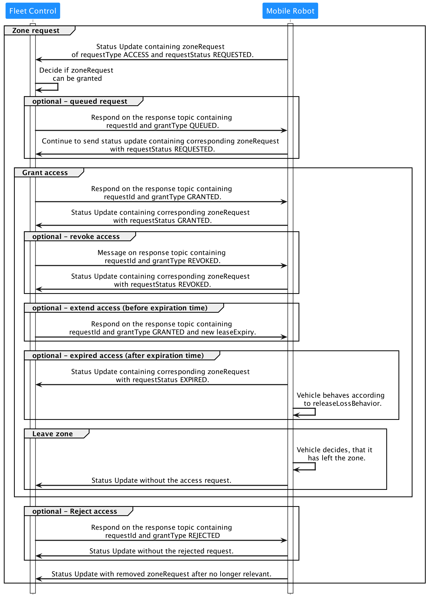
> **图 16**：RELEASE 区域请求行为

移动机器人在 RELEASE 区域内时，会在状态中保留 `zoneRequest` 对象，并继续报告 `requestStatus` 为 'GRANTED'，以通知车队控制它仍在该区域内。在机器人离开该区域后，应从状态消息中移除相应的 `zoneRequest` 条目。

当收到 `responseType` 为 'REVOKED' 的响应时，机器人应从状态中移除该请求。当 `leaseExpiry` 过期时，`requestStatus` 应设置为 'EXPIRED' 且不应进入该区域。如果移动机器人在 `leaseExpiry` 过期或被 'REVOKED' 时已在 RELEASE 区域内，应报告警告并根据区域定义中定义的 `releaseLossBehavior` 执行相应行为。

### COORDINATED_REPLANNING 区域请求

对于需要进入 'COORDINATED_REPLANNING' 区域的权限，`requestType` 应设置为 'REPLANNING'。对于 'REPLANNING' 请求，规划路径应作为 NURBS 添加到 `zoneRequest` 的 `trajectory` 字段。可以为同一区域发出多个具有不同轨迹的请求。每个路径应使用自己的 `zoneRequest` 对象请求。


> **图 17**：COORDINATED_REPLANNING 区域请求行为

移动机器人应选择所有 'GRANTED' 请求中的一条轨迹进入该区域，并将相应的 `requestStatus` 设置为 'GRANTED'，同时从状态中移除所有其他请求。

### 车队控制响应

车队控制通过 `responses` 主题响应区域请求。响应消息包含 `response` 对象数组。每个 `response` 仅响应由 `requestId` 引用的单个请求。每个响应具有以下 `responseType` 之一：'GRANTED'、'QUEUED'、'REVOKED' 或 'REJECTED'。

- 如果 `responseType` 为 'GRANTED'，允许移动机器人进入该区域或使用请求的轨迹。
- 如果设为 'QUEUED'，表示确认收到请求但未给予许可，通知机器人其请求正在处理中。
- 如果为 'REJECTED'，机器人不应进入该区域或使用请求的轨迹。
- 'REVOKED' 表示许可不再有效。车队控制应假设 'REVOKED' 的请求仍被视为 'GRANTED'，直到移动机器人的 `requestStatus` 设置为 'REVOKED'。

`response` 对象可以包含 `leaseExpiry`，指定 'GRANTED' 请求的有效期。车队控制可以通过重新发送带有更新 `leaseExpiry` 时间的响应消息来延长租约。

移动机器人应通过相应设置 `requestStatus` 来确认车队控制的响应，并在认为相关信息有效时保留该请求。

## 9.5 区域间交互规则

以下矩阵描述了区域间可能的交互。该矩阵是对称的，因为两个区域之间的交互与考虑顺序无关。对于每种组合，要么一个区域行为覆盖另一个（如 BLOCKED 区域覆盖 LINE_GUIDED 区域），要么不存在冲突。DIRECTED 和 BIDIRECTED 区域不应重叠，因为可能导致未定义行为。"无区域"(No Zone)列定义了基于轮廓的区域的行为（机器人可同时处于已定义区域和无区域区域）。对于基于运动中心的区域，机器人只能完全在区域内或完全在区域外，因此不存在此类重叠。

| |B|R|L-G|C-R|S-L|A|P|Pn|D|B-D|NZ|E-P|
|---|---|---|---|---|---|---|---|---|---|---|---|---|
|**B**|B|B|B|B|B|B|B|B|B|B|B|B|
|**R**||—|—|—|—|—|—|—|—|—|—|—|
|**L-G**|||—|L-G|—|(1)|L-G|L-G|L-G|—|L-G|—|
|**C-R**||||(2)|—|(1)|—|—|—|—|C-R|(3)|
|**S-L**|||||(4)|—|—|—|—|—|S-L|(4)|
|**A**||||||(5)|—|—|—|—|A|(5)|
|**P**|||||||(6)|(6)|—|—|(7)|—|
|**Pn**||||||||(6)|—|—|(7)|—|
|**D**|||||||||(8)|(8)|(7)|(9)|
|**B-D**||||||||||(8)|(7)|(9)|

> **图例**：B=BLOCKED, R=RELEASE, L-G=LINE_GUIDED, C-R=COORDINATED_REPLANNING, S-L=SPEED_LIMIT, A=ACTION, P=PRIORITY, Pn=PENALTY, D=DIRECTED, B-D=BIDIRECTED, NZ=无区域(No Zone), E-P=边属性(EDGE-PROPERTIES)。"—"=无冲突

> **注**：
> 1. 如果动作与其他区域行为冲突，报告 ZONE_ACTION_CONFLICT 错误（级别 CRITICAL），停止机器人。
> 2. 所有 COORDINATED_REPLANNING 区域都需要批准规划轨迹。
> 3. 如果边有预定义轨迹，应在区域请求中发送。
> 4. 取竞争值中的最低 `maximumSpeed`。
> 5. 执行所有动作。
> 6. 始终选择最严格的限制；PRIORITY 区域取最低 `priorityFactor`；重叠的 PRIORITY 和 PENALTY 区域取最高 `penaltyFactor`；重叠的 PENALTY 区域取最高 `penaltyFactor`。
> 7. 基于运动中心的区域，机器人只能完全在区域内或完全在区域外，因此不会出现重叠。
> 8. 区域不应重叠，因为行为未定义。
> 9. 边属性中的 `trajectory` 应覆盖 DIRECTED 和 BIDIRECTED 区域。

## 9.6 常见区域错误

| 错误类型 | 级别 | 说明 |
|----------|------|------|
| `BLOCKED_ZONE_VIOLATION` | CRITICAL | 进入或处于 BLOCKED 区域 |
| `RELEASE_LOST` | CRITICAL | RELEASE 区域授权丢失或过期 |
| `NODE_UNREACHABLE` | CRITICAL | 机器人无法到达订单中的节点 |
| `ZONE_ACTION_CONFLICT` | CRITICAL | 区域行为与区域动作冲突 |

当机器人在区域内遇到错误时：
1. 机器人进入错误状态
2. 报告错误详情
3. 等待车队控制指示
4. 根据指令继续或停止

## 9.7 区域顶点定义

区域通过多边形定义，顶点按逆时针方向排列：

- 至少需要 3 个顶点
- 多边形自动闭合
- 只能使用简单多边形（无交叉）

```
vertices: [
  {x: 0, y: 0},
  {x: 10, y: 0},
  {x: 10, y: 5},
  {x: 0, y: 5}
]
```

## 9.8 区域与订单的交互

对于已发布且属于订单但由于区域而受限的节点（如位于 'BLOCKED' 或 'RELEASE' 区域内的节点），机器人应根据区域行事（如不进入或等待 'GRANTED' 状态的请求）。

---

<div id="ch10"></div>

# 10. 连接

连接管理确保车队控制系统和移动机器人之间的可靠通信。

## 10.1 连接状态

移动机器人通过 `connection` 主题报告其连接状态：

| 状态 | 说明 |
|------|------|
| `ONLINE` | 移动机器人与 Broker 的连接处于活动状态 |
| `OFFLINE` | 移动机器人与 Broker 以协调方式离线 |
| `HIBERNATING` | 移动机器人进入低功耗状态，停止发送状态消息，但仍保持与 MQTT Broker 的连接 |
| `CONNECTION_BROKEN` | 移动机器人与 Broker 的连接意外终止 |

## 10.2 连接消息格式

```json
{
  "headerId": 1,
  "timestamp": "2024-01-15T10:30:00.000Z",
  "version": "3.0.0",
  "manufacturer": "ManufacturerA",
  "serialNumber": "ROBOT-001",
  "connectionState": "ONLINE"
}
```

## 10.3 Last Will 消息

MQTT 协议支持设置 Last Will（最后遗言）消息。当移动机器人意外断开连接时，Broker 会自动发布 Last Will 消息。因此，车队控制可以通过订阅所有移动机器人的 connection 主题来检测断连事件。断连检测通过 Broker 和客户端之间交换的心跳实现。

**配置建议**：
- 在移动机器人连接时配置 Last Will
- 主题设置为 `connection`
- 消息内容包含 `connectionState: CONNECTION_BROKEN`
- QoS 设置为 1

### 优雅断开连接

移动机器人希望优雅断开连接时：

1. 发送 `vda5050/v3/{manufacturer}/{serialNumber}/connection`，设置 `connectionState` 为 `OFFLINE`
2. 使用 MQTT 断开命令断开连接

### 重新上线

移动机器人重新上线时：

1. 创建 MQTT 连接时，将 Last Will 设置为 `vda5050/v3/{manufacturer}/{serialNumber}/connection`，字段 `connectionState` 设为 `CONNECTION_BROKEN`
2. 发送主题 `vda5050/v3/{manufacturer}/{serialNumber}/connection`，`connectionState` 设为 `ONLINE`

此主题上的所有消息应使用 `retained` 标志发送。

当移动机器人与 Broker 之间的连接意外停止时，Broker 将向主题发送 Last Will 消息：`vda5050/v3/{manufacturer}/{serialNumber}/connection`，字段 `connectionState` 设为 `CONNECTION_BROKEN`。

## 10.4 断开连接处理

当移动机器人与 Broker 断开连接时：

1. **保留订单信息**：机器人保留所有订单信息
2. **继续执行**：执行到最后一个已发布节点为止
3. **恢复连接后**：等待新的指令

## 10.5 休眠模式

`HIBERNATING` 状态用于省电或减少通信：
- 机器人进入低功耗模式
- 停止发送状态消息
- 保持与 MQTT Broker 的连接
- 可以通过指令或配置的唤醒机制恢复到 `ONLINE` 状态

## 10.6 连接健康检查

车队控制可以通过以下方式检查连接状态：
- 监控 `connection` 主题消息
- 设置 MQTT 心跳
- 定期检查 Last Will 消息

> 注意：`connection` 主题不应被车队控制用于检查移动机器人的健康状态，仅用于 MQTT 协议级别的连接检查。

---

<div id="ch11"></div>

# 11. 状态

`state` 主题是移动机器人向车队控制报告其当前状态的 MQTT 主题。

## 11.1 概述

状态消息包含移动机器人的完整当前信息，使车队控制能够：
- 跟踪机器人位置和进度
- 监控动作执行状态
- 检测错误和异常
- 进行交通管理决策


> **图 18**：状态主题提供的订单信息。仅传输最后一个节点的 ID 和剩余节点与边。

状态消息应在相关事件发生时发送，或至少每 30 秒发送一次。以下事件应触发状态消息的发送：

- 收到订单
- 收到订单更新
- `load` 对象的变更
- `errors` 数组的变更
- `operatingMode` 字段的变更
- `driving` 字段的变更
- `paused` 字段的变更
- `safetyState` 对象的变更
- `newBaseRequest` 字段的变更
- `lastNodeId` 或 `lastNodeSequenceId` 字段的变更
- `edgeRequests` 或 `zoneRequests` 数组的变更
- `powerSupply.charging` 字段的变更
- `nodeStates` 或 `edgeStates` 数组的变更
- `actionStates`、`instantActionStates` 或 `zoneActionStates` 数组的变更
- `zoneSets` 数组的变更
- `maps` 数组的变更

> 注：对于上述数组，数组内单个项目的变更以及添加或删除条目均应触发状态消息发送。应尽量控制通信量，如果两个事件互相关联（如收到新订单通常强制更新 nodeStates 和 edgeStates），则应合并为一次状态更新而非多次。

## 11.2 状态消息结构

```json
{
  "headerId": 1,
  "timestamp": "2024-01-15T10:30:00.000Z",
  "version": "3.0.0",
  "manufacturer": "ManufacturerA",
  "serialNumber": "ROBOT-001",
  "orderId": "order-123",
  "orderUpdateId": 0,
  "lastNodeId": "node-5",
  "lastNodeSequenceId": 4,
  "nodeStates": [...],
  "edgeStates": [...],
  "driving": true,
  "paused": false,
  "errors": [...],
  "information": [...],
  "loads": [...],
  "maps": [...],
  "zoneSets": [...],
  ...
}
```

### 必填字段

| 字段 | 类型 | 说明 |
|------|------|------|
| `headerId` | uint32 | 消息头部ID，每个主题独立递增 |
| `timestamp` | string | 时间戳 (ISO 8601, UTC) |
| `version` | string | 协议版本 |
| `manufacturer` | string | 制造商 |
| `serialNumber` | string | 序列号 |

### 订单相关字段

| 字段 | 类型 | 说明 |
|------|------|------|
| `orderId` | string | 当前或最近完成的订单ID，空字符串表示无 |
| `orderUpdateId` | uint32 | 订单更新ID，"0" 表示无 |
| `lastNodeId` | string | 最后到达的节点ID，空字符串表示无 |
| `lastNodeSequenceId` | uint32 | 最后到达节点的序列号 |

## 11.3 节点和边的遍历

### nodeStates

当前订单中需要遍历的节点状态列表：

```json
{
  "nodeId": "node-6",
  "sequenceId": 5,
  "nodeState": "TRAVERSING"
}
```

节点状态：
| 状态 | 说明 |
|------|------|
| `WAITING` | 等待到达该节点 |
| `REACHED` | 已到达该节点 |
| `TRAVERSING` | 正在遍历该节点 |

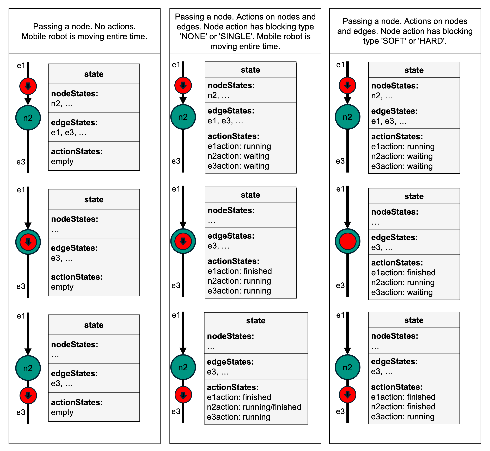
> **图 19**：订单执行过程中节点状态、边状态和动作状态的示意

### edgeStates

当前订单中需要遍历的边状态列表：

```json
{
  "edgeId": "edge-5",
  "sequenceId": 4,
  "edgeState": "TRAVERSING"
}
```

边状态：
| 状态 | 说明 |
|------|------|
| `TRAVERSING` | 正在遍历该边 |

### 节点/边遍历流程

1. 机器人到达节点，节点状态从 WAITING → REACHED
2. 如果节点有动作，触发动作执行
3. 触发下一个边的遍历
4. 边的边状态变为 TRAVERSING
5. 边的遍历完成后，触发下一个节点

#### allowedDeviationXY 椭圆定义

`allowedDeviationXY` 定义为节点位置周围的椭圆，以允许更灵活地接近节点。椭圆参数如下：

- `a`：椭圆半长轴长度（米）
- `b`：椭圆半短轴长度（米）
- `theta`：旋转角（从正水平轴到椭圆长轴的角度，在项目特定坐标系中）

当移动机器人的控制点进入椭圆范围内时，节点即可被视为已遍历。

如果 `a = b = 0.0`：不允许偏差，这意味着移动机器人应尽可能精确地到达或通过节点位置。


> **图 20**：allowedDeviation 椭圆

## 11.4 基线请求

移动机器人可以请求车队控制发布更多节点和边。请求通过在状态消息中包含 `baseRequest` 实现：

```json
{
  "baseRequest": {
    "requestId": "req-001",
    "type": "EXPAND_BASE"
  }
}
```

### 请求类型

| 类型 | 说明 |
|------|------|
| `EXPAND_BASE` | 请求扩展基线 |
| `RELEASE_NODES` | 请求释放特定节点 |

### 基线请求响应

车队控制通过发送订单更新响应基线请求，包含更多已发布的节点和边。

## 11.5 信息消息

信息消息用于传递非关键状态信息：

```json
{
  "information": [
    {
      "infoType": "LOCALIZATION",
      "infoLevel": "INFO",
      "description": "Localization quality good"
    }
  ]
}
```

### 信息类型

| 类型 | 说明 |
|------|------|
| `LOCALIZATION` | 定位相关信息 |
| `BATTERY` | 电池相关信息 |
| `SAFETY` | 安全相关信息 |
| `COMMUNICATION` | 通信相关信息 |
| `DEVICE` | 设备相关信息 |

### 信息级别

| 级别 | 说明 |
|------|------|
| `INFO` | 一般信息 |
| `WARNING` | 警告信息 |

## 11.6 错误处理

错误信息包含错误详情：

```json
{
  "errors": [
    {
      "errorType": "DEVICE_ERROR",
      "errorLevel": "WARNING",
      "errorMessage": "Battery level low",
      "errorCode": "E001",
      "errorReferences": [...]
    }
  ]
}
```

### 错误级别

错误分为四个级别：`WARNING`、`URGENT`、`CRITICAL` 和 `FATAL`。

- **`WARNING`**（警告）：不需要立即关注。移动机器人可以继续当前订单，也可以接受新订单。错误可能自我恢复，如 LiDar 扫描器脏污。
- **`URGENT`**（紧急）：需要立即关注，如电池电量低。移动机器人可以继续当前订单，也可以接受新订单。
- **`CRITICAL`**（严重）：需要立即关注，如尝试取货但货物不存在。移动机器人不应继续行驶，因为它无法继续当前订单，但可以接受新订单。
- **`FATAL`**（致命）：需要用户干预，如定位丢失。移动机器人不应继续行驶，既无法继续当前订单，也无法接受新订单。

移动机器人可以在 `errors` 数组中通过 `errorReferences` 添加有助于查找错误原因的引用。`errorDescription` 和 `errorHint` 字段可以提供人类可读的错误说明或建议的解决方案。

无论错误级别如何，移动机器人绝不应因此清除订单。

### 标准错误类型

| 错误类型 | 级别 | 说明 |
|----------|------|------|
| `VALIDATION_FAILURE` | WARNING | 订单验证失败 |
| `UNSUPPORTED_PARAMETER` | CRITICAL | 不支持的参数 |
| `INVALID_ORDER_ACTION` | WARNING | 无效订单动作 |
| `INVALID_INSTANT_ACTION` | WARNING | 收到不支持的即时动作 |
| `OUTDATED_ORDER_UPDATE` | WARNING | 过时的订单更新 |
| `SAME_ORDER_UPDATE_ID` | WARNING | 相同的订单更新ID |
| `OTHER_ORDER_ACTIVE` | WARNING | 有其他活动订单 |
| `START_NODE_OUT_OF_RANGE` | WARNING | 起始节点超出范围 |
| `NO_ROUTE_TO_TARGET` | WARNING | 无法到达目标 |
| `MOBILE_ROBOT_NOT_AVAILABLE` | WARNING | 机器人不可用 |
| `UNKNOWN_MAP_ID` | WARNING | 未知地图ID |
| `ORDER_UPDATE_FOLLOWING_CANCEL` | WARNING | 取消后的订单更新 |
| `NO_ORDER_TO_CANCEL` | WARNING | 没有可取消的订单 |
| `INSUFFICIENT_MEMORY` | URGENT | 机器人内存不足，无法处理接收到的订单 |
| `DUPLICATE_MAP` | WARNING | 收到已存在的地图（相同 mapId 和 mapVersion） |
| `DUPLICATE_ZONE_SET` | WARNING | 收到已存在的区域集（相同 zoneSetId） |
| `BLOCKED_ZONE_VIOLATION` | CRITICAL | 阻塞区域违规 |
| `OUTSIDE_OF_CORRIDOR` | CRITICAL | 走廊外 |
| `RELEASE_LOST` | CRITICAL | 释放丢失 |
| `ZONE_ACTION_CONFLICT` | CRITICAL | 区域行为与区域动作冲突 |
| `NODE_UNREACHABLE` | CRITICAL | 机器人无法到达订单中的节点 |
| `LOCALIZATION_ERROR` | FATAL | 机器人定位丢失 |

### 错误引用

如果错误是由错误的订单或执行失败引起的，移动机器人可以在 `errorReferences` 字段中返回有意义的错误引用，以帮助查找错误原因。错误引用可以包含以下信息：

- `headerId`
- 主题（`order` 或 `instantAction`）
- 如错误由订单更新引起：`orderId` 和 `orderUpdateId`
- 如错误由动作引起：`actionId`
- 如错误由错误的动作参数引起：参数列表

### 错误翻译

对于 `errorDescription` 和 `errorHint`，移动机器人可以通过 `errorDescriptionTranslations` 和 `errorHintTranslations` 数组提供翻译。每个翻译由 ISO 639-1 语言代码和对应的翻译文本组成。

## 11.7 运行模式

移动机器人可以报告不同的运行模式。对于常规订单执行，车队控制应完全控制移动机器人，但存在需要手动交互的情况。移动机器人通过 `operatingMode` 字段报告当前模式。

| 模式 | 说明 |
|------|------|
| `AUTOMATIC` | 自动驾驶模式。车队控制完全控制机器人，机器人根据车队控制的订单移动和执行动作。 |
| `SEMIAUTOMATIC` | 半自动模式。车队控制控制机器人，机器人根据车队控制的订单移动和执行动作。驾驶速度由 HMI 控制，转向由自动控制。 |
| `INTERVENED` | 干预模式。车队控制不控制机器人，机器人正确报告状态。HMI 可用于控制转向、速度和操纵装置。车队控制只能发送 `cancelOrder` 即时动作，但允许发送订单或订单更新以便在切回 AUTOMATIC 或 SEMIAUTOMATIC 后执行。机器人不应清除订单，但应清除所有区域请求。 |
| `MANUAL` | 手动模式。车队控制不控制机器人，不能发送订单或动作。HMI 可用于控制转向、速度和操纵装置。进入此模式时立即清除当前订单。 |
| `STARTUP` | 启动模式。机器人正在启动，未准备好接收订单。状态消息参数在启动完成前可能不完整或无效。 |
| `SERVICE` | 维护模式。授权人员可重新配置机器人。进入时清除当前订单。 |
| `TEACH_IN` | 示教模式。用于地图绘制等教学操作。进入时清除当前订单。 |

## 11.8 清除订单

在以下事件发生时，移动机器人应停止执行当前订单：

- 移动机器人将运行模式更改为 `MANUAL`、`STARTUP`、`SERVICE` 或 `TEACH_IN`
- 移动机器人从车队控制收到 `cancelOrder` 即时动作
- 移动机器人收到 `startHibernation` 即时动作

在这些情况下，移动机器人应清除当前订单，这意味着：

1. `actionStates` 中已安排的动作应被取消，并在 `actionStates` 中报告为 `FAILED`
2. `actionStates` 中正在运行的动作：
   - 如果可取消（`cancelAllowed = true`），应取消并报告为 `FAILED`
   - 如果不可取消（`cancelAllowed = false`），应继续报告 `RUNNING`，完成后报告相应状态（成功则 `FINISHED`，否则 `FAILED`）
3. `orderId`、`orderUpdateId`、`lastNodeId` 和 `lastNodeSequenceId` 的值保持不变
4. `nodeStates` 和 `edgeStates` 数组设置为空列表
5. 所有请求从状态中移除

只要订单的动作未处于 `FINISHED` 或 `FAILED` 状态，移动机器人就不应报告 `MANUAL`、`SERVICE` 或 `TEACH_IN` 运行模式。在报告这些模式之前，不应清空 `nodeStates` 和 `edgeStates`。

订单取消只能由车队控制触发。

## 11.9 空闲状态

如果移动机器人的 `nodeStates` 和 `edgeStates` 为空，且 `actionStates` 中的所有动作均为 `FINISHED` 或 `FAILED`，则移动机器人处于空闲状态。

- 新订单仅在移动机器人空闲时才能被接受
- 订单更新可以在移动机器人空闲时或订单执行过程中被接受
- 空闲时，移动机器人可以执行即时动作

## 11.10 动作状态

订单中定义的动作状态通过状态消息报告：

```json
{
  "actionStates": [
    {
      "actionId": "action-001",
      "actionType": "pick",
      "actionStatus": "RUNNING",
      "handle": "robot-arm-1"
    }
  ]
}
```

### 动作状态

| 状态 | 说明 |
|------|------|
| `WAITING` | 等待执行 |
| `INITIALIZING` | 初始化中 |
| `RUNNING` | 正在执行 |
| `PAUSED` | 已暂停 |
| `FINISHED` | 已完成 |
| `FAILED` | 失败 |
| `RETRIABLE` | 可重试 |

**动作状态转换示例**：

| 起始状态 → 目标状态 ↓ | WAITING | INITIALIZING | PAUSED | RUNNING | RETRIABLE | FAILED | FINISHED |
|---|---|---|---|---|---|---|---|
| **初始状态** | 排队等待后续执行 | 立即开始初始化（如即时动作） | - | 立即开始执行（如即时动作） | - | 即时动作执行失败（机器人无法识别或参数无效） | 动作立即完成（如设置参数） |
| **WAITING** | - | 需要准备工作（举升、传感器上电） | - | 无需准备 | - | 通过 cancel 中止，或切换到手动模式 | 到达节点/边后动作立即成功 |
| **INITIALIZING** | - | - | 外部触发 | 初始化完成，动作开始 | - | 初始化失败，通过 cancel 中止，或切换到手动模式 | - |
| **PAUSED** | - | 外部触发 | - | 外部触发 | - | 通过 cancelOrder 中止，或切换到手动模式 | - |
| **RUNNING** | - | - | 外部触发 | - | 动作未成功完成但可重试 | 通过 cancel 中止，切换到手动模式，或最终未返回期望结果 | 动作返回期望结果；可能因不可中断的动作在 cancelOrder 后仍需完成 |
| **RETRIABLE** | - | 通过 retry 重试动作，或外部触发 | - | 通过 retry 重试动作，或外部触发 | - | 通过 skipRetry 失败、通过 cancelOrder 失败、外部触发、切换到手动模式 | 操作员通过外部输入修复 |

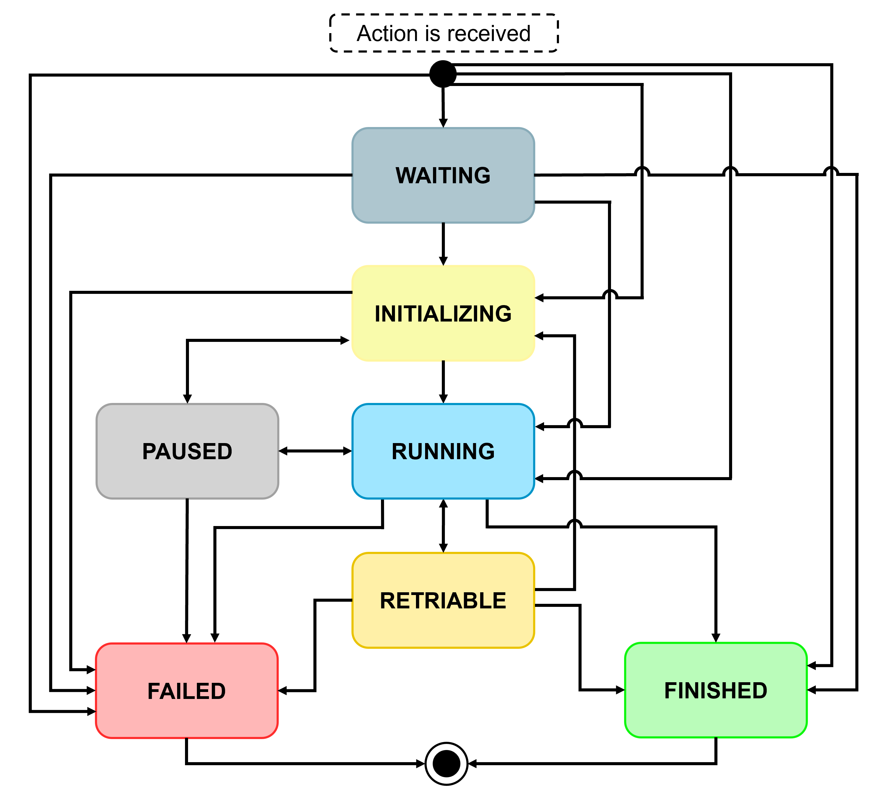
> **图 21**：所有可能的 actionStates 状态转换

### 即时动作状态

```json
{
  "instantActionStates": [
    {
      "actionId": "instant-001",
      "actionType": "startPause",
      "actionStatus": "FINISHED"
    }
  ]
}
```

### 视界中的动作报告

移动机器人的状态消息应始终反映其当前持有的订单的完整状态。因此，机器人应同时报告基线（已发布）和视界（未发布）中的动作状态。所有视界中的动作均报告为 `WAITING`。

如果移动机器人收到订单更新，其中部分旧视界被移除或更改，则所有附加到这些节点和边的动作应从 `actionStates` 中移除以反映这一变化。基线中的 `actionStates` 绝不应在订单更新过程中被移除，因为基线一旦发布就不能修改。

## 11.11 位置与速度

### 移动机器人位置

```json
{
  "mobileRobotPosition": {
    "x": 10.5,
    "y": 20.3,
    "theta": 1.57,
    "mapId": "map-001",
    "mapDescription": "Factory Floor 1"
  }
}
```

### 速度

```json
{
  "velocity": {
    "x": 0.5,
    "y": 0,
    "omega": 0
  }
}
```

## 11.12 负载状态

```json
{
  "loads": [
    {
      "loadId": "load-001",
      "loadPosition": "LHD1",
      "loadType": "EPAL"
    }
  ]
}
```

> 注意：如果移动机器人无法确定负载状态，此字段应完全省略。如果可以确定负载状态但数组为空，则认为移动机器人未装载。

## 11.13 地图与区域集状态

### 地图状态

```json
{
  "maps": [
    {
      "mapId": "map-001",
      "mapVersion": "1.0",
      "mapStatus": "ENABLED"
    }
  ]
}
```

地图状态值：
- `ENABLED`：可用
- `DISABLED`：不可用

### 区域集状态

```json
{
  "zoneSets": [
    {
      "zoneSetId": "zoneset-001",
      "mapId": "map-001",
      "zoneSetStatus": "ENABLED"
    }
  ]
}
```

## 11.14 能源状态

```json
{
  "powerSupply": {
    "stateOfCharge": 85,
    "charging": false,
    "range": 500
  }
}
```

## 11.15 暂停状态

```json
{
  "paused": true
}
```

- `true`：机器人当前处于暂停状态（通过物理按钮或即时动作）
- `false`：机器人当前未处于暂停状态

## 11.16 请求机制

移动机器人可以通过状态消息向车队控制发送请求。

### 11.16.1 区域释放请求

```json
{
  "zoneRequest": {
    "zoneId": "release-zone-1",
    "requestId": "req-001",
    "requestStatus": "REQUESTED"
  }
}
```

请求状态：
| 状态 | 说明 |
|------|------|
| `REQUESTED` | 已发送请求，等待批准 |
| `GRANTED` | 已获得批准 |
| `REVOKED` | 授权被撤销 |
| `REJECTED` | 请求被拒绝 |

### 11.16.2 走廊请求

如果当前活动订单中的走廊设置了 `releaseRequired: true` 标志，机器人在偏离边的预定义轨迹之前应发出请求。机器人应在状态消息中添加一个 `edgeRequest` 对象。`requestId` 应在所有请求（如 `zoneRequest`、`edgeRequest`）中保持唯一。

`requestStatus` 设置为 `REQUESTED`，`edgeId` 和 `sequenceId` 的组合引用机器人请求偏离的边轨迹。机器人可以同时请求多个走廊，只要它们属于当前基线的一部分。每个走廊的使用应在独立的 `edgeRequest` 中请求，并由车队控制通过 `responses` 主题单独批准。

车队控制只应为基线中的边释放走廊。机器人应保持在当前边的预定义轨迹上，直到收到车队控制的响应。一旦机器人收到批准开始调整路径，它将 `requestStatus` 设置为 `GRANTED`，然后可以使用走廊。

只要机器人需要走廊，它就应在状态中保留 `edgeRequest`。当机器人不再需要使用走廊时（例如成功完成避障），它通过从状态中移除相应的 `edgeRequest` 对象来通知车队控制。此后，机器人应重新作为循线导航机器人运行。如果希望再次偏离预定义轨迹，应发出新的 `edgeRequest`。

如果在避障过程中机器人到达当前边走廊的末端，并计划继续进入下一个走廊（尚未被释放），它应在其当前走廊的边界处停止，发送专用的边请求，并等待车队控制的批准。

如果机器人的批准根据响应的 `leaseExpiry` 过期，或者车队控制撤销了已批准的请求，机器人应启动边走廊的 `releaseLossBehavior` 中预定义的回退行为。释放丢失的恢复策略包括：机器人沿偏离路径返回边的预定义轨迹，或在当前位置停止并等待人工干预。

```json
{
  "edgeRequest": {
    "edgeId": "edge-001",
    "sequenceId": 3,
    "requestId": "req-002",
    "requestStatus": "REQUESTED"
  }
}
```

### 11.16.3 基线扩展请求

```json
{
  "baseRequest": {
    "requestId": "req-003",
    "type": "EXPAND_BASE"
  }
}
```

## 11.17 运行模式详细说明

| 运行模式 | 车队控制 | 状态消息有效 | 进入时清除订单 | 设置 lastNodeId 为空 | 清除区域请求 | 允许即时动作 | 允许订单 |
|----------|----------|--------------|----------------|---------------------|--------------|--------------|----------|
| `AUTOMATIC` | 是 | 是 | 否 | 否 | 否 | 是 | 是 |
| `SEMIAUTOMATIC` | 是 | 是 | 否 | 否 | 否 | 是 | 是 |
| `INTERVENED` | 否 | 是 | 否 | 否 | 是 | 仅 cancelOrder | 是 |
| `MANUAL` | 否 | 是 | 是 | 是¹ | 是 | 否 | 否 |
| `STARTUP` | 否 | 否 | 是 | 是 | 是 | 否 | 否 |
| `SERVICE` | 否 | 是 | 是 | 是 | 是 | 否 | 否 |
| `TEACH_IN` | 否 | 是 | 是 | 是 | 是 | 否 | 否 |

> ¹ 仅当机器人被移动到一个位置，使得当前 `lastNodeId` 的值无法作为新订单的起始节点时，才设置为空字符串。

- **AUTOMATIC**：车队控制完全控制机器人
- **SEMIAUTOMATIC**：车队控制控制机器人，但速度由HMI控制
- **INTERVENED**：车队控制不控制机器人，但状态正常报告
- **MANUAL**：手动模式，车队控制不能发送订单或动作
- **STARTUP**：启动模式，机器人正在启动
- **SERVICE**：维护模式，授权人员可重新配置机器人
- **TEACH_IN**：示教模式，用于地图绘制等

---

<div id="ch12"></div>

# 12. 可视化

可视化功能用于将移动机器人的位置和路径信息传输到可视化系统（如监控大屏、调试工具等）。

> 可视化功能是**可选的**。

## 12.1 可视化消息内容

移动机器人通过 `visualization` 主题发送高频位置和路径信息：

```json
{
  "headerId": 1,
  "timestamp": "2024-01-15T10:30:00.000Z",
  "version": "3.0.0",
  "manufacturer": "ManufacturerA",
  "serialNumber": "ROBOT-001",
  "position": {
    "x": 10.5,
    "y": 20.3,
    "theta": 1.57
  },
  "velocity": {
    "vx": 0.5,
    "vy": 0,
    "omega": 0
  },
  "plannedPath": {...},
  "intermediatePath": [...]
}
```

## 12.2 路径可视化

### plannedPath

机器人当前订单的规划路径，以 NURBS 曲线表示：

```json
{
  "plannedPath": {
    "type": "NURBS",
    "controlPoints": [...],
    "degree": 3
  }
}
```

### intermediatePath

机器人传感器感知到的近端路径点：

```json
{
  "intermediatePath": [
    {
      "x": 10.5,
      "y": 20.3,
      "orientation": 1.57
    }
  ]
}
```

## 12.3 使用场景

- 实时监控大屏
- 调试和诊断工具
- 路径规划和仿真系统
- 运营分析工具

---


<div id="ch13"></div>

# 13. 自由导航机器人的路径共享

对于自由导航的移动机器人，应通过状态消息将其规划的轨迹传达给车队控制系统。如需更高频率的共享，可使用 `visualization` 主题。

机器人共享其 `intermediatePath`（表示机器人通过传感器感知到的近端航点的预计到达时间）和 `plannedPath`（表示机器人当前活动订单内的较长路径）。两条路径都应从机器人当前位置开始，与订单中的任何节点无关。机器人可以根据实际情况决定共享路径的长度。

- `plannedPath` 定义为 NURBS 曲线，与 `edgeState` 中的 `trajectory` 字段定义相同。`plannedPath` 可以包含一个节点 ID 数组，标识将作为当前路径一部分被遍历的节点。应在机器人的 `plannedPath` 发生重大变化时更新。`plannedPath` 至少应覆盖机器人的当前基线。
- `intermediatePath` 定义为折线，由线性线段组成。每个航点由 `x`、`y` 位置、可选的机器人朝向（`theta`）和预计到达时间（`ETA`）组成。`intermediatePath` 应在每次发送状态或可视化消息时更新，并始终从机器人的当前位置开始。

`plannedPath` 和 `intermediatePath` 参数仅应用于机器人自行规划的轨迹。`edgeState` 中的轨迹字段仅应用于"确认"已在布局或订单中预先定义的轨迹。

---

<div id="ch14"></div>

# 14. 请求/响应机制

VDA 5050 定义了移动机器人向车队控制发送请求，车队控制响应的机制。

## 14.1 请求类型

### 14.1.1 区域释放请求

当移动机器人需要进入 `RELEASE` 类型区域时，需要向车队控制发送释放请求。

```json
{
  "zoneRequest": {
    "requestId": "req-001",
    "zoneId": "release-zone-1",
    "requestStatus": "REQUESTED"
  }
}
```

### 14.1.2 走廊使用请求

当订单中的走廊设置了 `releaseRequired: true` 时，机器人在使用走廊前需要请求批准。

```json
{
  "edgeRequest": {
    "requestId": "req-002",
    "edgeId": "edge-001",
    "sequenceId": 3,
    "requestStatus": "REQUESTED"
  }
}
```

### 14.1.3 基线扩展请求

机器人可以请求车队控制扩展基线，释放更多节点和边。

```json
{
  "baseRequest": {
    "requestId": "req-003",
    "type": "EXPAND_BASE"
  }
}
```

### 14.1.4 协调重规划请求

在 `COORDINATED_REPLANNING` 区域内，机器人需要请求车队控制批准才能重规划路径。

```json
{
  "replanningRequest": {
    "requestId": "req-004",
    "requestStatus": "REQUESTED",
    "reason": "obstacle_avoidance"
  }
}
```

## 14.2 响应消息

车队控制通过 `responses` 主题向移动机器人发送响应：

```json
{
  "headerId": 100,
  "timestamp": "2024-01-15T14:32:00.000Z",
  "version": "3.0.0",
  "manufacturer": "FleetController",
  "serialNumber": "FC-001",
  "responses": [
    {
      "requestId": "req-001",
      "requestType": "RELEASE_ZONE_ACCESS",
      "grantType": "GRANTED",
      "leaseExpiry": "2024-01-15T15:32:00.000Z"
    }
  ]
}
```

### 响应类型

| 类型 | 说明 |
|------|------|
| `GRANTED` | 请求已批准 |
| `QUEUED` | 请求已加入队列等待处理 |
| `REVOKED` | 撤销之前授予的请求 |
| `REJECTED` | 拒绝请求 |

## 14.3 请求处理流程

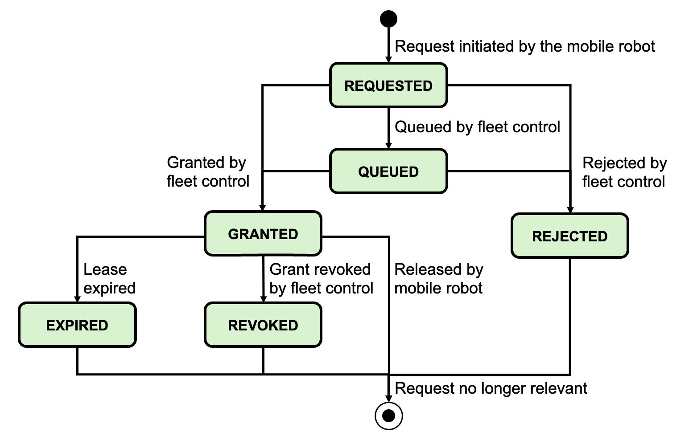

### 区域释放请求流程

1. 机器人进入 `RELEASE` 区域
2. 发送 `zoneRequest`，状态为 `REQUESTED`
3. 车队控制评估请求
4. 车队控制发送响应（GRANTED/QUEUED/REJECTED）
5. 机器人收到响应后更新状态

### 走廊请求流程

1. 订单中边包含 `releaseRequired: true` 的走廊
2. 机器人需要偏离预定义轨迹时
3. 发送 `edgeRequest`，状态为 `REQUESTED`
4. 车队控制批准（仅限基线中的边）
5. 机器人收到 `GRANTED` 响应后可以使用走廊
6. 不再需要时，机器人从状态中移除请求

## 14.4 授权过期与撤销

### 过期处理

响应消息中包含 `leaseExpiry` 时间戳。当授权过期时：

- **RELEASE 区域**：根据 `releaseLossBehavior` 执行 'STOP'、'EVACUATE' 或 'CONTINUE'
- **走廊**：返回预定义轨迹或停在当前位置等待干预

### 撤销处理

车队控制可以随时发送 `grantType: REVOKED` 的响应撤销已授予的请求，机器人收到后执行相应的回退行为。

## 14.5 请求超时

机器人应设置请求超时：

- 如果在合理时间内未收到响应，报告错误
- 可以重试请求或执行回退行为

## 14.6 多个请求

机器人可以同时发送多个请求，每个请求使用唯一的 `requestId`，请求之间相互独立，车队控制按需处理和响应。

<div id="ch15"></div>

# 15. 信息单 (Factsheet)

`factsheet` 主题用于移动机器人向车队控制提供参数和供应商特定信息，以协助车队控制对移动机器人进行设置。

> 信息单是**必选**的。

## 15.1 Factsheet 消息格式

```json
{
  "headerId": 1,
  "timestamp": "2024-01-15T10:30:00.000Z",
  "version": "3.0.0",
  "manufacturer": "ManufacturerA",
  "serialNumber": "ROBOT-001",
  "factsheet": {
    "manufacturer": "ManufacturerA",
    "serialNumber": "ROBOT-001",
    "robotType": "AGV",
    "robotModel": "Model-X",
    "description": "Standard warehouse AGV"
  }
}
```

## 15.2 主要信息类别

### 15.2.1 基本信息

| 字段 | 说明 |
|------|------|
| `manufacturer` | 制造商 |
| `serialNumber` | 序列号 |
| `robotType` | 机器人类型 (AGV/AMR) |
| `robotModel` | 型号 |

### 15.2.2 物理规格

| 字段 | 说明 |
|------|------|
| `dimensions.length` | 长度 (米) |
| `dimensions.width` | 宽度 (米) |
| `dimensions.height` | 高度 (米) |
| `weight` | 重量 (千克) |
| `maxLoad` | 最大负载 (千克) |

### 15.2.3 运动能力

| 字段 | 说明 |
|------|------|
| `maxSpeed` | 最大速度 (米/秒) |
| `maxAcceleration` | 最大加速度 (米/秒²) |
| `maxDeceleration` | 最大减速度 (米/秒²) |
| `minTurningRadius` | 最小转弯半径 (米) |

### 15.2.4 电池与能源

| 字段 | 说明 |
|------|------|
| `batteryType` | 电池类型 |
| `batteryCapacity` | 电池容量 (Wh) |
| `chargingTypes` | 支持的充电方式 |
| `chargingTime` | 充电时间 (小时) |

### 15.2.5 导航方式

| 字段 | 说明 |
|------|------|
| `navigationType` | 导航类型 (SLAM/循线/混合) |
| `localizationTypes` | 定位方式 |
| `mapFormats` | 支持的地图格式 |

### 15.2.6 动作能力

| 字段 | 说明 |
|------|------|
| `supportedActions` | 支持的动作列表 |
| `actionParameters` | 各动作的默认参数 |
| `loadHandlingTypes` | 载具处理类型 |

### 15.2.7 通信能力

| 字段 | 说明 |
|------|------|
| `mqttVersion` | MQTT 版本 |
| `protocolVersion` | VDA 5050 协议版本 |
| `qosSupport` | 支持的 QoS 级别 |

## 15.3 发送时机

- 首次连接时
- 配置变更后
- 响应车队控制请求时（`factsheetRequest` 即时动作）

## 15.4 更新机制

车队控制可以请求重新发送 factsheet：
- 系统启动时
- 定期更新
- 异常状态后

所有 factsheet 主题上的消息应使用 `retained` 标志发送。

## 15.5 协议限制 (protocolLimits)

以下参数定义了移动机器人的协议通信限制：

**最大字符串长度**

| 字段 | 说明 |
|------|------|
| `maximumMessageLength` | 最大 MQTT 消息长度 |
| `maximumTopicSerialLength` | MQTT 主题中序列号部分的最大长度 |
| `maximumIdLength` | ID 字符串的最大长度 |

**最大数组长度**

| 字段 | 说明 |
|------|------|
| `order.nodes` | 移动机器人可处理的每订单最大节点数 |
| `order.edges` | 移动机器人可处理的每订单最大边数 |
| `node.actions` | 移动机器人可处理的每个节点最大动作数 |
| `edge.actions` | 移动机器人可处理的每条边最大动作数 |
| `state.nodeStates` | 移动机器人发送的最大节点状态数 |
| `state.edgeStates` | 移动机器人发送的最大边状态数 |

**时序**

| 字段 | 说明 |
|------|------|
| `minimumOrderInterval` | 向移动机器人发送订单消息的最小间隔（秒） |
| `minimumStateInterval` | 发送状态消息的最小间隔（秒） |

## 15.6 协议特性 (protocolFeatures)

移动机器人通过 factsheet 声明支持的顺序参数、动作和参数：

- **optionalParameters**：支持的/必需的可选参数列表
- **mobileRobotActions**：移动机器人支持的所有动作数组，包含 actionScopes（INSTANT/NODE/EDGE/ZONE）、actionParameters、blockingTypes、pauseAllowed、cancelAllowed 等

## 15.7 移动机器人几何 (mobileRobotGeometry)

| 字段 | 说明 |
|------|------|
| `wheelDefinitions[]` | 车轮定义数组（类型、驱动/转向、位置、直径、宽度） |
| `envelopes2d[]` | 2D 包络曲线数组 |
| `envelopes3d[]` | 3D 包络曲线数组 |

## 15.8 负载规格 (loadSpecification)

| 字段 | 说明 |
|------|------|
| `loadPositions` | 负载位置/负载处理设备数组 |
| `loadSets[]` | 负载集数组（loadType、boundingBoxReference、loadDimensions、maximumWeight、pickTime、dropTime 等） |

## 15.9 移动机器人配置 (mobileRobotConfiguration)

| 字段 | 说明 |
|------|------|
| `versions` | 软件/硬件版本信息 |
| `network` | 网络配置（dnsServers、ntpServers、localIpAddress、netmask、defaultGateway） |
| `batteryCharging` | 电池充电参数（criticalLowChargingLevel、maximumDesiredChargingLevel、minimumDesiredChargingLevel、minimumChargingTime） |

---

<div id="ch16"></div>

# 16. 消息规格

## 16.1 表格符号与格式说明

### 必填与可选字段

- **粗体字段**：必填字段
- *斜体字段*：可选字段

### 允许的字符和字段长度

- 字符串字段的最大长度在各字段说明中定义
- 允许的字符：数字、字母、下划线、连字符等（见各字段规范）

### 字段、主题和枚举的表示法

本文档中的主题和字段以如下样式高亮显示：`exampleField` 和 `exampleTopic`。
枚举值应使用大写字母书写，单词之间用下划线分隔，例如：'EXAMPLE_ENUMERATION'。在文档中，这些值用单引号括起来。
这包括 `actionStatus` 字段中的关键字（如 'WAITING'、'FINISHED' 等）。
可扩展枚举（extensible enum）包含但不限于该参数预定义的值。

### JSON 数据类型

| 类型 | 说明 |
|------|------|
| `string` | 字符串 |
| `uint32` | 32位无符号整数 |
| `int32` | 32位有符号整数 |
| `float64` | 64位浮点数 |
| `boolean` | 布尔值 |
| `array` | 数组 |
| `object` | JSON 对象 |
| `enum` | 枚举值 |

## 16.2 协议头部

每个消息都包含相同的协议头部：

| 字段 | 类型 | 说明 |
|------|------|------|
| `headerId` | uint32 | 消息头部ID，每个主题独立递增 |
| `timestamp` | string | 时间戳 (ISO 8601, UTC) |
| `version` | string | 协议版本 [Major].[Minor].[Patch] |
| `manufacturer` | string | 移动机器人制造商 |
| `serialNumber` | string | 移动机器人序列号 |

> 时间戳格式：`YYYY-MM-DDTHH:mm:ss.fffZ`（如：`2017-04-15T11:40:03.123Z`）

## 16.3 Order 消息

```json
{
  "header": {...},
  "orderId": "string",
  "orderUpdateId": 0,
  "nodes": [
    {
      "nodeId": "string",
      "sequenceId": 0,
      "released": true,
      "nodeDescriptor": "string",
      "actions": [...]
    }
  ],
  "edges": [
    {
      "edgeId": "string",
      "sequenceId": 1,
      "released": true,
      "edgeDescriptor": "string",
      "actions": [...],
      "fromNodeId": "string",
      "toNodeId": "string"
    }
  ]
}
```

### Order 消息字段说明

| 字段 | 数据类型 | 说明 |
|------|----------|------|
| `headerId` | uint32 | 消息头部ID |
| `timestamp` | string | 时间戳 (ISO 8601, UTC) |
| `version` | string | 协议版本 |
| `manufacturer` | string | 制造商 |
| `serialNumber` | string | 序列号 |
| `orderId` | string | 订单标识，用于标识属于同一订单的多个消息 |
| `orderUpdateId` | uint32 | 订单更新标识，每个 orderId 唯一递增，从 0 开始 |
| `nodes[]` | array | 节点对象数组 |
| `edges[]` | array | 边对象数组 |

**节点对象 (node)**

| 字段 | 数据类型 | 说明 |
|------|----------|------|
| `nodeId` | string | 节点唯一标识 |
| `sequenceId` | uint32 | 在节点和边之间共享的序号，定义遍历顺序 |
| `released` | boolean | true=基线，false=视界 |
| `nodePosition` | object | 节点位置（可选） |
| `actions[]` | array | 要在节点上执行的动作数组 |

**节点位置 (nodePosition)**

| 字段 | 单位 | 数据类型 | 说明 |
|------|------|----------|------|
| `x` | m | float64 | 在项目特定坐标系中的 X 坐标 |
| `y` | m | float64 | 在项目特定坐标系中的 Y 坐标 |
| `theta` | rad | float64 | 节点朝向，范围 [-Pi ... Pi] |
| `allowedDeviationXY` | m | object | 允许偏差椭圆定义（a, b, theta） |
| `allowedDeviationTheta` | rad | float64 | 可选。节点朝向允许偏差范围 [0.0 ... Pi]。最低可接受角度为 theta - allowedDeviationTheta，最高为 theta + allowedDeviationTheta。若为 0.0 表示不允许偏差 |
| `mapId` | | string | 位置引用的地图标识 |

**边对象 (edge)**

| 字段 | 单位 | 数据类型 | 说明 |
|------|------|----------|------|
| `edgeId` | string | | 边的唯一标识 |
| `sequenceId` | uint32 | | 序号，与节点共享 |
| `released` | boolean | | true=基线，false=视界 |
| `maximumSpeed` | m/s | float64 | 边上允许的最大速度（可选） |
| `orientation` | rad | float64 | 边上移动机器人的朝向（可选） |
| `trajectory` | | object | 该边的 NURBS 轨迹（可选） |
| `corridor` | | object | 走廊定义（leftWidth, rightWidth, releaseRequired 等）（可选） |
| `length` | m | float64 | 从起始节点到结束节点的路径长度（可选） |
| `actions[]` | | array | 要在边上执行的动作数组 |

## 16.4 InstantAction 消息

即时动作消息用于发送需要立即执行的动作：

```json
{
  "header": {...},
  "instantActions": [
    {
      "actionType": "string",
      "actionId": "string",
      "blockingType": "NONE|SINGLE|SOFT|HARD",
      "actionParameters": [...],
      "retriable": false
    }
  ]
}
```

## 16.5 Response 消息

车队控制对移动机器人请求的响应：

```json
{
  "header": {...},
  "responses": [
    {
      "requestId": "string",
      "requestType": "string",
      "grantType": "GRANTED|QUEUED|REVOKED|REJECTED",
      "leaseExpiry": "string"
    }
  ]
}
```

| 类型 | 说明 |
|------|------|
| `GRANTED` | 请求已批准 |
| `QUEUED` | 请求已加入队列，等待处理 |
| `REVOKED` | 撤销之前授予的请求 |
| `REJECTED` | 拒绝请求 |

## 16.6 ZoneSet 消息

区域集消息：

```json
{
  "header": {...},
  "zoneSet": {
    "mapId": "string",
    "zoneSetId": "string",
    "zoneSetDescriptor": "string",
    "zones": [...]
  }
}
```

## 16.7 Connection 消息

连接状态消息：

```json
{
  "header": {...},
  "connectionState": "ONLINE|OFFLINE|HIBERNATING|CONNECTION_BROKEN"
}
```

## 16.8 可视化消息

| 字段 | 数据类型 | 说明 |
|------|----------|------|
| `headerId` | uint32 | 消息头部ID，每个主题独立递增 |
| `timestamp` | string | 时间戳 (ISO 8601, UTC) |
| `version` | string | 协议版本 [Major].[Minor].[Patch] |
| `manufacturer` | string | 移动机器人制造商 |
| `serialNumber` | string | 移动机器人序列号 |
| `referenceStateHeaderId` | uint32 | 此可视化消息所引用的状态消息的 headerId |
| `plannedPath` | object | 机器人当前活动订单内的规划路径（NURBS） |
| `intermediatePath` | object | 机器人传感器感知到的近端路径点（折线） |
| `mobileRobotPosition` | object | 移动机器人在地图上的当前位置 |
| `velocity` | object | 移动机器人在其坐标系中的速度 |

## 16.9 错误代码

标准错误代码：

| 错误代码 | 说明 |
|----------|------|
| `E001` | 电池电量低 |
| `E002` | 电池故障 |
| `E003` | 电机故障 |
| `E004` | 传感器故障 |
| `E005` | 通信错误 |
| `E006` | 定位失败 |
| `E007` | 导航错误 |
| `E008` | 安全区域入侵 |
| `E009` | 动作执行失败 |
| `E010` | 系统错误 |

## 16.10 枚举值汇总

| 枚举类 | 值 |
|--------|-----|
| 连接状态 | `ONLINE`, `OFFLINE`, `HIBERNATING`, `CONNECTION_BROKEN` |
| 运行模式 | `AUTOMATIC`, `SEMIAUTOMATIC`, `INTERVENED`, `MANUAL`, `STARTUP`, `SERVICE`, `TEACH_IN` |
| 动作状态 | `WAITING`, `INITIALIZING`, `RUNNING`, `PAUSED`, `FINISHED`, `FAILED`, `RETRIABLE` |
| 阻塞类型 | `NONE`, `SINGLE`, `SOFT`, `HARD` |
| 区域类型 | `BLOCKED`, `LINE_GUIDED`, `RELEASE`, `COORDINATED_REPLANNING`, `SPEED_LIMIT`, `ACTION`, `PRIORITY`, `PENALTY`, `DIRECTED`, `BIDIRECTED` |
| 响应类型 | `GRANTED`, `QUEUED`, `REVOKED`, `REJECTED` |

---

<div id="glossary"></div>

# 术语表

本术语表汇总了 VDA 5050 标准中使用的关键术语及其中文翻译。

## A

| 英文 | 中文 | 说明 |
|------|------|------|
| AGV | 自动化导引车 | Automated Guided Vehicle |
| AMR | 自主移动机器人 | Autonomous Mobile Robot |

## B

| 英文 | 中文 | 说明 |
|------|------|------|
| Base | 基线 | 已发布的节点和边的集合，定义机器人可以行驶的路径 |
| Blocking Type | 阻塞类型 | 动作执行时允许的其他行为类型 |

## C

| 英文 | 中文 | 说明 |
|------|------|------|
| Corridors | 走廊 | 车队控制为移动机器人定义的精确行驶边界 |

## E

| 英文 | 中文 | 说明 |
|------|------|------|
| Edge | 边 | 订单图中连接两个节点的路径段 |
| Edge State | 边状态 | 边的当前执行状态 |

## F

| 英文 | 中文 | 说明 |
|------|------|------|
| Factsheet | 信息单 | 移动机器人向车队控制提供的参数和供应商信息 |
| Fleet Control | 车队控制 | 负责协调和管理多个移动机器人的中央控制系统 |

## H

| 英文 | 中文 | 说明 |
|------|------|------|
| Horizon | 视界 | 未发布的节点和边的集合，表示未来规划路径 |

## L

| 英文 | 中文 | 说明 |
|------|------|------|
| LIF | 布局交换格式 | Layout Interchange Format，用于路线导入导出 |
| Line-guided | 循线导航 | 遵循预定义轨迹的导航方式 |

## M

| 英文 | 中文 | 说明 |
|------|------|------|
| MQTT | 消息队列遥测传输 | 轻量级消息传输协议 |
| Map | 地图 | 描述环境的二维或三维表示 |

## N

| 英文 | 中文 | 说明 |
|------|------|------|
| Node | 节点 | 订单图中的顶点，表示机器人需要到达的位置 |
| Node State | 节点状态 | 节点的当前执行状态 |

## O

| 英文 | 中文 | 说明 |
|------|------|------|
| Order | 订单 | 车队控制发送给移动机器人的任务指令 |
| Order Update | 订单更新 | 对现有订单的修改或扩展 |
| Order ID | 订单标识 | 订单的唯一标识符 |
| Order Update ID | 订单更新标识 | 订单更新的序列号 |

## Q

| 英文 | 中文 | 说明 |
|------|------|------|
| QoS | 服务质量 | MQTT 的服务质量级别 |

## R

| 英文 | 中文 | 说明 |
|------|------|------|
| Released | 已发布 | 允许机器人遍历的节点或边状态 |
| Request/Response | 请求/响应 | 移动机器人和车队控制之间的通信机制 |

## S

| 英文 | 中文 | 说明 |
|------|------|------|
| Sequence ID | 序列号 | 定义节点和边遍历顺序的标识 |
| State | 状态 | 移动机器人向车队控制报告的当前信息 |

## Z

| 英文 | 中文 | 说明 |
|------|------|------|
| Zone | 区域 | 地图上的逻辑分区，用于定义约束 |
| Zone Set | 区域集 | 区域集合，与特定地图关联 |

---

<div id="faq"></div>

# 常见问题

关于 VDA 5050 标准的常见问题解答。

## 基础问题

### Q1: VDA 5050 是什么？

VDA 5050 是德国汽车工业协会（VDA）发布的标准，定义了自动化导引车（AGV）和自主移动机器人（AMR）与车队控制系统之间的通信接口。该标准基于 MQTT 协议和 JSON 格式，旨在实现不同厂商设备之间的互操作性。

### Q2: VDA 5050 和 ROS/ROS2 是什么关系？

VDA 5050 是一种通信标准，而 ROS（机器人操作系统）是一种软件框架。两者可以结合使用：
- VDA 5050 定义了设备间的通信格式
- ROS/ROS2 可以在设备内部作为软件框架
- 已有多个开源项目（如 vda5050_msgs）提供了 ROS 包来实现 VDA 5050

### Q3: VDA 5050 是免费使用的吗？

是的，VDA 5050 是公开的标准，可以免费使用。官方 GitHub 仓库提供了完整的规范文档和 JSON Schema。

### Q4: VDA 5050 和 OPC UA 哪个更好？

两者适用于不同的场景：
- **VDA 5050**：专为 AGV/AMR 设计，基于 MQTT，更轻量
- **OPC UA**：更通用的工业通信标准，功能更丰富但更复杂

选择取决于具体应用需求。

## 技术问题

### Q5: MQTT QoS 如何选择？

VDA 5050 推荐：
- **QoS 0**：适用于大多数主题（order, state, instantActions 等），因为状态消息会频繁发送，丢失个别消息影响不大
- **QoS 1**：适用于 connection 主题，确保连接状态变化不会丢失

### Q6: 如何处理订单更新冲突？

当机器人正在执行订单时收到新的订单更新：
1. 基线部分不可更改（已执行的路径）
2. 视界部分可以更新
3. 机器人继续执行基线直到决策点
4. 等待新的视界扩展

### Q7: 机器人断开连接后会发生什么？

根据 VDA 5050 规范：
1. 机器人保留所有订单信息
2. 继续执行到最后一个已发布节点
3. Broker 会发送 Last Will 消息通知车队控制
4. 恢复连接后等待新指令

### Q8: 如何实现多机器人交通协调？

VDA 5050 本身不包含交通管理逻辑，但提供了支持机制：
- 区域（Zones）可以限制机器人行为
- 订单中的释放（released）机制控制机器人行进
- 状态消息帮助车队控制了解机器人位置

### Q9: 机器人如何报告错误？

通过 State 消息的 `errors` 字段：
```json
{
  "errors": [
    {
      "errorType": "DEVICE_ERROR",
      "errorLevel": "ERROR",
      "errorMessage": "详细描述",
      "errorCode": "E001"
    }
  ]
}
```

### Q10: 支持哪些动作类型？

VDA 5050 定义了标准动作类型（如 pick, drop, charge），也允许厂商自定义动作。完整动作列表和参数定义请参考[第 7 章](#ch07)。

## 实施问题

### Q11: 实施 VDA 5050 需要什么？

1. MQTT Broker（如 Mosquitto, EMQX）
2. 支持 VDA 5050 的机器人或适配器
3. 车队控制系统

### Q12: 有哪些开源实现可用？

- **vda5050_msgs**：ROS 消息定义
- **coatyio/vda-5050-lib.js**：JavaScript/TypeScript 库
- **openTCS**：开源车队控制系统，有 VDA 5050 适配器

### Q13: 如何验证实现的正确性？

1. 使用官方提供的 JSON Schema 进行验证
2. 参考官方 GitHub 的示例消息
3. 使用现有的模拟器进行测试（如 vda5050_vehicle_simulator）

### Q14: VDA 5050 版本如何演进？

采用语义化版本：
- 主版本：不兼容的 API 变更
- 次版本：向后兼容的新功能
- 补丁版本：向后兼容的问题修复

建议始终使用最新稳定版本。

### Q15: 如何获取官方规范文档？

从 VDA 5050 官方 GitHub 仓库获取：
- 英文规范：`VDA5050_EN.md`
- JSON Schema：`json_schemas/` 目录
- 地址：https://github.com/VDA5050/VDA5050

---

---

# 参考文献

| 文档 | 版本 | 说明 |
|------|------|------|
| ISO 3691-4 | 2023-12 | Industrial Trucks Safety Requirements and Verification-Part 4: Driverless trucks and their systems |
| ISO 9787 | 2013-05 | Robots and robotic devices — Coordinate systems and motion nomenclatures |
| ISO 639 | 2023-11 | Language code for the representation of the world's languages and language groups |
| ISO 8601 | 2019-02 | Date and time — Representations for information interchange |
| LIF – Layout Interchange Format | 2024-03 | Definition of a format of track layouts for exchange between the integrator of the driverless transport mobile robots and a (third-party) fleet control system |

---