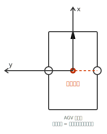
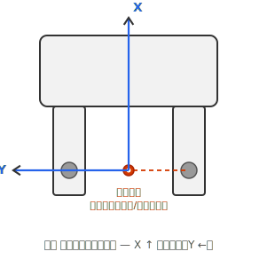
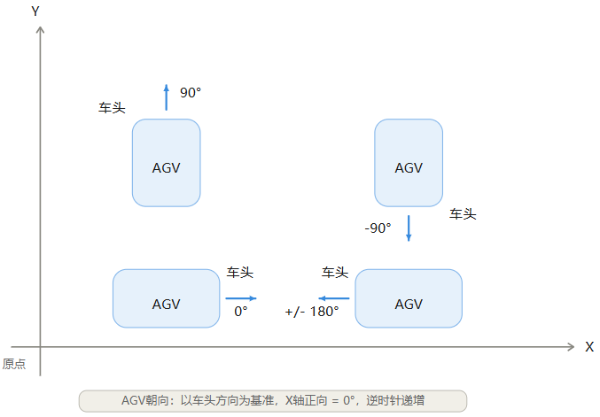
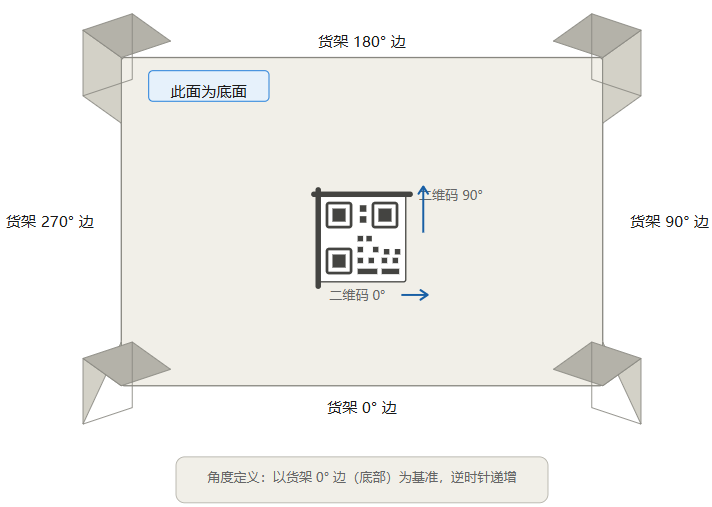
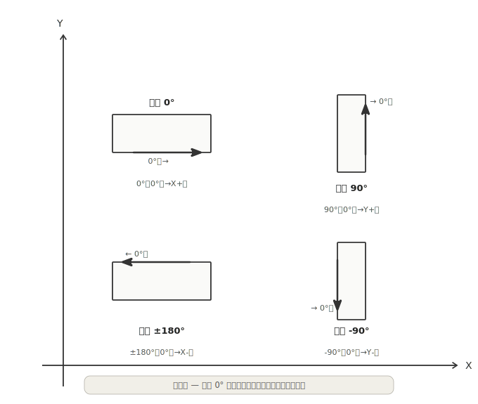
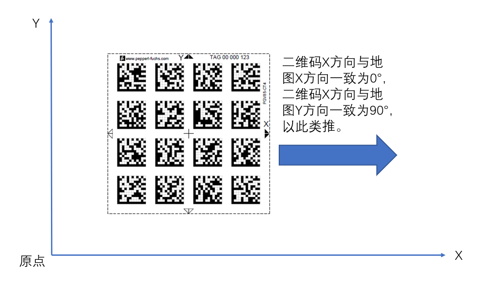

# VDA5050 3.0 协议接口手册（临工智科版）

> 本文档基于 VDA5050-V3.0.0 标准规范，结合临工智科实际接入需求编写。
> 涵盖坐标系定义、AGV朝向、货架背码部署、二维码贴码规范及完整的消息规格说明。

---

# 1 坐标系说明

## 1.1 地图坐标系

坐标系与 VDA5050 协议定义一致，采用**笛卡尔坐标系**。

| 项目 | 说明 |
|------|------|
| 坐标类型 | 笛卡尔坐标系（**右手系**），Z 轴朝上 |
| 位置单位 | 米（m），毫米精度，保留3位小数 |
| 角度单位 | 弧度（rad），范围 [-π ... π]，正旋转为逆时针 |
| 原点 | 项目特定的全局坐标原点，所有地图共享同一原点 |
| 坐标平移 | 支持整体进行平移（实际坐标可正可负，不限于第一象限） |

> 表 1：地图坐标系参数说明
```
位置: (-1.011, 2.002)
角度: 1.570 rad（约 90°）
```


> 图 1：地图笛卡尔坐标系示意，X 轴向右，Y 轴向上，角度以 X 轴正向为基准逆时针递增。

## 1.2 多楼层支持

每个楼层拥有独立的地图（`mapId` 标识），但所有地图使用相同的项目特定全局坐标原点。当 AGV 使用电梯跨楼层移动时：

- 从出发楼层的地图上消失
- 在目标楼层地图的对应电梯节点上重新出现

## 1.3 设备本体坐标系

AGV/AMR 自身也采用**右手坐标系**（符合 ISO 9787 标准）：

| 项目 | 说明 |
|------|------|
| 参考标准 | ISO 9787（机器人与机器人装置——坐标系与运动命名） |
| 右手定则 | X→Y→Z 三轴满足右手螺旋关系 |
| X 轴 | 指向移动机器人的**前进方向**（车头方向） |
| Y 轴 | 由右手定则确定（X 正方向逆时针旋转 90°） |
| Z 轴 | **朝上**（指向天顶） |
| 正旋转方向 | 绕 Z 轴逆时针（从上方看），对应 theta 增大方向 |
| 参考点 | 在机器人参考系中定义为 (0,0,0)，除非另有说明 |

> 表 2：设备本体坐标系参数拇指指向 Z 轴正方向（朝上），四指弯曲方向即为正旋转方向（逆时针），对应角度 theta 从 X 轴正向逆时针递增。

> 地图坐标系与设备本体坐标系均为右手系，差异仅在于原点不同：**地图坐标系**以项目全局原点为准，**设备本体坐标系**以设备自身参考点为准。

## 1.4 设备坐标系原点

设备本体坐标系的原点即为设备的**旋转中心**。不同车型的原点位置不同：

| 设备类型 | 原点位置 | 说明 |
|----------|----------|------|
| **AGV/AMR** | **物理中心** | 车体轮廓的几何中心 |
| **叉车** | **两个后轮中心连线中点** | 叉车绕后轮中心旋转 |

> 表 3：设备坐标系原点定义
AGV/AMR 的旋转中心位于车体的**物理中心**（几何中心），即中间两个制动轮的矩形中心点。



> 图 2：AGV 俯视图——设备坐标系原点位于物理中心（旋转中心），X 轴指向车头方向。

### 1.4.2 叉车原点——后轮中心

叉车的旋转中心位于**两个后轮中心连线的中点**。叉车行进时后轮为转向轮，前轮为驱动轮，转弯时车体绕后轮中心旋转。



> 图 3：叉车俯视图——设备坐标系原点位于两个后轮中心连线中点（旋转中心），X 轴指向叉齿方向。

---

# 2 AGV 朝向定义

## 2.1 朝向基准

AGV 的**车头方向**即为 AGV **0° 方向**。AGV 车头方向与 X 轴的夹角，就是 AGV 当前的朝向角度。

| 项目 | 设备内部 | VDA5050 协议上报 |
|------|----------|------------------|
| 角度范围 | 0° ~ 360° | -π ~ +π（弧度） |
| 正方向 | 车头朝向 | 同设备内部定义 |
| 转换 | — | 由设备内部完成转换 |

> 表 4：AGV 朝向基准定义
下图展示 AGV 在 XY 坐标系中的四种标准朝向姿态：



> 图 4：AGV 四种标准朝向——以车头方向为基准，X 轴正向 = 0°，**逆时针**递增。

| 朝向 | 角度值 | 车头指向 | 说明 |
|------|--------|----------|------|
| 0° | 0 | → 右（X轴正向） | 默认前进方向 |
| 90° | π/2 | ↑ 上（Y轴正向） | 车头向上 |
| -90° | -π/2 | ↓ 下（Y轴负向） | 车头向下 |
| ±180° | ±π | ← 左（X轴负向） | 车头向后 |

> 表 5：货架四种摆放朝向
- **节点朝向 (`nodePosition.theta`)**：AGV 到达节点时应匹配的绝对朝向
- **边朝向 (`edge.orientation`)**：AGV 在边上的行驶朝向
  - `orientationType = 'GLOBAL'`：相对于全局地图坐标系
  - `orientationType = 'TANGENTIAL'`：相对于边的轨迹切线方向（0° = 前进，π = 后退）
- **实时位姿 (`state.mobileRobotPosition.theta`)**：AGV 当前上报的实际朝向

---

# 3 货架朝向与角度定义

## 3.1 货架底面四边角度

货架底面以**俯视视角**定义四条边对应的基准角度，用于描述货架在世界坐标系中的摆放朝向。货架的 **0° 边指向哪个方向**，货架在地图坐标系中就是对应的角度。



> 图 5：货架底面坐标定义示意图——展示四边角度、二维码位置及朝向。

### 货架在地图坐标系中的四种摆放朝向（俯视图）



> 图 6：俯视图——货架 0° 边指向方向即为货架在地图坐标系中的角度值。

| 摆放角度 | 0° 边指向 | 说明 |
|----------|-----------|------|
| 0° | → X 轴正向 | 货架 0° 边朝右 |
| 90° | ↑ Y 轴正向 | 货架 0° 边朝上 |
| ±180° | ← X 轴负向 | 货架 0° 边朝左 |
| -90° | ↓ Y 轴负向 | 货架 0° 边朝下 |

> 表 6：货架四边角度定义

### 四边角度定义

| 边 | 角度 | 说明 |
|----|------|------|
| 底部边 | **0°** | 基准边，角度计算的起始参考 |
| 右侧边 | **90°** | 从 0° 边逆时针旋转 90° |
| 顶部边 | **180°** | 从 0° 边逆时针旋转 180° |
| 左侧边 | **270°** | 从 0° 边逆时针旋转 270°（或 -90°） |

> 表 7：二维码在货架上的朝向

## 3.2 二维码在货架上的朝向

货架底面中心贴附二维码时，二维码自身也有独立的朝向定义：

| 二维码朝向 | 角度 | 箭头指向 |
|-----------|------|----------|
| 二维码 0° | 0° | → 向右（沿货架底部边方向） |
| 二维码 90° | 90° | ↑ 向上（垂直于货架底部边） |

> 表 8：二维码轴向与地图坐标映射

## 3.3 货架背码部署规范

> 为使潜伏式 AGV 在取货架过程中车体与货架位置保持相对准确，需要在**货架背面**部署二维码（背码）。

**关键要求：**

1. **贴码面：** 货架的底面（即朝向地面的一面）
2. **位置：** 货架底面的中心区域
3. **方向约束：** 二维码的 **X 方向需与货架长边保持水平**（平行于 0° 边或 180° 边）
4. **RCS 配置：** 需在 RCS 地图中对应库位点开启**背码矫正功能**

---

# 4 二维码贴码部署

## 4.1 二维码阵列与坐标系对齐

当现场使用二维码阵列（如 DataMatrix 码阵）作为定位地标时，二维码的排布需与全局地图坐标系严格对齐。



> 图 7：二维码阵列贴码部署示意——二维码 X/Y 方向与地图坐标系的对应关系。

## 4.2 二维码轴向与地图坐标的映射

| 二维码方向 | 对应地图轴 | 对应角度 | 说明 |
|-----------|-----------|----------|------|
| 二维码 **X** 方向 | 地图 **X** 方向 | **0°** | 二维码 X 轴与地图 X 轴一致时为 0° |
| 二维码 **Y** 方向 | 地图 **Y** 方向 | **90°** | 二维码 Y 轴与地图 Y 轴一致时为 90° |

> 表 9：二维码轴向与地图轴对应关系

## 4.3 贴码注意事项

1. **平整度：** 二维码应贴附在平整、无变形的表面上
2. **清洁度：** 保持表面清洁，避免遮挡或污损
3. **唯一性：** 每个 `mapId` 下二维码 ID 应唯一
4. **精度：** 贴码位置的测量精度直接影响 AGV 定位精度
5. **SLAM 对齐：** 如使用 SLAM 导航，需通过调试软件将 SLAM 底图对齐到 CAD 坐标图；如使用二维码模式，需将节点 ID 和二维码 ID 绘制到厂商提供的地图软件中并下载至 AGV

---
# 5 Topic 定义

## 5.1 MQTT Topic 结构

通信协议采用 MQTT 协议，JSON 格式。MQTT topic 结构定义如下：

```
interfaceName/majorVersion/manufacturer/serialNumber/topic
```

| Topic 层级 | 数据类型 | 说明 |
|-----------|----------|------|
| interfaceName | string | 接口名称，固定为 `vda5050` |
| majorVersion | string | VDA5050 协议主版本号，格式为 `v` + 主版本号 |
| manufacturer | string | 设备制造商标识 |
| serialNumber | string | 设备唯一序列号（仅允许 A-Z、a-z、0-9、_、.、:、-） |
| topic | string | 消息主题，如 `order`、`state` 等 |

> 表 10：MQTT Topic 层级说明
由于 `/` 字符用于定义 topic 层级，因此不得在上述字段中使用。同时应避免使用通配符 `+`、`#` 以及 broker 内部保留字符 `$`。

## 5.2 临工智科 Topic 规范

临工智科现场部署统一采用以下 Topic 格式：

```
vda5050/v3/lgim/000001/topic
```

字段说明：

| 字段 | 值 | 说明 |
|------|-----|------|
| interfaceName | `vda5050` | VDA5050 接口 |
| majorVersion | `v3` | VDA5050 V3.0.0 主版本 |
| manufacturer | `lgim` | 临工智科设备标识 |
| serialNumber | `000001` | 设备序列号（示例值，实际以分配为准） |
| topic | `order` / `state` / `connection` 等 | 消息主题 |

> 表 11：临工智科 Topic 字段说明
协议使用以下 Topic 在调度系统（RCS）与 AGV 之间进行信息交换：

| Topic 名称 | 发布者 | 订阅者 | 用途 | 必选 |
|-----------|--------|--------|------|------|
| `order` | RCS | AGV | 下发订单指令 | 必选 |
| `instantActions` | RCS | AGV | 下发即时动作指令 | 必选 |
| `state` | AGV | RCS | 上报 AGV 状态。任务中上报周期 300 毫秒一次；空闲状态下上报周期 5 秒一次；空闲时收到平台命令后，针对命令的响应有变化立即上报。 | 必选 |
| `connection` | Broker / AGV | RCS | 连接状态检测 | 必选 |
| `factsheet` | AGV | RCS | 上报 AGV 参数信息 | 必选 |
| `visualization` | AGV | 可视化系统 | 高频位置/路径更新 | 可选 |
| `requests` | AGV | RCS | AGV向平台请求路径等，***临工智科新增*** | 可选 |
| `responses` | RCS | AGV | 对 AGV 请求的响应 | 可选 |
| `events` | AGV | RCS | 设备上报事件信息，上报周期 30 秒一次，有变化立即上报，事件消除后停止上报。***临工智科新增*** | 可选 |
| `rcsDetails` | RCS | AGV | 平台下发任务异常分析结果，设备接收后展示在显示屏幕上。***临工智科新增*** | 可选 |

> 表 12：通信 Topic 列表

## 5.4 连接与心跳

AGV 连接 MQTT Broker 时，需设置遗嘱消息（Last Will）。当 AGV 非正常断开连接时，Broker 将发布遗嘱消息到 `connection` Topic。

- **AGV 正常上线：** 设置遗嘱消息 `connectionState = 'CONNECTION_BROKEN'`，然后发布 `connectionState = 'ONLINE'`
- **AGV 正常离线：** 发布 `connectionState = 'OFFLINE'`，然后执行断开命令
- **AGV 异常断开：** Broker 自动发布遗嘱消息 `connectionState = 'CONNECTION_BROKEN'`

所有 `connection` 消息应设置 `retained` 标志。

---

# 6 消息规格

各消息以表格形式描述 JSON 字段内容。

此外，公共 Git 仓库（<https://github.com/VDA5050/VDA5050>）中提供了用于验证的 JSON Schema。
JSON Schema 会随每次 VDA5050 发布而更新。如 JSON Schema 与本文档存在差异，以本文档为准。

## 6.1 表格符号与格式说明

对象结构表格包含标识符名称、单位、数据类型以及描述（如有）。

| 标识 | 说明 |
|---|---|
| 常规 | 变量为基本数据类型 |
| **粗体** | 变量为非基本数据类型（如 JSON 对象或数组），单独定义 |
| *斜体* | 变量为可选 |
| ***斜粗体*** | 变量为可选且为非基本数据类型 |
| 数组名称[数组数据类型] | 变量（此处为 数组名称）为方括号中所含数据类型（此处为 数组数据类型）的数组 |

> 表 13：表格符号与格式说明
所有关键字区分大小写。
所有字段名采用 camelCase 格式。

### 6.1.1 可选字段

如果变量标记为可选，则对发送方而言是可选的，因为在某些情况下该变量可能不适用（例如，当调度系统向 AGV 下发订单时，部分 AGV 自行规划轨迹，订单中 `edge` 对象的 `trajectory` 字段可省略）。

如果 AGV 收到的消息包含本协议中标记为可选的字段，AGV 应相应地执行操作，不得忽略该字段。
如果 AGV 因不支持某参数而无法处理订单，应报告 'UNSUPPORTED_PARAMETER' 类型的错误（错误级别 'CRITICAL'）并拒绝该订单。

调度系统仅发送 AGV 支持的可选字段。

示例：轨迹是可选的。
如果 AGV 无法处理轨迹，调度系统不应向该 AGV 发送轨迹。

AGV 应通过 factsheet 消息声明其所需的可选参数。

### 6.1.2 允许的字符和字段长度

所有通信均采用 UTF-8 编码，以支持描述的国际化适配。
建议 ID 仅使用以下字符：

A-Z a-z 0-9 _ - . :

未定义最大消息长度，但受 MQTT 协议规范及 factsheet 中定义的技术约束限制。

如果 AGV 内存不足以处理接收到的订单，应拒绝该订单并报告 'INSUFFICIENT_MEMORY' 类型的错误（错误级别 'URGENT'）。

最大字段长度、字符串长度或值范围的匹配由集成方决定。

为便于集成，AGV 厂商应提供详细的 AGV factsheet，详见第 6.11 节。

### 6.1.3 字段、Topic 和枚举的表示法

本文档中的 Topic 和字段以以下样式标注：`exampleField` 和 `exampleTopic`。
枚举应使用大写字母书写，使用下划线分隔单词，例如 'EXAMPLE_ENUMERATION'。这些值在文档中用单引号括起来。
包括 `actionStatus` 字段中的关键字（'WAITING'、'FINISHED' 等）。
可扩展枚举包括但不限于该参数的预定义值。

### 6.1.4 JSON 数据类型

尽可能使用 JSON 数据类型。
因此，布尔值以 "true" 或 "false" 编码，而非枚举（'TRUE'、'FALSE'）或魔术数字。
数值数据类型指定类型和精度，例如 float64 或 uint32。不支持 IEEE 754 中的 NaN 和无穷大等特殊数值。

## 6.2 协议头

每条 JSON 消息以一个头部开始。
头部由以下单独元素组成。头部不是 JSON 对象。

| 对象结构 | 数据类型 | 描述 |
|---|---|---|
| headerId | uint32 | 消息的头部 ID。<br>头部 ID 按 topic 定义，每发送一条消息（不一定是接收到的消息）递增 1。 |
| timestamp | string | 时间戳（ISO 8601，UTC）；YYYY-MM-DDTHH:mm:ss.fffZ（例如 "2017-04-15T11:40:03.123Z"）。 |
| version | string | 协议版本 [主版本].[次版本].[修订版本]（例如 1.3.2）。 |
| manufacturer | string | AGV 制造商。 |
| serialNumber | string | AGV 序列号。 |

> 表 14：协议头字段说明

## 6.3 order 消息实现

| 对象结构 | 单位 | 数据类型 | 描述 |
|---|---|---|---|
| headerId | | uint32 | 消息的头部 ID。<br>头部 ID 按 topic 定义，每发送一条消息递增 1。 |
| timestamp | | string | 时间戳（ISO 8601，UTC）；YYYY-MM-DDTHH:mm:ss.fffZ（例如 "2017-04-15T11:40:03.123Z"）。 |
| version | | string | 协议版本 [主版本].[次版本].[修订版本]（例如 1.3.2）。 |
| manufacturer | | string | AGV 制造商。 |
| serialNumber | | string | AGV 序列号。 |
| orderId | | string | 订单标识。<br>用于标识属于同一订单的多个订单消息。 |
| orderUpdateId | | uint32 | 订单更新标识。<br>每个 orderId 内唯一，新订单从 0 开始。<br>如果订单更新被拒绝，该字段应在相应错误中传递。 |
| **nodes [node]** | | array | 为完成订单需遍历的 node 对象数组。 |
| **edges [edge]** | | array | 为完成订单需遍历的 edge 对象数组。 |

> 表 15：order 消息字段说明

| 对象结构 | 单位 | 数据类型 | 描述 |
|---|---|---|---|
| **node** { | | JSON 对象 | |
| nodeId | | string | 节点的唯一标识符。<br>同一节点可以在一个订单消息中被多次引用。使用 `sequenceId` 区分遍历顺序。<br>特殊值 ***`"selfPosition"`*** 表示设备当前位置，当设备不在路径点上时使用。***临工智科新增*** |
| sequenceId | | uint32 | 用于跟踪订单中节点和边的顺序并简化订单更新的编号。<br>主要目的是区分在同一 orderId 中被多次经过的节点。<br>sequenceId 在节点和边之间共享，定义遍历顺序。 |
| released | | boolean | "true" 表示该节点属于基础路径。<br>"false" 表示该节点属于前瞻路径。 |
| ***nodePosition*** | | JSON 对象 | 节点位置。<br>对于不需要节点位置的 AGV 类型（如线导 AGV），该字段为可选。 |
| **actions [action]** | | array | 在节点上执行的动作数组。<br>如无需动作，则为空数组。 |
| } | | | 

> 表 16：node 对象字段说明

| 对象结构 | 单位 | 数据类型 | 描述 |
|---|---|---|---|
| **nodePosition** { | | JSON 对象 | 在全局项目特定世界坐标系中定义地图上的位置。<br>每层楼有独立的地图。<br>所有地图应使用相同的项目特定全局原点。 |
| x | m | float64 | 相对于全局项目特定坐标系的地图 X 坐标。<br>精度由具体实现决定。 |
| y | m | float64 | 相对于全局项目特定坐标系的地图 Y 坐标。<br>精度由具体实现决定。 |
| *theta* | rad | float64 | 范围：[-π ... π]<br><br>AGV 在节点上应匹配的绝对朝向，以使节点被视为已遍历。<br>如已定义，AGV 应在该节点上匹配此朝向。<br>如果前一条边不允许旋转，AGV 应在节点上旋转。<br>如果后一条边定义了不同的朝向但不允许旋转，AGV 应在节点上旋转到边所需的朝向后再进入该边。 |
| ***allowedDeviationXY*** | m | JSON 对象 | 指示 AGV 匹配节点位置的精度要求，以使节点被视为已遍历。<br>（另见标准文档"订单取消"和"节点和边的遍历"章节）。 |
| *allowedDeviationTheta* | rad | float64 | 范围：[0.0 ... π]<br><br>如已定义，指示 AGV 匹配节点朝向的精度要求，以使节点被视为已遍历。<br>最低可接受角度为 *`theta` - `allowedDeviationTheta`*，最高可接受角度为 *`theta` + `allowedDeviationTheta`*。如果未指定 `theta`，则对 AGV 朝向无要求。<br>如果 = 0.0：不允许偏差，即 AGV 应尽可能精确地达到节点朝向（在技术能力范围内）。如果 AGV 支持此属性但调度系统未为该节点定义，AGV 应将此值视为 0.0。 |
| mapId | | string | 位置所引用的地图的唯一标识。<br>每张地图具有相同的项目特定全局坐标原点。<br>当 AGV 使用电梯从出发楼层到达目标楼层时，它将从出发楼层的地图上消失，并在目标楼层地图的对应电梯节点上重新出现。 |
| *loadTheta* | rad | float64 | 范围：[-π ... π]<br><br>AGV 在该节点上负载（货叉/货架等）应达到的绝对朝向（地图全局角度，非车体角度）。<br>如已定义，AGV 应调整负载使其在该节点上匹配此朝向。***临工智科新增*** |
| } | | |

> 表 17：nodePosition 对象字段说明

| 对象结构 | 单位 | 数据类型 | 描述 |
|---|---|---|---|
| **allowedDeviationXY** { | | JSON 对象 | 指示 AGV 匹配节点位置的精度要求，以使节点被视为已遍历。<br>如果 `a` = `b` = 0.0：不允许偏差，即 AGV 应尽可能精确地（在技术能力范围内）到达或经过节点位置（以 AGV 控制点为准）。如果 `allowedDeviationXY` 小于技术可行值时亦同。如果 AGV 支持此属性但调度系统未为该节点定义，AGV 应将 `a` 和 `b` 的值视为 0.0。<br>节点的坐标定义椭圆的中心。 |
| a | m | float64 | 椭圆长半轴长度（米）。 |
| b | m | float64 | 椭圆短半轴长度（米）。 |
| theta | rad | float64 | 旋转角度（从项目特定坐标系水平正轴到椭圆长轴的角度）。 |
| } | | | 

> 表 18：allowedDeviationXY 对象字段说明

> **注意：** 临工现场将 `allowedDeviationXY` 配置为圆形（`a` = `b`，`theta` = 0），即以节点坐标为圆心、以 `a` / `b` 为半径的圆。AGV 控制点与节点坐标的欧几里得距离小于半径时，判定 AGV 已到达该节点。

| 对象结构 | 单位 | 数据类型 | 描述 |
|---|---|---|---|
| **action** { | | JSON 对象 | 描述 AGV 可执行的动作。 |
| actionType | | string | 动作类型。对于预定义动作，定义在预定义动作表的第一列。<br>标识动作的功能。 |
| actionId | | string | 唯一 ID，用于标识动作并将其映射到状态中的 `actionState`。<br>建议：使用 UUID。 |
| blockingType | | string | 枚举 {'NONE', 'SINGLE', 'SOFT', 'HARD'}：<br>'NONE'：允许行驶和其他动作；<br>'SINGLE'：允许行驶但不允许其他动作；<br>'SOFT'：允许其他动作但不允许行驶；<br>'HARD'：该时刻只允许此动作。 |
| ***actionParameters [actionParameter]*** | | array | 所指示动作的 actionParameter 对象数组，例如 "deviceId"、"loadId"、"外部触发器"。<br><br>示例实现见第 6.3.1 节。 |
| *retriable* | | boolean | "true"：动作失败时可进入 RETRIABLE 状态。<br>"false"：动作失败后直接进入 FAILED 状态。<br>默认值："false"。 |
| *maxRetries* | | uint32 | 最大重试次数。<br>当动作进入 RETRIABLE 状态后，重试次数超过此值时直接进入 FAILED 状态。<br>默认值：0（不重试）。 ***临工智科新增***|
| } | | | 

> 表 19：action 对象字段说明

| 对象结构 | 单位 | 数据类型 | 描述 |
|---|---|---|---|
| **edge** { | | JSON 对象 | 两个节点之间的有向连接。 |
| edgeId | | string | 边的唯一标识符。<br>同一条边可以在一个订单消息中被多次引用。使用 `sequenceId` 区分遍历顺序。 |
| sequenceId | | uint32 | 用于跟踪订单中节点和边的顺序并简化订单更新的编号。<br>sequenceId 在节点和边之间共享，定义遍历顺序。 |
| released | | boolean | "true" 表示该边属于基础路径。<br>"false" 表示该边属于前瞻路径。 |
| *maximumSpeed* | m/s | float64 | 边上允许的最大速度。<br>速度以 AGV 的最快测量值为准。 |
| *orientation* | rad | float64 | AGV 在边轨迹上的朝向。`orientationType` 值定义该朝向是相对于全局项目特定地图坐标系还是相对于边轨迹的切线方向。对于切线方向，0.0 表示前进，π 表示后退。<br>示例：朝向 π/2 弧度可能导致 90 度旋转。<br><br>如果 AGV 以不同朝向起始，且 `reachOrientationBeforeEntering` 设为 "false"，则在边上旋转 AGV 到所需朝向。<br>如果 `reachOrientationBeforeEntering` 为 "true"，则在进入边之前完成旋转。<br>如果无法完成，应拒绝订单。<br><br>如果未定义轨迹，则将朝向和任何旋转应用于两连接节点之间的直线路径。<br>如果未定义朝向，AGV 可在边上采用任意朝向。 |
| *orientationType* | | string | 枚举 {'GLOBAL', 'TANGENTIAL'}：<br>'GLOBAL'：相对于全局项目特定地图坐标系，仅适用于全向 AGV。<br>'TANGENTIAL'：相对于边轨迹的切线方向。示例：对于全向 AGV，任意朝向均可；对于差速驱动 AGV，可能仅支持 0.0（前进）和 π（后退）朝向。<br><br>默认值：'TANGENTIAL'。 |
| *reachOrientationBeforeEntering* | | boolean | 此参数仅对全向 AGV 有效。"true"：在进入边之前应达到所需的边朝向。<br>"false"：AGV 可以在边上旋转到所需朝向。<br>默认值："false"。 |
| *maximumRotationSpeed* | rad/s | float64 | 最大旋转速度。<br><br>可选：<br>如未设置，则无限制。 |
| ***trajectory*** | | JSON 对象 | 此边的轨迹 JSON 对象，以 NURBS 定义。<br>定义 AGV 在边的起始节点和结束节点之间应行驶的路径。<br><br>可选：<br>如果 AGV 无法处理轨迹或 AGV 自行规划轨迹，可省略。 |
| ***corridor*** | | JSON 对象 | 定义 AGV 可偏离轨迹的边界，例如用于识别动作时平台扩大的锁格，设备无需向平台申请路径。 |
| **actions [action]** | | array | 在边上执行的动作数组。<br>如无需动作，则为空数组。<br>由边触发的动作仅在 AGV 遍历触发该动作的边期间有效。 |
| } | | | 

> 表 20：edge 对象字段说明

| 对象结构 | 单位 | 数据类型 | 描述 |
|---|---|---|---|
| **trajectory** { | | JSON 对象 | |
| *degree* | | uint32 | 定义轨迹的 NURBS 曲线次数。<br><br>范围：[1 ... uint32.max]<br>默认值：1 |
| ***knotVector [float64]*** | | array | NURBS 的节点值数组。<br>`knotVector` 的大小比 `controlPoints` 的大小正好大 `degree` + 1。<br>首尾节点的重数必须均为 `degree` + 1（钳位 NURBS）。<br>非首尾节点的重数不得大于 `degree`（连续性）。<br><br>节点范围：[0.0 ... 1.0]<br>默认值：从 0.0 到 1.0 的等距节点，首尾节点重数为 `degree` + 1，其余节点重数为 1（均匀节点）。 |
| **controlPoints [controlPoint]** | | array | 定义 NURBS 控制点的 controlPoint 对象数组，明确包含起点和终点（钳位 NURBS）。<br>控制点数量至少为 `degree` + 1。 |
| } | | |

> 表 21：trajectory 对象字段说明

| 对象结构 | 单位 | 数据类型 | 描述 |
|---|---|---|---|
| **controlPoint** { | | JSON 对象 | |
| x | m | float64 | 项目特定坐标系中的 X 坐标。 |
| y | m | float64 | 项目特定坐标系中的 Y 坐标。 |
| *weight* | | float64 | 控制点对曲线的权重。<br><br>范围：]0.0 ... float64.max]<br>默认值：1.0 |
| } | | |

> 表 22：controlPoint 对象字段说明

| 对象结构 | 单位 | 数据类型 | 描述 |
|---|---|---|---|
| ***corridor*** { | | JSON 对象 | |
| leftWidth | m | float64 | 范围：[0.0 ... float64.max]<br>定义相对于 AGV 轨迹左侧的通道宽度（米）。 |
| rightWidth | m | float64 | 范围：[0.0 ... float64.max]<br>定义相对于 AGV 轨迹右侧的通道宽度（米）。 |
| *corridorReferencePoint* | | string | 定义边界适用于 AGV 的运动学中心还是轮廓。如未指定，边界适用于 AGV 的运动学中心。<br>枚举 {'KINEMATIC_CENTER', 'CONTOUR'}。 |
| } | | |

> 表 23：corridor 对象字段说明

> **注意：** 如果 RCS 需要设备或者货架旋转到指定角度，平台会下发相同点位（`nodeId` 和坐标相同但 `theta` 不同），并在边（`edge`）上指定旋转属性（`orientation`、`orientationType`、`maximumRotationSpeed`、`reachOrientationBeforeEntering=false`），设备在边上自行完成旋转。***临工智科新增***
>
> **注意：** 如果设备当前位置不在路径点上，平台下发第一条路径时，第一个节点为设备当前位置，`nodeId` 设为 `"selfPosition"`。***临工智科新增***

### 6.3.1 动作参数格式

错误、信息和动作的参数设计为包含键值对的 JSON 对象数组。

| 对象结构 | 数据类型 | 描述 |
|---|---|---|
| **actionParameter** { | JSON 对象 | 所指示动作的 actionParameter，例如 deviceId、loadId、外部触发器。 |
| key | string | 参数的键。 |
| value | 以下之一：<br>array,<br>boolean,<br>number,<br>integer,<br>string,<br>object | 属于该键的参数值。 |
| } | | 

> 表 24：actionParameter 对象字段说明
以下是动作 "someAction" 的 `actionParameter` 示例，包含 stationType 和 loadType 的键值对：

```
"actionParameters":[
{"key":"stationType", "value": "floor"},
{"key":"weight", "value": 8.5},
{"key": "loadType", "value": "pallet_eu"}
]
```

采用 "key": "actualKey", "value": "actualValue" 方案的原因是保持实现的通用性。"actualValue" 可以是任何可能的 JSON 数据类型，如 array、boolean、integer、number、string 甚至 object。

## 6.4 instantAction 消息实现

| 对象结构 | 数据类型 | 描述 |
|---|---|---|
| headerId | uint32 | 消息的头部 ID。<br>头部 ID 按 topic 定义，每发送一条消息递增 1。 |
| timestamp | string | 时间戳（ISO 8601，UTC）；YYYY-MM-DDTHH:mm:ss.fffZ（例如 "2017-04-15T11:40:03.123Z"）。 |
| version | string | 协议版本 [主版本].[次版本].[修订版本]（例如 1.3.2）。 |
| manufacturer | string | AGV 制造商。 |
| serialNumber | string | AGV 序列号。 |
| **actions [action]** | array | 需立即执行且不属于常规订单的动作数组。 |

> 表 25：instantAction 消息字段说明
`action` 对象定义见第 6.3 节。

## 6.5 requests 消息实现

设备通过 `requests` 消息向平台提交路径规划请求，请求替换订单中的部分边并提交自主规划路径。

| 对象结构 | 数据类型 | 描述 |
|---|---|---|
| headerId | uint32 | 消息的头部 ID。<br>头部 ID 按 topic 定义，每发送一条消息递增 1。 |
| timestamp | string | 时间戳（ISO 8601，UTC）；YYYY-MM-DDTHH:mm:ss.fffZ（例如 "2017-04-15T11:40:03.123Z"）。 |
| version | string | 协议版本 [主版本].[次版本].[修订版本]（例如 1.3.2）。 |
| manufacturer | string | AGV 制造商。 |
| serialNumber | string | AGV 序列号。 |
| **requests[request]** | array | request 对象数组。 |

> 表 26：requests 消息字段说明。

| 对象结构 | 数据类型 | 描述 |
|---|---|---|
| **request** { | JSON 对象 | 设备向平台提交的路径规划请求。 |
| requestId | string | 在所有活动请求中每台 AGV 唯一的标识符。 |
| requestType | string | 枚举：'autoPlanPath'<br>请求类型，'autoPlanPath' 表示设备自主规划路径请求。 |
| *mapId* | string | 路径所属地图 ID。可选，跨楼层场景时使用。 |
| ***replaceEdges [replaceEdge]*** | array | 需要替换的边对象数组。可选，未指定时表示当前设备没有可执行的平台路径，需平台重新下发完整路径。 |
| **path [waypoint]** | array | 设备已规划好的路径折线点数组。 |
| } | | |

> 表 27：request 对象字段说明。

| 对象结构 | 数据类型 | 描述 |
|---|---|---|
| **replaceEdge** { | JSON 对象 | 描述需要被替换的边。 |
| edgeId | string | 被替换的边的唯一标识符。 |
| sequenceId | uint32 | 被替换的边的序号。 |
| startNodeId | string | 替换路径的起始节点 ID。 |
| endNodeId | string | 替换路径的结束节点 ID。 |
| } | | |

> 表 28：replaceEdge 对象字段说明。

| 对象结构 | 单位 | 数据类型 | 描述 |
|---|---|---|---|
| **waypoint** { | | JSON 对象 | 折线路径上的路径点。 |
| x | m | float64 | 项目坐标系 X 坐标。 |
| y | m | float64 | 项目坐标系 Y 坐标。 |
| theta | rad | float64 | 设备在该点的朝向。 |
| *loadTheta* | rad | float64 | 负载在该点需达到的角度（地图全局角度，非车体角度）。 |
| } | | |

> 表 29：waypoint 对象字段说明。

## 6.6 response 消息实现

| 对象结构/标识符 | 数据类型 | 描述 |
|---|---|---|
| headerId | uint32 | 消息的头部 ID。<br>头部 ID 按 topic 定义，每发送一条消息递增 1。 |
| timestamp | string | 时间戳（ISO 8601，UTC）；YYYY-MM-DDTHH:mm:ss.fffZ（例如 "2017-04-15T11:40:03.123Z"）。 |
| version | string | 协议版本 [主版本].[次版本].[修订版本]（例如 1.3.2）。 |
| manufacturer | string | AGV 制造商。 |
| serialNumber | string | AGV 序列号。 |
| **responses[response]** | array | response 对象数组。 |

> 表 30：response 消息字段说明

| 对象结构/标识符 | 数据类型 | 描述 |
|---|---|---|
| response <br> { | JSON 对象 | 包含调度系统对特定请求回复的对象。 |
| requestId | string | 在所有活动请求中每台 AGV 唯一的标识符和和request中的请求id对应。 |
| grantType | enum | 枚举 {'GRANTED', 'QUEUED', 'REVOKED', 'REJECTED'}<br>'GRANTED'：调度系统已批准请求。'REVOKED'：调度系统撤销先前批准的请求。'REJECTED'：调度系统拒绝请求。'QUEUED'：确认 AGV 的请求，但尚未给予许可。请求已加入某种队列。 |
| ***forbiddenZones [forbiddenZone]*** | array | 禁行区数组。当设备规划的路径经过禁行区域时，平台下发该字段要求设备重新规划路径绕过。***临工智科新增*** |
| } | |  |

> 表 31：response 对象字段说明

| 对象结构 | 数据类型 | 描述 |
|---|---|---|
| **forbiddenZone** { | JSON 对象 | 由多个顶点构成的多边形禁行区。 |
| *zoneId* | string | 禁行区唯一标识。 |
| **vertices [vertex]** | array | 定义禁行区多边形边界的顶点数组，以逆时针顺序排列，至少 3 个顶点。 |
| } | | |

> 表 32：forbiddenZone 对象字段说明

| 对象结构 | 数据类型 | 描述 |
|---|---|---|
| **vertex** { | JSON 对象 | 禁行区多边形的顶点。 |
| x | float64 | X 坐标。 |
| y | float64 | Y 坐标。 |
| } | | |

> 表 33：vertex 对象字段说明

## 6.7 events 消息实现

设备通过 `events` 消息向平台上报警通知类事件。事件在消除前持续上报，上报频率 15~30 秒一次，有变化立即上报。一次可上报多个事件。

| 对象结构 | 数据类型 | 描述 |
|---|---|---|
| headerId | uint32 | 消息的头部 ID。<br>头部 ID 按 topic 定义，每发送一条消息递增 1。 |
| timestamp | string | 时间戳（ISO 8601，UTC）；YYYY-MM-DDTHH:mm:ss.fffZ（例如 "2017-04-15T11:40:03.123Z"）。 |
| version | string | 协议版本 [主版本].[次版本].[修订版本]（例如 1.3.2）。 |
| manufacturer | string | AGV 制造商。 |
| serialNumber | string | AGV 序列号。 |
| **events[event]** | array | event 对象数组。 |

> 表 34：events 消息字段说明。

| 对象结构 | 数据类型 | 描述 |
|---|---|---|
| **event** { | JSON 对象 | 事件对象。 |
| eventId | string | 事件唯一标识符。<br>建议：使用 UUID。 |
| eventType | string | 事件类型，可扩展枚举，包括以下预定义值：<br>枚举 {'PATH_ALARM', 'ACTION_ALARM', 'DEVICE_STATUS', 'BATTERY', 'COMMUNICATION', 'SAFETY', 'MAINTENANCE', 'INFO'}<br>'PATH_ALARM'：路径相关报警通知，<br>'ACTION_ALARM'：动作执行报警通知，<br>'DEVICE_STATUS'：设备本体状态通知，<br>'BATTERY'：电池相关事件，<br>'COMMUNICATION'：通信异常通知，<br>'SAFETY'：安全事件通知（非急停类），<br>'MAINTENANCE'：维护提醒，<br>'INFO'：普通信息。 |
| eventCode | string | 具体事件码，可扩展枚举，按 `eventType` 分类：<br><br>**PATH_ALARM：**<br>'OBSTACLE_DETECTED'：检测到障碍物。<br><br>**BATTERY：**<br>'LOW_BATTERY'：电量低，<br>'BATTERY_FULL'：电池已充满。<br><br>**COMMUNICATION：**<br>'WIFI_WEAK'：网络信号弱，<br>'WIFI_LOST'：网络连接断开。<br><br>**DEVICE_STATUS：**<br>'MOTOR_OVERHEAT'：电机温度过高，<br>'LOW_AIR_PRESSURE'：气压不足。<br><br>**MAINTENANCE：**<br>'MAINTENANCE_REMINDER'：维护周期提醒，<br>'LASER_DIRTY'：激光雷达传感器脏污。 |
| ***eventReferences [eventReference]*** | array | 事件相关引用数组（例如 `nodeId`、`edgeId`、`orderId`、`actionId` 等），用于提供与事件相关的上下文信息，便于定位问题。 |
| *eventDescription* | string | 事件详细描述。提供事件的具体原因、当前状态及可能的处理建议。 |
| } | | |

> 表 35：event 对象字段说明。

| 对象结构 | 数据类型 | 描述 |
|---|---|---|
| **eventReference** { | JSON 对象 | |
| referenceKey | string | 指定使用的引用类型（例如 `nodeId`、`edgeId`、`orderId`、`actionId` 等）。 |
| referenceValue | string | 属于引用键的值。例如，事件涉及的节点 ID、边 ID 或订单 ID 等。 |
| } | | |

> 表 36：eventReference 对象字段说明。

## 6.8 connection 消息实现

| 标识符 | 数据类型 | 描述 |
|---|---|---|
| headerId | uint32 | 消息的头部 ID。<br>头部 ID 按 topic 定义，每发送一条消息递增 1。 |
| timestamp | string | 时间戳（ISO 8601，UTC）；YYYY-MM-DDTHH:mm:ss.fffZ（例如 "2017-04-15T11:40:03.123Z"）。 |
| version | string | 协议版本 [主版本].[次版本].[修订版本]（例如 1.3.2）。 |
| manufacturer | string | AGV 制造商。 |
| serialNumber | string | AGV 序列号。 |
| connectionState | string | 枚举 {'ONLINE', 'OFFLINE', 'HIBERNATING', 'CONNECTION_BROKEN'}<br><br>'ONLINE'：AGV 与 broker 之间的连接处于活动状态。<br><br>'OFFLINE'：AGV 与 broker 之间的连接以协调方式离线。<br><br>'HIBERNATING'：AGV 进入低功耗状态并停止发送状态消息。与 MQTT broker 的连接应保持活动。此模式用于节能或减少通信。AGV 可在收到指令或通过配置的唤醒机制后恢复为 ONLINE。<br><br>'CONNECTION_BROKEN'：AGV 与 broker 之间的连接意外中断。 |

> 表 37：connection 消息字段说明

## 6.9 state 消息实现

| 对象结构 | 单位 | 数据类型 | 描述 |
|---|---|---|---|
| headerId | | uint32 | 消息的头部 ID。<br>头部 ID 按 topic 定义，每发送一条消息递增 1。 |
| timestamp | | string | 时间戳（ISO 8601，UTC）；YYYY-MM-DDTHH:mm:ss.fffZ（例如 "2017-04-15T11:40:03.123Z"）。 |
| version | | string | 协议版本 [主版本].[次版本].[修订版本]（例如 1.3.2）。 |
| manufacturer | | string | AGV 制造商。 |
| serialNumber | | string | AGV 序列号。 |
| ***maps[map]*** | | array | 当前存储在 AGV 上的 map 对象数组。 |
| orderId | | string | 当前订单或先前已完成订单的唯一订单标识。<br>orderId 保持不变直到收到新订单。<br>如无先前 orderId，为空字符串（""）。 |
| orderUpdateId | | uint32 | 订单更新标识，用于标识 AGV 已接受的订单更新。<br>如无先前 orderUpdateId，为 "0"。 |
| lastNodeId | | string | 最后到达的节点 ID，或如果 AGV 当前在节点上则为当前节点 ID（例如 "node7"）。如无 `lastNodeId`，为空字符串（""）。 |
| lastNodeSequenceId | | uint32 | 最后到达节点的序列 ID，或如果 AGV 当前在节点上则为当前节点的序列 ID。<br>此值仅在 `lastNodeId` 不为空字符串（""）时有效。如果 `lastNodeId` 为空字符串（""），`lastNodeSequenceId` 的值可以是任意的，应被忽略。 |
| **nodeStates [nodeState]** | | array | 为完成订单需遍历的 nodeState 对象数组<br>（空闲时为空数组）。 |
| **edgeStates [edgeState]** | | array | 为完成订单需遍历的 edgeState 对象数组<br>（空闲时为空数组）。 |
| ***mobileRobotPosition*** | | JSON 对象 | AGV 在地图上的当前位置。<br><br>可选：仅对于无定位能力的 AGV（如线导 AGV）可省略。<br><br>***VDA5050 2.0 版本名称为 `agvPosition`，3.0 版本统一更名为 `mobileRobotPosition`。*** |
| ***velocity*** | | JSON 对象 | AGV 在自身坐标系中的速度。 |
| ***loads [load]*** | | array | AGV 当前搬运的负载。<br><br>可选：如果 AGV 无法确定负载状态，应完全省略此字段，而不是报告为空数组。<br>如果 AGV 能确定负载状态但数组为空，则认为 AGV 未装载。 |
| driving | | boolean | "true"：表示 AGV 正在行驶（手动或自动）。其他运动（如升降运动）不包括在内。<br>"false"：表示 AGV 未在行驶。 |
| *paused* | | boolean | "true"：AGV 当前处于暂停状态，可能是由于 AGV 上的物理按钮或即时动作触发。<br>AGV 可以恢复订单。<br><br>"false"：AGV 当前未处于暂停状态。 |
| **actionStates [actionState]** | | array | 包含当前订单所有动作的数组。动作状态在订单保持活动期间一直保留，在接受新订单时清除。<br>可能包括先前节点上仍在进行中的动作。<br><br>当动作完成时，发布更新后的状态消息，`actionStatus` 设为 'FINISHED'，如有则附带相应的 `resultDescription`。 |
| **instantActionStates [actionState]** | | array | AGV 收到的所有即时动作状态的数组。即时动作保留在状态消息中直到执行 clearInstantActions 动作。如果列表过长难以管理，AGV 可抛出 errorType 'INSTANT_ACTION_STATES_FULL'、errorLevel 'URGENT' 的错误。建议调度系统在可行时尽快清理此列表。 |
| **powerSupply** | | JSON 对象 | 包含所有电源相关信息。 |
| operatingMode | | string | 枚举 {'STARTUP', 'AUTOMATIC', 'SEMIAUTOMATIC', 'INTERVENED', 'MANUAL', 'SERVICE', 'TEACH_IN'}。<br>更多信息见标准文档第 6.6.6 节"操作模式"章节的表格。 |
| *autoPlan* | | boolean | "true"：AGV 已进入自主规划路径状态，平台不能控制设备，只能答复设备申请的路径。<br>"false"：AGV 遵循平台下发的路径行驶。<br>默认值："false"。***临工智科新增*** |
| **errors [error]** | | array | error 对象数组。<br>仅上报以下影响平台调度设备状态的错误：<br>1. 路径相关错误（如无法到达节点、偏离通道等）；<br>2. action 执行错误；<br>3. 设备本体状态故障（如定位丢失等）。<br>其他报警通知类状态通过 `events` topic 上报。<br>空数组表示 AGV 没有活动错误。 |
| **safetyState** | | JSON 对象 | 包含所有安全相关信息。 |

> 表 38：state 消息字段说明

| 对象结构 | 单位 | 数据类型 | 描述 |
|---|---|---|---|
| **map**{ | | JSON 对象 | |
| mapId | | string | 描述 AGV 工作空间特定区域的地图 ID。 |
| mapVersion | | string | 地图版本。 |
| mapStatus | | string | 枚举 {'ENABLED', 'DISABLED'} <br> 'ENABLED'：表示此地图当前在 AGV 上被主动使用。具有相同 `mapId` 的地图最多只能有一个状态为 'ENABLED'。<br>'DISABLED'：表示此地图版本当前未在 AGV 上启用，因此可被请求启用或删除。 |
| } | | |

> 表 39：map 对象字段说明

| 对象结构 | 单位 | 数据类型 | 描述 |
|---|---|---|---|
| **nodeState** { | | JSON 对象 | |
| nodeId | | string | 节点的唯一标识符。<br>同一节点可以在一个状态消息中被多次引用。使用 `sequenceId` 区分遍历顺序。 |
| sequenceId | | uint32 | 节点的 `sequenceId`，用于区分具有相同 nodeId 的多个节点。 |
| released | | boolean | "true" 表示该节点属于基础路径。<br>"false" 表示该节点属于前瞻路径。 |
| ***nodePosition*** | | JSON 对象 | 节点位置。<br>可选：调度系统已有此信息。可额外发送，例如用于调试目的。 |
| } | | | 

> 表 40：nodeState 对象字段说明

| 对象结构 | 单位 | 数据类型 | 描述 |
|---|---|---|---|
| **nodePosition** { | | JSON 对象 | 在项目特定坐标系中定义地图上的位置。<br>每层楼有独立的地图。<br>所有地图应使用相同的项目特定全局原点。 |
| x | m | float64 | 项目特定坐标系中地图上的 X 坐标。 |
| y | m | float64 | 项目特定坐标系中地图上的 Y 坐标。 |
| *theta* | rad | float64 | 范围：[-π ... π]<br><br>AGV 在节点上应达到的绝对朝向。<br>可选：AGV 可自行规划路径。<br>如已定义，AGV 应在该节点上采用此 theta 角度。<br>如果前一条边不允许旋转，AGV 应在节点上旋转。<br>如果后一条边定义了不同的朝向但不允许旋转，AGV 应在节点上旋转到边所需的朝向后再进入该边。 |
| mapId | | string | 位置所引用的地图的唯一标识。<br>每张地图具有相同的项目特定全局坐标原点。<br>当 AGV 使用电梯从出发楼层到达目标楼层时，它将从出发楼层的地图上消失，并在目标楼层地图的对应电梯节点上重新出现。 |
| } | | |

> 表 41：state 中 nodePosition 对象字段说明

| 对象结构 | 单位 | 数据类型 | 描述 |
|---|---|---|---|
| **edgeState** { | | JSON 对象 | |
| edgeId | | string | 边的唯一标识符。<br>同一条边可以在一个状态消息中被多次引用。`sequenceId` 用于区分遍历顺序。 |
| sequenceId | | uint32 | 边的 `sequenceId`，用于区分具有相同 edgeId 的多条边。 |
| released | | boolean | "true" 表示该边属于基础路径。<br>"false" 表示该边属于前瞻路径。 |
| ***trajectory*** | | JSON 对象 | 报告在布局中预先定义的或作为订单的一部分为此边发送的轨迹。<br><br>轨迹以 NURBS 格式通信，定义见第 6.3 节。<br><br>轨迹段从 AGV 进入边的点开始，到 AGV 报告结束节点已遍历的点终止。 |
| } | | | 

> 表 42：edgeState 对象字段说明

| 对象结构 | 单位 | 数据类型 | 描述 |
|---|---|---|---|
| **mobileRobotPosition** { | | JSON 对象 | 在项目特定坐标系中定义地图上的位置。每层楼有独立的地图。 |
| x | m | float64 | 项目特定坐标系中地图上的 X 坐标。 |
| y | m | float64 | 项目特定坐标系中地图上的 Y 坐标。 |
| theta | | float64 | 范围：[-π ... π]<br><br>AGV 的朝向。 |
| mapId | | string | 位置所引用的地图的唯一标识。<br><br>每张地图具有相同的坐标原点。<br>当 AGV 使用电梯从出发楼层到达目标楼层时，它将离开出发楼层的地图，并在目标楼层地图的对应电梯节点上重新出现。 |
| localized | | boolean | "true"：AGV 已定位。`x`、`y` 和 `theta` 可信。<br>"false"：AGV 未定位。`x`、`y` 和 `theta` 不可信。<br>仅当 AGV 无法再确定其位置时，才应将状态切换为 "false"。AGV 应通过错误报告此状态（`errorType` = 'LOCALIZATION_ERROR'，`errorLevel` = 'FATAL'）。当该值设为 "false" 时，AGV 不得恢复自动行驶或继续其订单。 |
| *localizationScore* | | float64 | 范围：[0.0 ... 1.0]<br>描述定位质量，例如 SLAM AGV 可用于描述当前位置信息的准确程度。<br>0.0：最低可信度<br>1.0：最高可信度。<br>仅用于日志记录和可视化目的。 |
| *deviationRange* | m | float64 | 位置偏差范围值（米）。<br>仅用于日志记录和可视化目的。 |
| } | | |

> 表 43：mobileRobotPosition 对象字段说明

| 对象结构 | 单位 | 数据类型 | 描述 |
|---|---|---|---|
| **velocity** { | | JSON 对象 | |
| *vx* | m/s | float64 | AGV 在其 X 方向上的速度。 |
| *vy* | m/s | float64 | AGV 在其 Y 方向上的速度。 |
| *omega* | rad/s | float64 | AGV 绕其 Z 轴的旋转速度。 |
| } | | | 

> 表 44：velocity 对象字段说明

| 对象结构 | 单位 | 数据类型 | 描述 |
|---|---|---|---|
| **load** { | | JSON 对象 | |
| *loadId* | | string | 负载的唯一标识（例如条形码或 RFID）。<br><br>如果 AGV 能识别负载但尚未识别，则为空字段。<br><br>如果 AGV 无法识别负载，则为可选。 |
| *loadType* | | string | 负载类型。 |
| *height* | m | float64 | 负载高度。针对举升车为顶举高度，针对叉车为叉齿高度。***临工智科新增*** |
| ***boundingBoxReference*** | | JSON 对象 | 负载中心位置的参考点。<br>参考点始终是边界框底表面的中心（高度 = 0），以 AGV 坐标系描述。 |
| } | | | 

> 表 45：load 对象字段说明

| 对象结构 | 单位 | 数据类型 | 描述 |
|---|---|---|---|
| **boundingBoxReference** { | | JSON 对象 | 边界框位置的参考点。<br>参考点始终是边界框底表面的中心（高度 = 0），以 AGV 坐标系描述。 |
| x | | float64 | 参考点的 X 坐标。 |
| y | | float64 | 参考点的 Y 坐标。 |
| z | | float64 | 参考点的 Z 坐标。 |
| *theta*<br> } | | float64 | 负载边界框的朝向。<br>对牵引车、列车等场景重要。 |

> 表 46：boundingBoxReference 对象字段说明

| 对象结构 | 单位 | 数据类型 | 描述 |
|---|---|---|---|
| **actionState** { | | JSON 对象 | |
| actionId | | string | 动作的唯一标识符。 |
| *actionType* | | string | 动作类型。<br><br>可选：仅用于信息或可视化目的。调度系统知道订单中发送的动作类型。 |
| actionStatus | | string | 枚举 {'WAITING', 'INITIALIZING', 'RUNNING', 'PAUSED', 'RETRIABLE', 'FINISHED', 'FAILED'}<br><br>参见标准文档第 6.6.9 节。 |
| *actionResult* | | string | 结果的描述，例如 RFID 读取的结果。<br><br>错误将通过 errors 传输。 |
| } | | | 

> 表 47：actionState 对象字段说明

| 对象结构 | 单位 | 数据类型 | 描述 |
|---|---|---|---|
| **powerSupply** { | | JSON 对象 | |
| stateOfCharge | % | float64 | 范围：[0 ... 100]<br><br>AGV 的荷电状态。对于永久供电的 AGV，此字段应为 100。 |
| *batteryVoltage* | V | float64 | 电池电压。 |
| *batteryCurrent* | A | float64 | 电池电流。 |
| *batteryHealth* | % | int8 | 范围：[0 ... 100]<br><br>描述电池健康状态。 |
| charging | | boolean | "true"：正在充电。<br>"false"：AGV 当前未在充电。仅当 AGV 可接受订单时才应报告为 "false"。 |
| *range* | m | uint32 | 范围：[0 ... uint32.max]<br><br>当前荷电状态下的预估行驶距离。 |
| } | | | 

> 表 48：powerSupply 对象字段说明

| 对象结构 | 单位 | 数据类型 | 描述 |
|---|---|---|---|
| **error** { | | JSON 对象 | |
| errorType | | string | 错误类型，可扩展枚举，包括以下预定义值：<br>枚举 {'UNSUPPORTED_PARAMETER', 'NO_ORDER_TO_CANCEL', 'VALIDATION_FAILURE', 'INVALID_ORDER', 'OUTDATED_ORDER_UPDATE', 'SAME_ORDER_UPDATE_ID', 'ORDER_UPDATE_FOLLOWING_CANCEL', 'OUTSIDE_OF_CORRIDOR', 'DUPLICATE_MAP', 'DUPLICATE_ZONE_SET', 'BLOCKED_ZONE_VIOLATION', 'RELEASE_LOST', 'ZONE_ACTION_CONFLICT', 'NODE_UNREACHABLE', 'LOCALIZATION_ERROR', 'UNKNOWN_MAP_ID', ...}。 |
| ***errorReferences [errorReference]*** | | array | 引用数组（例如 `nodeId`、`edgeId`、`orderId`、`actionId` 等），用于提供与错误相关的更多信息。 |
| *errorDescription* | | string | 提供错误详情和可能原因的详细描述。 |
| *errorHint* | | string | 关于如何处理或解决所报告错误的提示。 |
| errorLevel | | string | 枚举 {'WARNING', 'URGENT', 'CRITICAL', 'FATAL'}<br><br>'WARNING'：无需立即关注，AGV 能继续当前订单（如有）并能接受订单更新或新订单。<br>'URGENT'：需要立即关注，AGV 能继续当前订单（如有）并能接受订单更新或新订单。<br>'CRITICAL'：需要立即关注，AGV 不能继续当前订单，但能接受新订单。<br>'FATAL'：需要用户干预，AGV 不能继续当前订单，且不能接受订单更新或新订单。 |
| } | | |

> 表 49：error 对象字段说明

| 对象结构 | 单位 | 数据类型 | 描述 |
|---|---|---|---|
| **errorReference** { | | JSON 对象 | |
| referenceKey | | string | 指定使用的引用类型（例如 `nodeId`、`edgeId`、`orderId`、`actionId` 等）。 |
| referenceValue | | string | 属于引用键的值。例如，错误发生的节点 ID。 |
| } | | | 

> 表 50：errorReference 对象字段说明

| 对象结构 | 单位 | 数据类型 | 描述 |
|---|---|---|---|
| **safetyState** { | | JSON 对象 | |
| activeEmergencyStop | | string | 枚举 {'MANUAL', 'REMOTE', 'NONE'}<br><br>定义已激活的急停类型：<br>'MANUAL'：急停需要在 AGV 上手动确认。<br>'REMOTE'：设施急停需要远程确认。<br>'NONE'：未激活急停。 |
| fieldViolation | | boolean | 安全防护区域触发（例如由激光或保险杠触发）。<br>"true"：安全防护区域被触发。<br>"false"：安全防护区域未被触发。 |
| } | | | 

> 表 51：safetyState 对象字段说明

## 6.10 visualization 消息实现

| 字段 | 数据类型 | 描述 |
|---|---|---|
| headerId | uint32 | 消息的头部 ID。<br>头部 ID 按 topic 定义，每发送一条消息递增 1。 |
| timestamp | string | 时间戳（ISO 8601，UTC）；YYYY-MM-DDTHH:mm:ss.fffZ（例如 "2017-04-15T11:40:03.123Z"）。 |
| version | string | 协议版本 [主版本].[次版本].[修订版本]（例如 1.3.2）。 |
| manufacturer | string | AGV 制造商。 |
| serialNumber | string | AGV 序列号。 |
| referenceStateHeaderId | uint32 | 此 visualization 消息所引用的 state 消息的头部 ID。 |
| ***plannedPath*** | JSON 对象 | 表示 AGV 当前活动订单中路径的 NURBS。 |
| ***intermediatePath*** | JSON 对象 | 表示 AGV 传感器可感知的较近路径点的预计到达时间。 |
| ***mobileRobotPosition*** | JSON 对象 | AGV 在地图上的当前位置。 |
| ***velocity*** | JSON 对象 | AGV 在 AGV 坐标系中的速度。 |

> 表 52：visualization 消息字段说明
对象 `plannedPath`、`intermediatePath`、`mobileRobotPosition` 和 `velocity` 定义见第 6.9 节。

## 6.11 factsheet 消息实现

| 字段 | 数据类型 | 描述 |
|---|---|---|
| headerId | uint32 | 消息的头部 ID。<br>头部 ID 按 topic 定义，每发送一条消息递增 1。 |
| timestamp | string | 时间戳（ISO 8601，UTC）；YYYY-MM-DDTHH:mm:ss.fffZ（例如 "2017-04-15T11:40:03.123Z"）。 |
| version | string | 协议版本 [主版本].[次版本].[修订版本]（例如 1.3.2）。 |
| manufacturer | string | AGV 制造商。 |
| serialNumber | string | AGV 序列号。 |
| **typeSpecification** | JSON 对象 | 这些参数通常指定 AGV 的类别和能力。 |
| **physicalParameters** | JSON 对象 | 这些参数指定 AGV 的基本物理属性。 |
| **mobileRobotGeometry** | JSON 对象 | AGV 几何结构的详细定义。 |
| **protocolFeatures** | JSON 对象 | VDA5050 协议支持的功能。 |
| ***mobileRobotConfiguration*** | JSON 对象 | AGV 当前软件和硬件版本的摘要及可选的网络信息。 |
> 表 53：factsheet 消息字段说明

#### typeSpecification（类型规格）

此 JSON 对象描述 AGV 类型的一般属性。

| 字段 | 数据类型 | 描述 |
|---|---|---|
| seriesName | string | 制造商指定的通用系列名称（自由文本）。 |
| *seriesDescription* | string | AGV 类型系列的免费文本人类可读描述。 |
| mobileRobotKinematics | string | AGV 运动学类型的简化描述。<br>可扩展枚举：{'DIFFERENTIAL', 'OMNIDIRECTIONAL', 'THREE_WHEEL', ...}<br>'DIFFERENTIAL'：差速驱动，<br>'OMNIDIRECTIONAL'：全向 AGV，<br>'THREE_WHEEL'：三轮驱动 AGV 或类似运动学的 AGV。 |
| mobileRobotClass | string | AGV 类别的简化描述。<br>可扩展枚举：{FORKLIFT, CONVEYOR, TUGGER, CARRIER, ...}<br>FORKLIFT：叉车，<br>CONVEYOR：带有传送带的 AGV，<br>TUGGER：牵引车，<br>CARRIER：带或不带升降单元的承载车。 |
| maximumLoadMass | float64 | [kg]，最大负载质量。 |
| localizationTypes | string 数组 | 定位类型的简化描述。<br>可扩展枚举：{'NATURAL', 'REFLECTOR', 'RFID', 'DMC', 'SPOT', 'GRID', ...}<br>NATURAL：自然地标，<br>REFLECTOR：激光反射板，<br>RFID：RFID 标签，<br>DMC：数据矩阵码，<br>SPOT：磁点，<br>GRID：磁网格。 |
| navigationTypes | string 数组 | AGV 支持的路径规划类型数组，按优先级排序。<br>可扩展枚举：{'PHYSICAL_LINE_GUIDED', 'VIRTUAL_LINE_GUIDED', 'FREELY_NAVIGATING', ...}<br>'PHYSICAL_LINE_GUIDED'：无路径规划，AGV 跟随物理安装路径，<br>'VIRTUAL_LINE_GUIDED'：AGV 跟随固定（虚拟）路径，<br>'FREELY_NAVIGATING'：AGV 自行规划路径。 |

> 表 54：typeSpecification 对象字段说明

#### physicalParameters（物理参数）

此 JSON 对象描述 AGV 的物理属性。

| 字段 | 数据类型 | 描述 |
|---|---|---|
| minimumSpeed | float64 | [m/s] AGV 的最小受控持续速度。 |
| maximumSpeed | float64 | [m/s] AGV 的最大速度。 |
| *minimumAngularSpeed* | float64 | [rad/s] AGV 的最小受控持续旋转速度。 |
| *maximumAngularSpeed* | float64 | [rad/s] AGV 的最大旋转速度。 |
| maximumAcceleration | float64 | [m/s²] 最大负载下的最大加速度。 |
| maximumDeceleration | float64 | [m/s²] 最大负载下的最大减速度。 |
| minimumHeight | float64 | [m] AGV 的最小高度。 |
| maximumHeight | float64 | [m] AGV 的最大高度。 |
| width | float64 | [m] AGV 的宽度。 |
| length | float64 | [m] AGV 的长度。 |
| *diagonalLength* | float64 | [m] AGV 的斜边长（对角线长度），用于计算 AGV 最大转向空间。***临工智科新增*** |

> 表 55：physicalParameters 对象字段说明

#### mobileRobotGeometry（AGV 几何结构）

此 JSON 对象定义 AGV 的几何属性，例如轮廓和轮子位置。

| 字段 | 数据类型 | 描述 |
|---|---|---|
| ***chargingDefinitions*** | JSON 对象 | 充电贴片的位置。***临工智科新增*** |
| { | | |
| &emsp;**position** { | JSON 对象 | |
| &emsp;&emsp; x | float64 | [m]，AGV 坐标系中的 X 位置。 |
| &emsp;&emsp; y | float64 | [m]，AGV 坐标系中的 Y 位置。 |
| &emsp;&emsp; *theta* | float64 | [rad]，AGV 坐标系中贴片的朝向|
| &emsp;} | | |
| } | | |

> 表 56：mobileRobotGeometry 对象字段说明

#### protocolFeatures（协议功能）

此 JSON 对象定义 AGV 支持的能力集。

| 字段 | 数据类型 | 描述 |
|---|---|---|
| ***capabilities [capability]*** | array | AGV 支持的高级功能集数组。未在此处列出的能力均视为 AGV 不支持。***临工智科新增*** |
| { | | |
| &emsp;capability | string | 能力名称。<br>预定义值：<br>'autoPlan'：AGV 支持自主导航，可自行规划路径并向平台申请路径替换。<br>'movingDetect'：AGV 支持边走边识别，可在行驶过程中识别工位/负载。 |
| &emsp;*description* | string | 自由文本：能力的详细描述。 |
| } | | |

> 表 57：protocolFeatures 对象字段说明

#### mobileRobotConfiguration（AGV 配置）

此 JSON 对象详细说明 AGV 上运行的软件和硬件版本，以及网络信息的简要摘要。

| 字段 | 数据类型 | 描述 |
|---|---|---|
| ***versions[versionInfo]*** | array | 包含软件和硬件信息的键值对对象数组。 |
| { | | |
| &emsp;key | string | 软件/硬件版本的键（例如 softwareVersion）。 |
| &emsp;value | string | 与键对应的版本（例如 v1.12.4-beta）。 |
| } | | |
| ***network*** { | JSON 对象 | AGV 网络连接信息。所列信息在 AGV 运行期间不应更新。 |
| &emsp;&emsp; *dnsServers* | string 数组 | AGV 使用的域名服务器（DNS）数组。 |
| &emsp;&emsp; *ntpServers* | string 数组 | AGV 使用的网络时间协议（NTP）服务器数组。 |
| &emsp;&emsp; *localIpAddress* | string | 用于与 MQTT broker 通信的预先分配的 IP 地址。注意此 IP 地址在运行期间不应修改/更改。 |
| &emsp;&emsp; *netmask* | string | 与本地 IP 地址对应的网络配置中的子网掩码。 |
| &emsp;&emsp; *defaultGateway* | string | AGV 使用的默认网关，对应于本地 IP 地址。 |
| &emsp;} | | |
| ***batteryCharging*** { | JSON 对象 | 电池充电参数信息。 |
| &emsp;*criticalLowChargingLevel* | float64 | 指定的临界充电水平百分比，等于或低于该百分比时调度系统仅发送指令 AGV 前往充电站的订单。 |
| &emsp;*maximumDesiredChargingLevel* | float64 | 指定的最大期望充电水平百分比。 |
| &emsp;*minimumDesiredChargingLevel* | float64 | 指定的最小期望充电水平百分比。 |
| &emsp;*minimumChargingTime* | uint32 | 指定的最小期望充电时间（秒）。 |
| &emsp;} | | |

> 表 58：mobileRobotConfiguration 对象字段说明

## 6.12 rcsDetails 消息实现

平台通过 `rcsDetails` 消息向设备下发任务异常分析结果，设备接收后展示在显示屏幕上。

`rcsDetails` 消息的内容为字符串，结构如下：

| 对象结构 | 数据类型 | 描述 |
|---|---|---|
| headerId | uint32 | 消息的头部 ID。<br>头部 ID 按 topic 定义，每发送一条消息递增 1。 |
| timestamp | string | 时间戳（ISO 8601，UTC）；YYYY-MM-DDTHH:mm:ss.fffZ（例如 "2017-04-15T11:40:03.123Z"）。 |
| version | string | 协议版本 [主版本].[次版本].[修订版本]（例如 1.3.2）。 |
| manufacturer | string | AGV 制造商。 |
| serialNumber | string | AGV 序列号。 |
| details | string | 平台下发的任务异常分析详情内容，为本地化翻译后的字符串。 |

> 表 59：rcsDetails 消息字段说明。
---

# 7 预定义动作

如果 AGV 支持除行驶之外的动作，这些动作通过附加到节点或边的 `actions` 数组、通过单独的 `instantActions` topic（见标准文档第 6.2.1 节）或通过动作区域（见标准文档第 6.4.1 节）进行指令。在边上执行的动作仅在 AGV 位于该边时运行（参见标准文档第 6.6.2 节）。

在节点上触发的动作可以按照需要的时间运行，并且应为自终止的（例如持续五秒的音频信号，或在取货完成后结束的 pick 动作），或以成对形式定义（例如 "activateWarningLights" 和 "deactivateWarningLights"）。

## 7.1 即时动作

在某些情况下，需要向 AGV 发送必须立即执行的动作。这可以通过向 `instantActions` topic 发布 `instantAction` 消息来实现。这些动作不得与 AGV 当前订单的内容冲突（例如，`instantAction` 要求降低货叉，而订单要求升高货叉）。

即时动作相关的一些示例包括：
- 暂停 AGV 而不更改当前订单中的任何内容
- 暂停后恢复订单
- 激活信号（光学、音频等）

当 AGV 收到 `instantAction` 时，应在 AGV 状态的 `instantActionStates` 数组中添加相应的 `actionStatus`。`actionStatus` 应根据动作的进展进行更新（参见标准文档第 6.6.9 节"动作状态"）。即时动作的 `blockingType` 始终为 'NONE'。

当 AGV 收到无法执行的 `instantAction` 时，应报告错误类型为 'INVALID_INSTANT_ACTION'、错误级别为 'WARNING'，并将该 `instantAction` 的 `actionId` 作为 `errorReference` 传递。

## 7.2 动作阻塞类型和顺序

列表中多个动作的顺序定义了 AGV 执行它们的顺序。

动作的并行执行由其各自的 `blockingType` 控制。动作有四种不同的阻塞类型，如表 54 所述。

| | 允许并行执行 | 不允许并行执行 |
|---|---|---|
| 允许自动行驶 | NONE | SINGLE |
| 不允许自动行驶 | SOFT | HARD |

> 表 60：动作阻塞类型定义（取决于行驶和并行执行）
当 AGV 到达需要执行新动作的点（即到达节点、边或动作区域）时，动作按照动作数组的相同顺序入队。此队列持续处理。如果队列中任何动作的阻塞类型为 'SOFT' 或 'HARD'，AGV 应停止自动行驶。如果动作的阻塞类型为 'NONE' 或 'SOFT'，则收集这些动作进行并行执行。如果要执行的动作为 'SINGLE' 或 'HARD' 类型，则在启动该动作之前，所有已收集的并行动作应为 'FINISHED' 或 'FAILED' 状态。如果队列中没有更多阻塞类型为 'SOFT' 或 'HARD' 的动作，AGV 可以恢复自动行驶。'FINISHED' 或 'FAILED' 的动作应从队列中移除。

## 7.3 预定义动作

本节介绍预定义的动作。如果 AGV 的能力与动作描述相符，则应使用这些预定义动作。如果有合理的方式使用已定义的参数，则应使用这些参数。如果需要成功执行动作，可以定义额外的参数。每台 AGV 都应支持 `cancelOrder`、`startPause` 和 `stopPause` 动作。

如果无法将某些动作映射到以下节中的任何一个动作，AGV 制造商可以定义额外的动作，由调度系统使用。

### 7.3.1 定义、参数、效果和范围

动作类型 | 逆动作 | 描述 | 幂等 | 关联状态 | 即时 | 节点 | 边 | 区域
---|---|---|---|---|---|---|---|---
startPause | stopPause | 激活暂停模式。<br>需要关联状态，因为许多 AGV 可通过硬件开关暂停。<br>可暂停的动作应暂停，其他动作继续。执行 stopPause 后恢复订单执行。<br>通过 `stopMode` 参数控制停车方式：'IMMEDIATE' 立即停车，'NEXT_NODE' 行驶到下一节点后停车。<br>通过 `cancelPath` 参数控制是否取消当前路径：`false` 保留路径，stopPause 后可恢复执行；`true` 取消路径，stopPause 后不会恢复当前路径。如果取消路径，AGV 应通过 state 消息中的 `errors` 上报路径失败。 | 是 | paused | 是 | 否 | 否 | 否
stopPause | startPause | 停用暂停模式。<br>运动和其他动作将恢复（如有）。<br>需要关联状态，因为许多 AGV 可通过硬件开关暂停。<br>stopPause 也可以重新启动那些通过触发 startPause 的硬件按钮停止的 AGV（如果已配置）。 | 是 | paused | 是 | 否 | 否 | 否
startCharging | stopCharging | 激活充电过程。<br>充电可在充电点（AGV 停止）或充电车道（行驶中）进行。<br>过充保护由 AGV 负责。<br>通过 `stationId` 参数指定充电桩 ID，AGV 自动导航到对应充电桩进行充电。 | 是 | powerSupply.charging | 是 | 是 | 否 | 否
stopCharging | startCharging | 终止充电过程。<br>充电过程也可由 AGV 或充电站中断，例如电池已充满。<br>通过 `stationId` 参数指定要停止充电的充电桩 ID。 | 是 | powerSupply.charging | 是 | 是 | 否 | 否
initializePosition | - | 使用给定参数重置（覆盖）AGV 的位姿。 | 是 | mobileRobotPosition<br>lastNodeId<br>maps | 是 | 是<br>（电梯） | 否 | 否
enableMap | - | 显式启用先前下载的地图，以便在不初始化新位置的情况下在订单中使用。 | 是 | maps | 是 | 是 | 否 | 否
downloadMap | - | 触发新地图的下载。下载期间处于活动状态。错误在 AGV 状态中报告。在验证下载成功、准备地图使用并在状态中设置地图后完成。 | 是 | maps | 是 | 否 | 否 | 否
deleteMap | - | 触发从 AGV 内存中移除地图。 | 是 | maps | 是 | 否 | 否 | 否
clearInstantActions | - | 从 AGV 状态中移除所有已完成或失败的即时动作。 | 是 | instantActionStates | 是 | 是 | 否 | 否
pick | drop<br><br>（如自动化） | 请求 AGV 取负载。<br>具有多个负载搬运装置的 AGV 可并行处理多个取货操作。<br>在这种情况下，参数 lhd 需存在（例如 LHD1）。<br>参数 stationType 告知如何处理取货操作的细节（例如地面位置、货架位置、被动传送带、主动传送带等）。<br>负载类型告知负载单元，可用于切换场地等（例如 EPAL、INDU 等）。<br>为准备负载搬运装置（例如基于高度参数的预升操作），可提前在路径前瞻中宣告该动作。<br>但是，预升操作等不会在 AGV 状态中报告为 'RUNNING'，因为关联节点尚未释放。<br>如果在边上，AGV 可使用其传感设备检测在节点处取货的位置。 | 否 | .load | 否 | 是 | 是 | 否
drop | pick<br><br>（如自动化） | 请求 AGV 放负载。<br>详见 pick 动作。 | 否 | .load | 否 | 是 | 是 | 否
detectObject | - | AGV 检测对象。<br>通过 `detectType` 指定识别对象类型，枚举 {'CHARGER', 'LOAD', 'REFLECTOR'}。<br>如未指定，设备通过地图点位配置判断识别类型。<br>通过 `loadModel` 指定负载模型，`loadTheta` 指定负载角度。<br>通过 `targetPosition` 指定识别目标位置（含节点 ID 或坐标）。<br>通过 `approachTheta`/`departTheta` 指定识别前/后设备角度。<br>通过 `approachHeight` 指定识别前负载机构高度。 | 是 | - | 否 | 是 | 是 | 是
cancelOrder | - | AGV 尽快停止。可能是立即或在下一节点。参见标准文档第 6.1.3 节"订单取消"。 | 是 | - | 是 | 否 | 否 | 否
lhdAdjust | - | 调整负载搬运装置（主要针对叉车叉齿高度）。<br>通过 `height` 参数指定目标高度。 | 是 | - | 是 | 是 | 否 | 否
downloadFile | - | 从平台下载指定文件到 AGV 本地。<br>通过 `fileName` 和 `fileVersion` 指定文件，通过 `fileDownloadLink` 指定下载链接。<br>`fileType` 指定文件类型，预定义值：'LOAD_MODEL'（负载模型说明）。 | 是 | - | 是 | 否 | 否 | 否
factsheetRequest | - | 请求 AGV 发送 factsheet。 | 是 | - | 是 | 否 | 否 | 否
> 表 61：预定义动作及其范围（即时、节点、边、区域）

### 7.3.1.1 预定义动作参数

| 动作类型 | 参数名 | 数据类型 | 是否可选 | 说明 |
|---|---|---|---|---|
| startPause | stopMode | enum | 否 | 停车方式。枚举 {'IMMEDIATE', 'NEXT_NODE'}<br>'IMMEDIATE'：立即停车，<br>'NEXT_NODE'：行驶到下一节点后停车。 |
| | cancelPath | boolean | 否 | 是否取消当前路径。<br>`false`：保留路径，stopPause 后可恢复执行；<br>`true`：取消路径，stopPause 后不会恢复当前路径。 |
| startCharging | stationId | string | 否 | 充电桩 ID。指定后 AGV 导航到对应充电桩进行充电。 |
| initializePosition | x | float64 | 否 | X 坐标 |
| | y | float64 | 否 | Y 坐标 |
| | theta | float64 | 否 | 朝向角度 |
| | mapId | string | 否 | 地图标识 |
| | lastNodeId | string | 否 | 最后节点 ID |
| stopCharging | stationId | string | 否 | 充电桩 ID。指定要停止充电的充电桩。 |
| enableMap | mapId | string | 否 | 地图标识 |
| | mapVersion | string | 否 | 地图版本 |
| downloadMap | mapId | string | 否 | 地图标识 |
| | mapVersion | string | 否 | 地图版本 |
| | mapDownloadLink | string | 否 | 地图下载链接 |
| | mapHash | string | 是 | 地图文件哈希值 |
| deleteMap | mapId | string | 否 | 地图标识 |
| | mapVersion | string | 否 | 地图版本 |
| pick | lhd | string | 是 | 负载搬运装置标识 |
| | stationType | string | 是 | 工位类型（如 floor、rack、conveyor） |
| | stationName | string | 是 | 工位名称 |
| | loadType | string | 是 | 负载类型（如 EPAL、INDU） |
| | loadId | string | 是 | 负载唯一标识 |
| | height | float64 | 是 | 负载底部高度（相对地面） |
| | depth | float64 | 是 | 取货深度（叉车用） |
| | side | string | 是 | 工位侧（如 left、right） |
| drop | lhd | string | 是 | 负载搬运装置标识 |
| | stationType | string | 是 | 工位类型 |
| | stationName | string | 是 | 工位名称 |
| | loadType | string | 是 | 负载类型 |
| | loadId | string | 是 | 负载唯一标识 |
| | height | float64 | 是 | 负载底部高度 |
| | depth | float64 | 是 | 放货深度 |
| detectObject | detectType | enum | 是 | 识别对象类型。枚举 {'CHARGER', 'LOAD', 'REFLECTOR'}<br>'CHARGER'：充电桩，<br>'LOAD'：负载，<br>'REFLECTOR'：反光条。<br>如未指定，设备通过地图点位配置判断识别类型。 |
| | loadModel | string | 是 | 负载模型。 |
| | targetPosition | JSON 对象 | 是 | 识别目标位置。包含字段：`nodeId`（string，可选）目标节点 ID；`x`（float64，可选）目标 X 坐标；`y`（float64，可选）目标 Y 坐标。 |
| | loadTheta | float64 | 是 | 负载角度（地图全局角度）。 |
| | approachTheta | float64 | 是 | 识别前设备角度。 |
| | departTheta | float64 | 是 | 识别后设备角度。 |
| | approachHeight | float64 | 是 | 识别前负载机构高度。 |
| cancelOrder | orderId | string | 是 | 需取消的订单 ID |
| downloadFile | fileName | string | 否 | 文件名。 |
| | fileVersion | string | 否 | 文件版本。 |
| | fileDownloadLink | string | 否 | 文件下载链接。 |
| | fileHash | string | 是 | 文件哈希值，用于校验文件完整性。 |
| | fileType | string | 否 | 文件类型。预定义值：'LOAD_MODEL'（负载模型说明）。 |
| lhdAdjust | height | float64 | 否 | 目标高度（米）。叉车叉齿或顶升装置需达到的高度。 |

> 表 62：预定义动作参数说明


### 7.3.2 动作状态

动作类型 | 'INITIALIZING' | 'RUNNING' | 'PAUSED' | 'FINISHED' | 'FAILED' | 'RETRIABLE'
---|---|---|---|---|---|---
startPause | - | 模式的激活正在准备中。<br>如果 AGV 支持即时转换，此状态可省略。 | - | AGV 未在移动。<br>所有可暂停的动作已暂停。<br>暂停模式已激活。<br>AGV 报告 paused："true"。 | 暂停模式因某种原因无法激活（例如被硬件开关覆盖）。
stopPause | - | 模式的停用正在准备中。<br>如果 AGV 支持即时转换，此状态可省略。 | - | 暂停模式已停用。<br>所有暂停的动作已恢复。<br>AGV 报告 paused："false"。 | 暂停模式因某种原因无法停用（例如被硬件开关覆盖）。 | -
startCharging | - | 充电过程的激活正在进行中（与充电器的通信正在运行）。<br>如果 AGV 支持即时转换，此状态可省略。 | - | 充电过程已启动。<br>AGV 报告 powerSupply.charging："true"。 | 充电过程因某种原因无法启动（例如未对齐充电器）。充电问题应报告相应的错误。 | 充电过程无法启动。AGV 正在等待调度系统或操作员的干预。
stopCharging | - | 充电过程的停用正在进行中（与充电器的通信正在运行）。<br>如果 AGV 支持即时转换，此状态可省略。 | - | 充电过程已停止。<br>AGV 报告 powerSupply.charging："false"。 | 充电过程因某种原因无法停止（例如未对齐充电器）。<br>充电问题应报告相应的错误。 | -
initializePosition | - | 新位姿的初始化正在进行中（置信度检查等）。<br>如果 AGV 支持即时转换，此状态可省略。 | - | 位姿已重置。<br>AGV 报告：<br>mobileRobotPosition.x = x，<br>mobileRobotPosition.y = y，<br>mobileRobotPosition.theta = theta，<br>mobileRobotPosition.mapId = mapId，<br>mobileRobotPosition.lastNodeId = lastNodeId。 | 位姿无效或无法重置。<br>一般的定位问题应报告相应的错误。 | -
downloadMap | 初始化与地图服务器的连接。 | AGV 正在下载地图。 | - | 下载已完成。AGV 通过设置 mapId/mapVersion 及相应的 mapStatus 为 'DISABLED' 来更新其状态。 | 下载失败，在 AGV 状态中更新（例如连接丢失、地图服务器不可达、mapId/mapVersion 在地图服务器上不存在）。 | 下载失败或中断。AGV 正在等待调度系统的干预。
enableMap | - | AGV 启用具有请求的 mapId 和 mapVersion 的地图，并禁用具有相同 mapId 的任何其他地图。 | - | 地图已启用。AGV 将请求的地图的对应 mapStatus 更新为 'ENABLED'，将具有相同 mapId 的其他版本更新为 'DISABLED'。 | 请求的 mapId/mapVersion 组合不存在。 | -
deleteMap | - | AGV 从其内部存储器中删除具有请求的 mapId 和 mapVersion 的地图。 | - | 地图已删除。AGV 从其状态中移除 mapId/mapVersion。 | 地图无法删除，例如因为地图当前正在使用或请求的 mapId/mapVersion 组合之前已被删除。 | -
clearInstantActions | - | | - | 即时动作数组已清理所有 FINISHED 或 FAILED 的即时动作。 | - | -
pick | 取货过程的初始化，例如未完成的升举操作。 | 取货过程正在运行（AGV 正在驶入工位、负载搬运装置忙碌、与工位的通信正在运行等）。 | 取货过程正在暂停，例如安全场被触发。<br>移除触发后，取货过程继续。 | 取货已完成。<br>负载已进入 AGV，AGV 报告新的负载状态。 | 取货失败，例如工位意外为空。<br>失败的取货操作应报告相应的错误。 | 取货失败，但可重试。AGV 正在等待调度系统或操作员的干预。
drop | 放货过程的初始化，例如未完成的升举操作。 | 放货过程正在运行（AGV 正在驶入工位、负载搬运装置忙碌、与工位的通信正在运行等）。 | 放货过程正在暂停，例如安全场被触发。<br>移除触发后，放货过程继续。 | 放货已完成。<br>负载已离开 AGV，AGV 报告新的负载状态。 | 放货失败，例如工位意外被占用。<br>失败的放货操作应报告相应的错误。 | 放货失败，但可重试。AGV 正在等待调度系统或操作员的干预。
detectObject | - | 对象检测正在运行。 | 识别动作正在暂停，例如安全场被触发。<br>移除触发后识别继续。 | 对象已被检测到。 | 无法检测到对象。 | 对象检测失败，但可重试。AGV 正在等待调度系统或操作员的干预。
cancelOrder | - | AGV 正在停止或行驶，直到到达下一节点。 | - | AGV 未在移动。AGV 已取消执行订单并处于空闲状态。 | <br>AGV 没有活动订单。<br>之前的订单已被取消。<br>传入的 orderId 与当前活动的 orderId 不匹配。 | -
factsheetRequest | - | - | - | Factsheet 已通信。 | - | -
downloadFile | 初始化与文件服务器的连接。 | AGV 正在下载文件。 | - | 文件下载完成，已保存到 AGV 本地。 | 下载失败（例如连接丢失、服务器不可达、文件不存在、哈希校验失败）。 | 下载失败或中断。AGV 正在等待调度系统的干预。
lhdAdjust | - | 负载搬运装置正在调整高度（如叉齿升降）。 | 调整过程正在暂停，例如安全场被触发。<br>移除触发后调整继续。 | 负载搬运装置已调整到目标高度。 | 高度调整失败（如机械故障、超出限位）。 | 调整失败，但可重试。AGV 正在等待调度系统或操作员的干预。

> 表 63：预定义动作的动作状态预期行为
---

# 8 自主导航功能
---

# 9 边走边识别功能
## 9.1 流程说明
## 9.2 动作重试
---

# 10 文件格式说明
## 10.1 地图文件格式
## 10.2 货架模型文件格式
---

# 11 充电桩说明
## 11.1 充电桩状态
## 11.2 充电流程